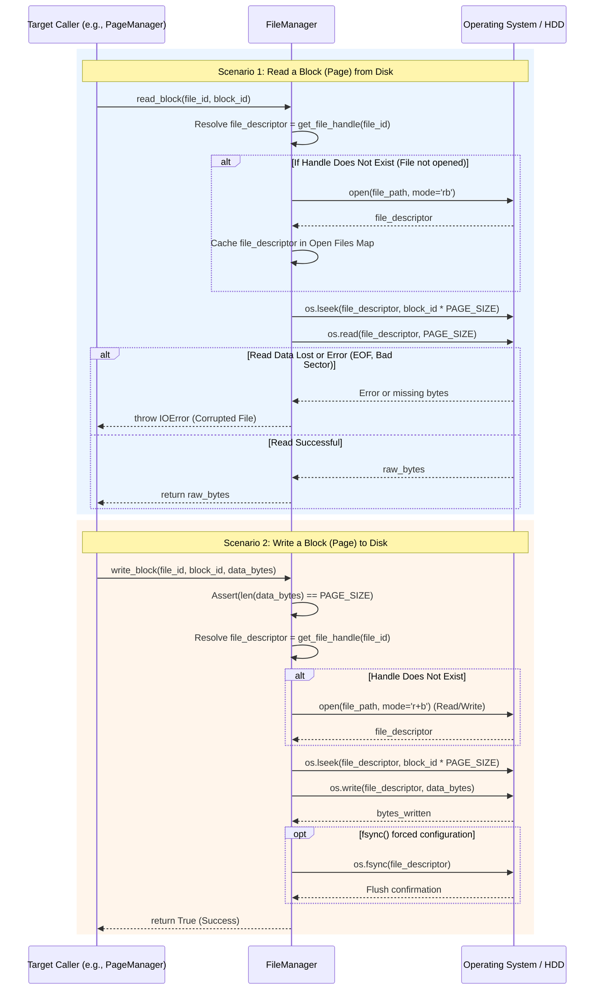

# Sequence Diagram: File Manager (Read / Write Blocks)

This diagram details the interactions of the `FileManager` when receiving Read/Write Data requests from higher layers (typically `PageManager` or `BufferManager`) down to the Operating System (OS). By analyzing this diagram, we can easily identify IO/File lock risks to design appropriate Test Cases.

