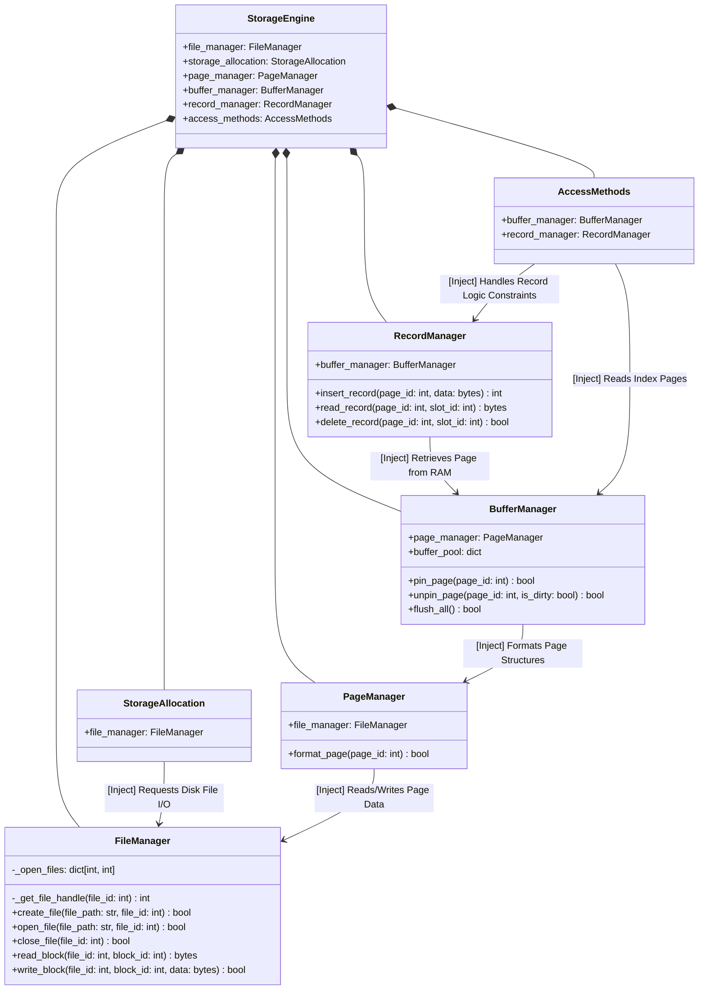

# Storage Engine — Layer 2 Class Diagram (Interfaces & Dependencies)

This diagram is an expanded version of Layer 1, clearly illustrating the Methods, Properties, and Dependency Injection flows through Constructors between classes. This diagram accurately reflects the structure of the `Layer_2/storage_engine/storage_core.py` source file.

