# Flowchart: Top-Down Architecture to Test Implementation

This flowchart illustrates the "Drill-down Journey" from the massive core system (Layer 1) cascading through design specifications (Layer 2) and arriving at the execution layer (Layer 3 - Test Cases).

This flowchart focuses exclusively on expanding the `Storage Engine -> File Manager` branch to keep the representation clean and readable. It closely aligns with the hierarchical structure design described in the `DBMS_layer2.txt` reference.

```mermaid
flowchart TD
    %% LAYER 1: Core System
    DBMS["DBMS (Core System)"]
    
    DBMS --> SE["Storage Engine"]
    DBMS --> QP["Query Processing..."]
    DBMS --> TC["Transaction & Concurrency..."]
    DBMS --> SEC["Security..."]
    DBMS --> DOM["Database Object & Metadata..."]
    DBMS --> ADM["Administration..."]
    DBMS --> BRL["Backup, Recovery & Logging..."]
    DBMS --> CC["Communication & Connectivity..."]
    
    %% LAYER 2: Storage Engine Components
    SE --> FM["File Manager"]
    SE --> PM["Page Manager"]
    SE --> BM["Buffer Manager"]
    SE --> RM["Record Manager"]
    SE --> AM["Access Methods"]
    SE --> SA["Storage Allocation"]
    
    %% LAYER 3: File Manager Test Cases (TDD Execution)
    subgraph TDD["Layer 3: TDD Framework for FileManager"]
        direction TB
        FM --> T_FM_01["FM_01: Create & Open File"]
        FM --> T_FM_02["FM_02: Write & Read Block"]
        FM --> T_FM_03["FM_03: Close File"]
        FM --> T_FM_04["FM_04: Read Unopened (IOError)"]
        FM --> T_FM_05["FM_05: Write Invalid Size (ValueError)"]
        FM --> T_FM_06["FM_06: Read Non-existent Block"]
        FM --> T_FM_07["FM_07: Close Dead File"]
        FM --> T_FM_08["FM_08: Concurrent Multiple Files"]
    end

    %% Custom styling to separate Layers by Color
    classDef layer1 fill:#ffebee,stroke:#c62828,stroke-width:2px;
    classDef layer2 fill:#e3f2fd,stroke:#1565c0,stroke-width:1px;
    classDef layer3 fill:#e8f5e9,stroke:#2e7d32,stroke-width:1px,stroke-dasharray: 4 4;
    
    class DBMS,QP,TC,SEC,DOM,ADM,BRL,CC layer1;
    class SE,PM,BM,RM,AM,SA layer2;
    class T_FM_01,T_FM_02,T_FM_03,T_FM_04,T_FM_05,T_FM_06,T_FM_07,T_FM_08 layer3;
```

