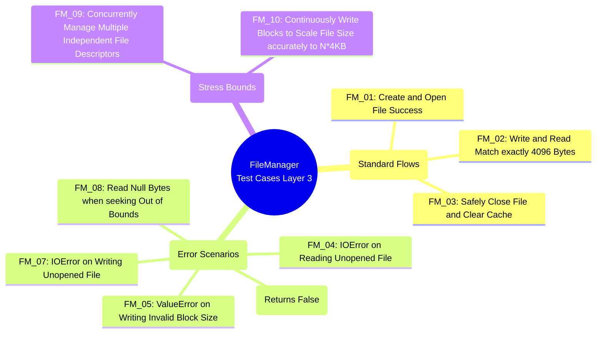

# Mindmap: FileManager Test Cases (TDD Layer 3)

The mindmap below structurally visualizes the 3 primary groups of test scenarios (Test Cases) designed to ensure the `FileManager` class operates flawlessly under all core conditions and potential software risks.

*This diagram directly corresponds to the detailed test catalog found at `docs/testing/test_plan_file_manager.md` and aligns with the actual Python test source code at `tests/Layer_3/storage_engine/test_file_manager.py`*
