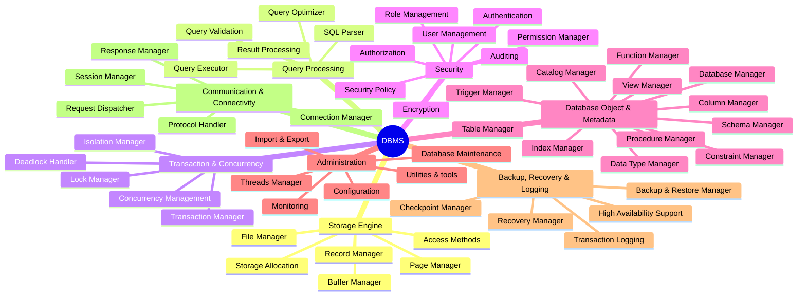
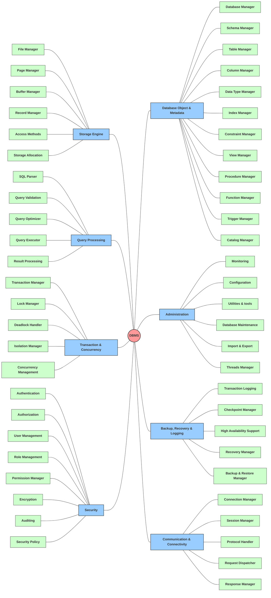

# Bản vẽ bản demo Layer 2 - DBMS Mindmap

File này trình bày hai cách vẽ sơ đồ Layer 1 và Layer 2 của hệ thống DBMS bằng công cụ **Mermaid**.

> [!WARNING]
> **Lưu ý về hiển thị trong VS Code Preview:**
> * **Cách 1 (cú pháp `mindmap`):** Có thể không hiển thị được (báo lỗi syntax hoặc trắng trơn) trên VS Code do trình dựng mặc định của VS Code chưa hỗ trợ layout này. Chỉ hiển thị khi bạn tải Extension `Markdown Preview Mermaid Support` của Matt Bierner hoặc khi push lên GitHub.
> * **Cách 2 (cú pháp `flowchart`):** Hiển thị hoàn hảo ngay lập tức trên VS Code và GitHub mà không cần cài thêm gì.

---

## Cách 1: Sử dụng cú pháp `mindmap` (Mermaid Mindmap)

Đây là cú pháp tối ưu và ngắn gọn nhất cho Sơ đồ tư duy dạng tỏa tròn.



---

## Cách 2: Sử dụng cú pháp `flowchart` (graph LR)

Giao diện dạng cây từ trái sang phải, cho phép tùy biến hình dạng node và phân màu bằng CSS.




```mermaid
graph LR
    classDef branch fill:#99ccff,stroke:#333;
    classDef sub fill:#ccffcc,stroke:#333;
    classDef classNode fill:#fff,stroke:#333,stroke-dasharray: 5 5;

    se[Storage Engine]:::branch
    
    %% Sub-components
    se --> am[Access Methods]:::sub
    se --> pm[Page Manager]:::sub
    
    %% Classes & Interfaces
    am --- IAccess[<< interface >> IAccessMethod]:::classNode
    am --- BTree[class BPlusTreeManager]:::classNode
    am --- Heap[class HeapScan]:::classNode
    
    pm --- BasePg[<< abstract >> BasePage]:::classNode
    pm --- DataPg[class DataPage]:::classNode
    pm --- Header[class PageHeader]:::classNode


# Class Diagram Level 1: Hệ thống DBMS (High-Level Architecture)

Tài liệu này cung cấp sơ đồ Class Diagram Level 1, thể hiện sự tương tác, phụ thuộc và thừa kế giữa các Class/Interface lớn nhất đại diện cho 8 nhánh của hệ thống DBMS.

---

## 1. Bản vẽ Class Diagram Level 1 (Mermaid)

Sơ đồ này mô tả cách các thành phần trong các tầng kiến trúc (Connectivity -> Query Parser -> Execution Operators -> Access Methods -> Buffer Pool -> OS Files/Logs) giao tiếp với nhau bằng cách sử dụng các Interfaces cột trụ để giảm sự phụ thuộc trực tiếp (coupling).

```mermaid
classDiagram
    %% ==========================================
    %% TẦNG 1: COMMUNICATION & CONNECTIVITY (Mạng & Phiên)
    %% ==========================================
    class NetworkListener {
        +startPortListener()
        +acceptClientSocket()
    }
    class SessionManager {
        +createSession() : SessionContext
        +closeSession(SessionID)
        +getActiveSession(SessionID) : SessionContext
    }
    class RequestDispatcher {
        -threadPool : WorkerThreadPool
        +dispatchQuery(queryString, SessionContext)
    }

    NetworkListener --> SessionManager : "authenticates & creates"
    NetworkListener --> RequestDispatcher : "dispatches socket stream to"

    %% ==========================================
    %% TẦNG 2: QUERY PROCESSING (Bộ xử lý truy vấn)
    %% ==========================================
    class SQLParser {
        -lexer : Lexer
        +parseToAST(queryString) : AST
    }
    class SemanticValidator {
        -catalog : CatalogManager
        +checkSemanticState(AST) : boolean
    }
    class QueryOptimizer {
        -costEstimator : CostEstimator
        +generateBestPlan(AST) : PhysicalPlan
    }
    class OperatorExecutor {
        <<abstract>>
        +open()
        +next() : Record
        +close()
    }

    RequestDispatcher --> SQLParser : "sends raw query to"
    SQLParser --> SemanticValidator : "sends AST to"
    SemanticValidator --> QueryOptimizer : "sends validated AST to"
    QueryOptimizer --> OperatorExecutor : "compiles plan to executor tree"

    %% ==========================================
    %% TẦNG 3: DATABASE OBJECT & METADATA (Cấu trúc & Catalog)
    %% ==========================================
    class CatalogManager {
        -metadataCache : MetadataCache
        +resolveObjectID(schemaName, tableName) : ObjectID
        +getTableMetadata(ObjectID) : TableMetadata
    }
    class IConstraintValidator {
        <<interface>>
        +validateConstraints(Record, TableMetadata) : boolean
    }

    SemanticValidator ..> CatalogManager : "lookups metadata"
    OperatorExecutor ..> IConstraintValidator : "evaluates validations on INSERT/UPDATE"

    %% ==========================================
    %% TẦNG 4: TRANSACTION & LOCKING (Concurrency)
    %% ==========================================
    class TransactionManager {
        -transactionTable : TransactionTable
        +beginTransaction() : Transaction
        +commit(Transaction)
        +abort(Transaction)
    }
    class LockManager {
        -lockTable : LockTable
        +acquireLock(TransactionID, ResourceID, LockMode) : boolean
        +releaseLock(TransactionID, ResourceID)
    }

    RequestDispatcher ..> TransactionManager : "manages tx block"
    OperatorExecutor ..> LockManager : "requests locks (Shared/Exclusive) during read/write"

    %% ==========================================
    %% TẦNG 5: ACCESS METHODS & BUFFER POOL (Storage Engine)
    %% ==========================================
    class IAccessMethod {
        <<interface>>
        +getNextRecordRID(ScanState) : RID
    }
    class BPlusTreeManager {
        +findKey(Key) : RID
        +insertKey(Key, RID)
        +removeKey(Key)
    }
    class HeapScan {
        +scanNextRow(TableID) : RID
    }
    class BufferPoolManager {
        -frameTable : BufferFrame[]
        +pinPage(PageID) : BasePage
        +unpinPage(PageID, isDirty)
        +flushAll()
    }

    IAccessMethod <|.. BPlusTreeManager : "implements"
    IAccessMethod <|.. HeapScan : "implements"

    OperatorExecutor --> IAccessMethod : "retrieves physical row IDs from"
    BPlusTreeManager --> BufferPoolManager : "requests data pages from"
    HeapScan --> BufferPoolManager : "requests data pages from"

    %% ==========================================
    %% TẦNG 6: FILE SYSTEM & LOGGING (OS & Bền vững)
    %% ==========================================
    class IFileManager {
        <<interface>>
        +readPageBlock(PageID, byteBuffer)
        +writePageBlock(PageID, byteBuffer)
    }
    class IWalWriter {
        <<interface>>
        +appendLogRecord(LSN, byteBuffer)
        +flushLogToDisk()
    }

    BufferPoolManager --> IFileManager : "swaps pages using"
    TransactionManager --> IWalWriter : "logs transaction state change"
    BPlusTreeManager --> IWalWriter : "logs structural page modifications (Split/Merge)"
```

---

## 2. Giải thích sự tương tác giữa các Class thông qua Interface

Sơ đồ Class Diagram Level 1 thể hiện rõ nét triết lý **Dependency Inversion** (các module cấp cao không phụ thuộc phụ thuộc trực tiếp vào module cấp thấp, cả hai đều phụ thuộc vào lớp trừu tượng - Interface):

1.  **Sự cô lập của Query Execution (`OperatorExecutor`):**
    *   `OperatorExecutor` là lớp trừu tượng đại diện cho các toán tử chạy lệnh (Volcano Iterator Model). Nó **không hề giao tiếp trực tiếp** với File cứng trên đĩa và cũng không biết cấu trúc cây B+Tree index chạy ra sao.
    *   Nó tương tác với bộ máy ổ cứng thông qua giao diện **`IAccessMethod`**.
2.  **Trừu tượng hóa cách lấy Row ID (`IAccessMethod`):**
    *   Tùy thuộc vào kế hoạch chạy (Physical Plan), `OperatorExecutor` sẽ gọi `IAccessMethod`. Nếu dùng index, hệ thống nạp engine **`BPlusTreeManager`**; nếu quét hết bảng, hệ thống nạp **`HeapScan`**. Cả hai đều implement `IAccessMethod` để trả về Số định danh bản ghi `RID` (Row ID).
3.  **Cách ly lưu trữ đĩa thông qua `IFileManager`:**
    *   Bộ điều phối RAM **`BufferPoolManager`** khi hết bộ đệm hoặc khi cần ghi tệp tin sẽ không gọi trực tiếp API của OS mà thông qua Interface **`IFileManager`** (Cửa ngõ quản lý file). Việc này cho phép chúng ta dễ dàng đổi cơ chế lưu trữ (lưu trên file NTFS cục bộ, lưu trên ổ SSD trực tiếp - Raw Device, hay lưu trên Cloud Storage) bằng cách viết các class triển khai mới kế thừa `IFileManager`.
4.  **Kiểm soát khóa bất đồng bộ qua `LockManager`:**
    *   Khi `OperatorExecutor` duyệt dữ liệu, nó sẽ liên lạc với `LockManager` để xin cấp khóa (ví dụ: xin khóa đọc Shared Lock cho Row ID tương ứng). Nếu thành công, nó mới tiếp tục gọi `IAccessMethod` nạp trang. Việc này tách biệt hoàn toàn logic kiểm soát đồng thời khỏi logic lưu trữ.
5.  **Bảo vệ toàn vẹn qua `IConstraintValidator`:**
    *   Khi Executor làm nhiệm vụ ghi (như INSERT), nó sẽ gọi giao diện `IConstraintValidator`. Tùy theo thiết lập bảng, `ForeignKeyValidator` hay `PrimaryKeyValidator` sẽ được nạp vào để kiểm duyệt điều kiện logic, bảm đảm tính Integrity.
