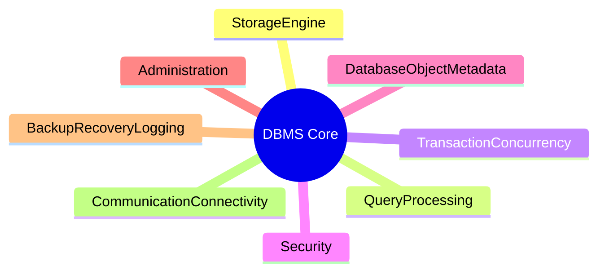
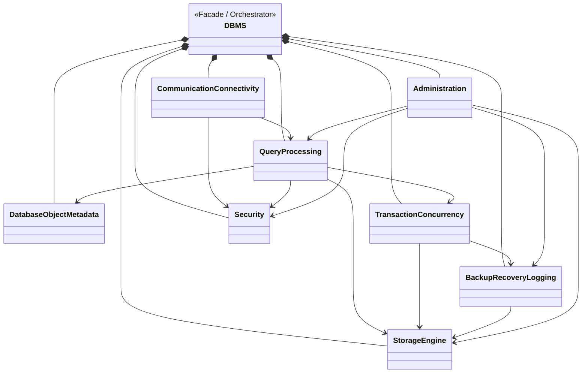

# DBMS — Database Management System

A modular, SOLID-compliant Database Management System designed with a top-down architecture approach.
The system is decomposed into 8 core subsystems, each designed with clear interfaces, entities, and service classes following OOP best practices.

---

## Architecture Overview

### Layer 1 — System Domains

## Design Principles

| Principle | Application |
|---|---|
| **SOLID** | Each class has a single responsibility; interfaces are segregated by functionality |
| **ISP** | Fat interfaces split into focused interfaces (e.g., `IFileReader`, `IFileWriter`, `IFileSynchronizer`) |
| **DIP** | High-level modules depend on abstractions, not concrete implementations |
| **Design Patterns** | Facade, Template Method, Strategy, Composite, Iterator used per module |
