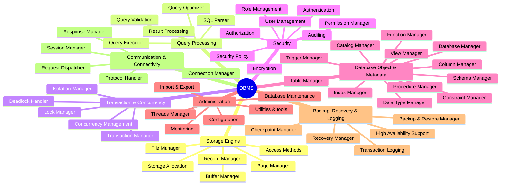

# Bản vẽ bản demo Layer 2 - DBMS Mindmap

File này trình bày hai cách vẽ sơ đồ Layer 1 và Layer 2 của hệ thống DBMS bằng công cụ **Mermaid**.

> [!WARNING]
> **Lưu ý về hiển thị trong VS Code Preview:**
> * **Cách 1 (cú pháp `mindmap`):** Có thể không hiển thị được (báo lỗi syntax hoặc trắng trơn) trên VS Code do trình dựng mặc định của VS Code chưa hỗ trợ layout này. Chỉ hiển thị khi bạn tải Extension `Markdown Preview Mermaid Support` của Matt Bierner hoặc khi push lên GitHub.
> * **Cách 2 (cú pháp `flowchart`):** Hiển thị hoàn hảo ngay lập tức trên VS Code và GitHub mà không cần cài thêm gì.

---

## Cách 1: Sử dụng cú pháp `mindmap` (Mermaid Mindmap)

Đây là cú pháp tối ưu và ngắn gọn nhất cho Sơ đồ tư duy dạng tỏa tròn.



---

## Cách 2: Sử dụng cú pháp `flowchart` (graph LR)

Giao diện dạng cây từ trái sang phải, cho phép tùy biến hình dạng node và phân màu bằng CSS.

```mermaid
graph LR
    %% Styles & Colors
    classDef default fill:#f9f9f9,stroke:#333,stroke-width:1px;
    classDef root fill:#ff9999,stroke:#333,stroke-width:2px,font-weight:bold;
    classDef layer1 fill:#99ccff,stroke:#333,stroke-width:1.5px,font-weight:bold;
    classDef layer2 fill:#ccffcc,stroke:#333,stroke-width:1px;

    %% Root
    db((DBMS)):::root

    %% Layer 1 (Branches)
    se[Storage Engine]:::layer1
    qp[Query Processing]:::layer1
    tc[Transaction & Concurrency]:::layer1
    sc[Security]:::layer1
    dom[Database Object & Metadata]:::layer1
    adm[Administration]:::layer1
    brl[Backup, Recovery & Logging]:::layer1
    cc[Communication & Connectivity]:::layer1

    %% Connections Layer 1
    db --> se
    db --> qp
    db --> tc
    db --> sc
    db --> dom
    db --> adm
    db --> brl
    db --> cc

    %% Layer 2: Storage Engine
    se --> se_fm[File Manager]:::layer2
    se --> se_pm[Page Manager]:::layer2
    se --> se_bm[Buffer Manager]:::layer2
    se --> se_rm[Record Manager]:::layer2
    se --> se_am[Access Methods]:::layer2
    se --> se_sa[Storage Allocation]:::layer2

    %% Layer 2: Query Processing
    qp --> qp_sp[SQL Parser]:::layer2
    qp --> qp_qv[Query Validation]:::layer2
    qp --> qp_qo[Query Optimizer]:::layer2
    qp --> qp_qe[Query Executor]:::layer2
    qp --> qp_rp[Result Processing]:::layer2

    %% Layer 2: Transaction & Concurrency
    tc --> tc_tm[Transaction Manager]:::layer2
    tc --> tc_lm[Lock Manager]:::layer2
    tc --> tc_dh[Deadlock Handler]:::layer2
    tc --> tc_im[Isolation Manager]:::layer2
    tc --> tc_cm[Concurrency Management]:::layer2

    %% Layer 2: Security
    sc --> sc_at[Authentication]:::layer2
    sc --> sc_az[Authorization]:::layer2
    sc --> sc_um[User Management]:::layer2
    sc --> sc_rm[Role Management]:::layer2
    sc --> sc_pm[Permission Manager]:::layer2
    sc --> sc_ec[Encryption]:::layer2
    sc --> sc_ad[Auditing]:::layer2
    sc --> sc_sp[Security Policy]:::layer2

    %% Layer 2: Database Object & Metadata
    dom --> dom_db[Database Manager]:::layer2
    dom --> dom_sc[Schema Manager]:::layer2
    dom --> dom_tb[Table Manager]:::layer2
    dom --> dom_cl[Column Manager]:::layer2
    dom --> dom_dt[Data Type Manager]:::layer2
    dom --> dom_id[Index Manager]:::layer2
    dom --> dom_cs[Constraint Manager]:::layer2
    dom --> dom_vw[View Manager]:::layer2
    dom --> dom_pr[Procedure Manager]:::layer2
    dom --> dom_fn[Function Manager]:::layer2
    dom --> dom_tr[Trigger Manager]:::layer2
    dom --> dom_ct[Catalog Manager]:::layer2

    %% Layer 2: Administration
    adm --> adm_mn[Monitoring]:::layer2
    adm --> adm_cf[Configuration]:::layer2
    adm --> adm_ut[Utilities & tools]:::layer2
    adm --> adm_dm[Database Maintenance]:::layer2
    adm --> adm_ie[Import & Export]:::layer2
    adm --> adm_tm[Threads Manager]:::layer2

    %% Layer 2: Backup, Recovery & Logging
    brl --> brl_tl[Transaction Logging]:::layer2
    brl --> brl_cm[Checkpoint Manager]:::layer2
    brl --> brl_ha[High Availability Support]:::layer2
    brl --> brl_rm[Recovery Manager]:::layer2
    brl --> brl_br[Backup & Restore Manager]:::layer2

    %% Layer 2: Communication & Connectivity
    cc --> cc_cm[Connection Manager]:::layer2
    cc --> cc_sm[Session Manager]:::layer2
    cc --> cc_ph[Protocol Handler]:::layer2
    cc --> cc_rd[Request Dispatcher]:::layer2
    cc --> cc_rm[Response Manager]:::layer2
