```mermaid
classDiagram
    direction TB

    %% ════════════════════════════════════════
    %% FILE MANAGER
    %% ════════════════════════════════════════

    class IFileOperations {
        <<interface>>
        +open(path: str, mode: str) FileHandle
        +close(handle: FileHandle) None
        +read(handle: FileHandle, offset: int, size: int) bytes
        +write(handle: FileHandle, offset: int, data: bytes) None
        +sync(handle: FileHandle) None
    }

    class OSFileWrapper {
        -_file_descriptors: dict
        +open(path: str, mode: str) FileHandle
        +close(handle: FileHandle) None
        +read(handle: FileHandle, offset: int, size: int) bytes
        +write(handle: FileHandle, offset: int, data: bytes) None
        +sync(handle: FileHandle) None
        +get_file_size(handle: FileHandle) int
    }

    class DataFileRegistry {
        -_registry: dict
        +register(file_id: int, path: str) None
        +unregister(file_id: int) None
        +lookup(file_id: int) str
        +is_registered(file_id: int) bool
    }

    class FileDescriptorManager {
        -_open_descriptors: dict
        -_max_open: int
        +acquire(file_id: int) FileDescriptor
        +release(fd: FileDescriptor) None
        +is_open(file_id: int) bool
        +get_active_count() int
    }

    class FileGrowthManager {
        -_growth_policy: str
        -_growth_size: int
        +expand_file(file_id: int, additional_bytes: int) None
        +set_growth_policy(policy: str, size: int) None
        +get_current_size(file_id: int) int
    }

    IFileOperations <|.. OSFileWrapper : implements
    OSFileWrapper --> DataFileRegistry : lookups path
    OSFileWrapper --> FileDescriptorManager : acquires fd
    FileGrowthManager --> IFileOperations : expands via

    %% ════════════════════════════════════════
    %% PAGE MANAGER
    %% ════════════════════════════════════════

    class IPageIO {
        <<interface>>
        +read_page(page_id: int) Page
        +write_page(page: Page) None
    }

    class AbstractPageFormatter {
        <<abstract>>
        +format_page(page: Page) None
        #_write_page_header(page: Page, header: PageHeader) None
        #_init_slot_directory(page: Page) None
    }

    class DefaultPageFormatter {
        -_page_size: int
        +format_page(page: Page) None
        +format_empty_page(page_id: int) Page
    }

    class PageHeaderManager {
        -PAGE_SIZE: int
        +read_header(page: Page) PageHeader
        +write_header(page: Page, header: PageHeader) None
        +is_valid(page: Page) bool
        +get_page_type(page: Page) str
    }

    class SlotDirectoryManager {
        +add_slot(page: Page, offset: int, length: int) int
        +remove_slot(page: Page, slot_id: int) None
        +get_slot(page: Page, slot_id: int) SlotEntry
        +get_free_slot(page: Page) int
    }

    class FreeSpaceManager {
        -_fsm_table: dict
        +get_free_space(page_id: int) int
        +mark_used(page_id: int, bytes_used: int) None
        +find_page_with_space(required: int) int
    }

    class PageIOInterface {
        -_file_manager: IFileOperations
        +read_page(page_id: int) Page
        +write_page(page: Page) None
        +read_raw(page_id: int) bytes
    }

    AbstractPageFormatter <|-- DefaultPageFormatter : extends
    IPageIO <|.. PageIOInterface : implements
    PageIOInterface --> IFileOperations : reads/writes via
    DefaultPageFormatter --> PageHeaderManager : writes header
    DefaultPageFormatter --> SlotDirectoryManager : inits slots
    FreeSpaceManager --> PageHeaderManager : reads free space from

    %% ════════════════════════════════════════
    %% BUFFER MANAGER
    %% ════════════════════════════════════════

    class IReplacementPolicy {
        <<interface>>
        +choose_victim() int
        +notify_access(page_id: int) None
        +notify_pin(page_id: int) None
    }

    class AbstractReplacementPolicy {
        <<abstract>>
        #_pinned: set
        +choose_victim() int
        +notify_access(page_id: int) None
        +notify_pin(page_id: int) None
    }

    class LRUPolicy {
        -_access_order: dict
        +choose_victim() int
        +notify_access(page_id: int) None
    }

    class ClockPolicy {
        -_clock_hand: int
        -_ref_bits: list
        +choose_victim() int
        +notify_access(page_id: int) None
    }

    class BufferFrameManager {
        -_frames: list
        -_capacity: int
        -_page_table: dict
        +pin_page(page_id: int) Page
        +unpin_page(page_id: int, is_dirty: bool) None
        +is_in_buffer(page_id: int) bool
        +get_frame_count() int
    }

    class DirtyPageWriter {
        -_dirty_pages: set
        +mark_dirty(page_id: int) None
        +flush_dirty_pages() None
        +flush_page(page_id: int) None
        +get_dirty_count() int
    }

    class PrefetchManager {
        -_prefetch_queue: list
        +prefetch(page_ids: list) None
        +is_ready(page_id: int) bool
        +set_prefetch_size(size: int) None
    }

    IReplacementPolicy <|.. AbstractReplacementPolicy : implements
    AbstractReplacementPolicy <|-- LRUPolicy : extends
    AbstractReplacementPolicy <|-- ClockPolicy : extends
    BufferFrameManager --> IReplacementPolicy : uses policy
    BufferFrameManager --> DirtyPageWriter : marks dirty
    BufferFrameManager --> IPageIO : swaps pages
    PrefetchManager --> IPageIO : pre-reads pages

    %% ════════════════════════════════════════
    %% RECORD MANAGER
    %% ════════════════════════════════════════

    class IRecordLayout {
        <<interface>>
        +serialize(record: Record) bytes
        +deserialize(data: bytes, schema: Schema) Record
    }

    class RecordLayoutManager {
        -_schema: Schema
        +serialize(record: Record) bytes
        +deserialize(data: bytes, schema: Schema) Record
        +get_record_size(schema: Schema) int
        +is_fixed_length(schema: Schema) bool
    }

    class RIDGenerator {
        +generate_rid(page_id: int, slot_id: int) RID
        +parse_rid(rid: RID) tuple
        +is_valid_rid(rid: RID) bool
    }

    class VarLenDataManager {
        +store(data: bytes, page: Page) int
        +retrieve(ref: int, page: Page) bytes
        +get_stored_size(ref: int) int
    }

    class LargeObjectManager {
        -_lob_storage: IFileOperations
        +store_lob(data: bytes) int
        +retrieve_lob(lob_ref: int) bytes
        +delete_lob(lob_ref: int) None
        +get_lob_size(lob_ref: int) int
    }

    IRecordLayout <|.. RecordLayoutManager : implements
    RecordLayoutManager --> RIDGenerator : generates RID after store
    RecordLayoutManager --> VarLenDataManager : delegates variable cols
    RecordLayoutManager --> LargeObjectManager : delegates LOB cols
    VarLenDataManager --> SlotDirectoryManager : uses slot for offset
    LargeObjectManager --> IFileOperations : stores in separate file

    %% ════════════════════════════════════════
    %% ACCESS METHODS
    %% ════════════════════════════════════════

    class IAccessMethod {
        <<interface>>
        +search(key: object) RID
        +range_search(low: object, high: object) list
        +insert(key: object, rid: RID) None
        +delete(key: object) None
    }

    class BPlusTreeManager {
        -_root_page_id: int
        -_order: int
        -_index_state: IndexStateManager
        +search(key: object) RID
        +range_search(low: object, high: object) list
        +insert(key: object, rid: RID) None
        +delete(key: object) None
        -_split_node(node_id: int) None
        -_merge_node(node_id: int) None
        -_find_leaf(key: object) int
    }

    class HashIndexManager {
        -_buckets: list
        -_bucket_count: int
        +search(key: object) RID
        +range_search(low: object, high: object) list
        +insert(key: object, rid: RID) None
        +delete(key: object) None
        -_hash(key: object) int
        -_rehash() None
    }

    class IndexStateManager {
        -_root_page_id: int
        -_tree_height: int
        -_total_entries: int
        +get_state(index_id: int) dict
        +update_state(index_id: int, state: dict) None
        +get_root_page(index_id: int) int
    }

    class IndexMaintenance {
        +rebuild_index(index_id: int) None
        +reorganize_index(index_id: int) None
        +validate_index(index_id: int) bool
        +get_fragmentation(index_id: int) float
    }

    IAccessMethod <|.. BPlusTreeManager : implements
    IAccessMethod <|.. HashIndexManager : implements
    BPlusTreeManager --> IndexStateManager : reads/updates state
    BPlusTreeManager --> BufferFrameManager : pins tree pages
    HashIndexManager --> BufferFrameManager : pins bucket pages
    IndexMaintenance --> BPlusTreeManager : rebuilds
    IndexMaintenance --> IndexStateManager : resets state

    %% ════════════════════════════════════════
    %% STORAGE ALLOCATION
    %% ════════════════════════════════════════

    class ExtentManager {
        -EXTENT_SIZE: int
        -_extent_bitmap: list
        +allocate_extent(file_id: int) int
        +free_extent(extent_id: int) None
        +get_free_extent_count() int
    }

    class SegmentManager {
        -_segments: dict
        +create_segment(table_id: int) int
        +drop_segment(segment_id: int) None
        +expand_segment(segment_id: int) None
        +get_segment_pages(segment_id: int) list
    }

    class TablespaceManager {
        -_tablespaces: dict
        +create_tablespace(name: str, path: str) int
        +drop_tablespace(tablespace_id: int) None
        +get_tablespace(table_id: int) int
        +list_tablespaces() list
    }

    class SpaceReclamationManager {
        +reclaim_page(page_id: int) None
        +compact_segment(segment_id: int) None
        +get_reclaimable_pages() list
    }

    SegmentManager --> ExtentManager : allocates extents
    TablespaceManager --> SegmentManager : manages segments
    SpaceReclamationManager --> ExtentManager : returns extents
    SpaceReclamationManager --> FreeSpaceManager : updates FSM

    %% ════════════════════════════════════════
    %% CROSS-MODULE DEPENDENCIES (nội bộ Storage Engine)
    %% ════════════════════════════════════════

    BufferFrameManager ..> PageHeaderManager : validates page on load
    RecordLayoutManager ..> FreeSpaceManager : checks free space before insert
    BPlusTreeManager ..> PageIOInterface : reads index pages
```

# Class Diagram Chi Tiết — Storage Engine

Zoom vào nhánh **Storage Engine**, thể hiện đầy đủ:
- Concrete classes `[C]`, Abstract classes `[A]`, Interfaces `[I]`
- Properties và methods (Python snake_case)
- Relationships nội bộ giữa các class

---

---

## Tổng hợp Classes

| Sub-module | Interface | Abstract | Concrete |
|---|---|---|---|
| **File Manager** | `IFileOperations` | — | `OSFileWrapper`, `DataFileRegistry`, `FileDescriptorManager`, `FileGrowthManager` |
| **Page Manager** | `IPageIO` | `AbstractPageFormatter` | `DefaultPageFormatter`, `PageHeaderManager`, `SlotDirectoryManager`, `FreeSpaceManager`, `PageIOInterface` |
| **Buffer Manager** | `IReplacementPolicy` | `AbstractReplacementPolicy` | `LRUPolicy`, `ClockPolicy`, `BufferFrameManager`, `DirtyPageWriter`, `PrefetchManager` |
| **Record Manager** | `IRecordLayout` | — | `RecordLayoutManager`, `RIDGenerator`, `VarLenDataManager`, `LargeObjectManager` |
| **Access Methods** | `IAccessMethod` | — | `BPlusTreeManager`, `HashIndexManager`, `IndexStateManager`, `IndexMaintenance` |
| **Storage Allocation** | — | — | `ExtentManager`, `SegmentManager`, `TablespaceManager`, `SpaceReclamationManager` |

## Design Patterns được áp dụng

| Pattern | Ở đâu | Mục đích |
|---|---|---|
| **Strategy** | `IReplacementPolicy` → LRU / Clock | Swap thuật toán eviction không đụng `BufferFrameManager` |
| **Strategy** | `IAccessMethod` → B+Tree / Hash | Swap index engine không đụng Query layer |
| **Template Method** | `AbstractPageFormatter` | Định nghĩa khung format, subclass override chi tiết |
| **Facade** | `BufferFrameManager` | Che phức tạp của buffer pool khỏi các layer trên |
| **Interface Segregation** | `IFileOperations`, `IPageIO` tách biệt | Không ép class implement method không dùng |
