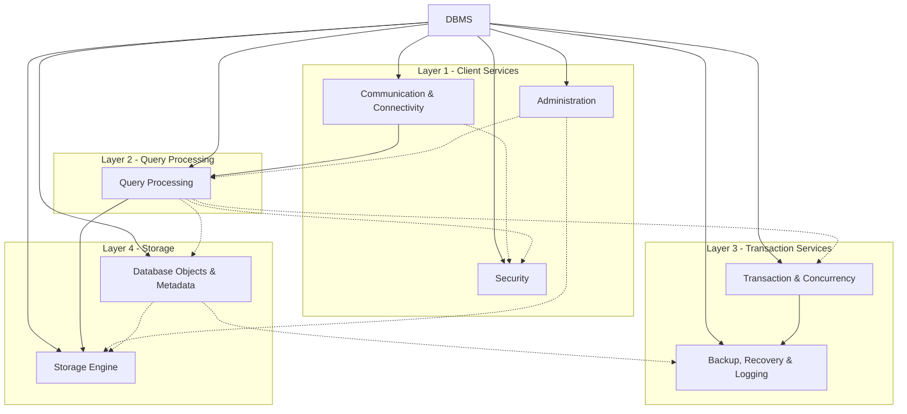

```mermaid
flowchart TB

DBMS["DBMS"]

subgraph L1["Layer 1 - Client Services"]
direction LR
CC["Communication & Connectivity"]
SEC["Security"]
ADM["Administration"]
end

subgraph L2["Layer 2 - Query Processing"]
direction TB
QP["Query Processing"]
end

subgraph L3["Layer 3 - Transaction Services"]
direction LR
TX["Transaction & Concurrency"]
BR["Backup, Recovery & Logging"]
end

subgraph L4["Layer 4 - Storage"]
direction LR
SE["Storage Engine"]
META["Database Objects & Metadata"]
end

DBMS --> CC
DBMS --> SEC
DBMS --> ADM
DBMS --> QP
DBMS --> TX
DBMS --> BR
DBMS --> SE
DBMS --> META

CC --> QP
QP --> SE
TX --> BR

CC -.-> SEC
QP -.-> SEC
QP -.-> TX
QP -.-> META
ADM -.-> QP
ADM -.-> SE
META -.-> SE
META -.-> BR
```
