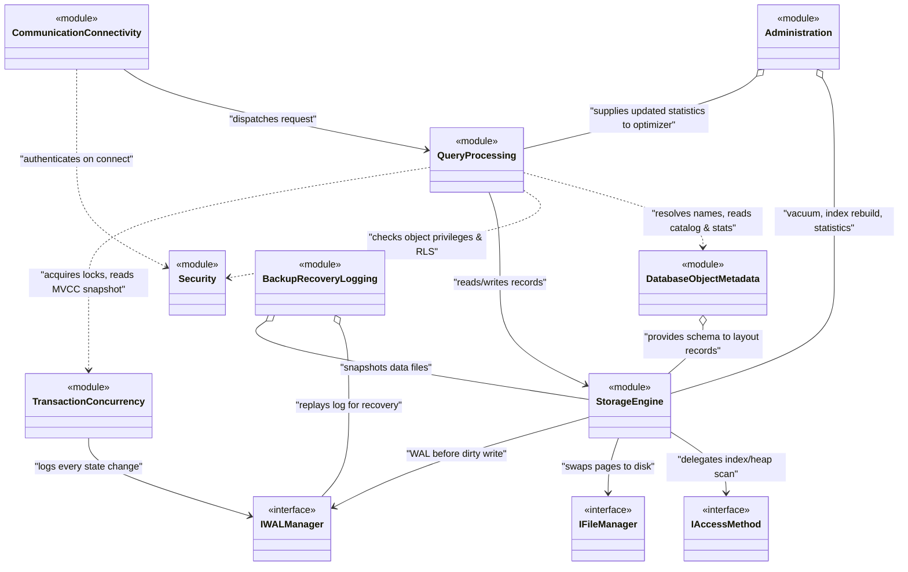

# Class Diagram Level 1 — DBMS High-Level Architecture

Sơ đồ thể hiện **8 module chính** và mối quan hệ giữa chúng ở mức tổng quan.  
Không đi vào chi tiết method/property — đó là phần của Class Diagram Level 2 (chi tiết từng nhánh).

> **Relationship legend:**
> - `<|--` Inheritance
> - `<|..` Realization (implement interface)
> - `*--` Composition
> - `o--` Aggregation
> - `-->` Association / uses
> - `..>` Dependency

---

## Mermaid Class Diagram

---

## Mối quan hệ chính giải thích

| Relationship | Loại | Ý nghĩa |
|---|---|---|
| `CommunicationConnectivity → QueryProcessing` | Association | Mọi request đều đi qua đây trước |
| `QueryProcessing ..> DatabaseObjectMetadata` | Dependency | Tra cứu catalog khi validate & optimize |
| `QueryProcessing → StorageEngine` | Association | Query thực sự đọc/ghi data ở đây |
| `QueryProcessing ..> TransactionConcurrency` | Dependency | Xin lock, đọc MVCC version trong lúc execute |
| `StorageEngine → IAccessMethod` | Association | Strategy pattern — B+Tree hay HeapScan |
| `StorageEngine → IWALManager` | Association | WAL rule: log trước, ghi sau |
| `TransactionConcurrency → IWALManager` | Association | Mọi BEGIN/COMMIT/ROLLBACK phải log |
| `BackupRecoveryLogging o-- IWALManager` | Aggregation | Recovery đọc lại log, không sở hữu |
| `Administration o-- StorageEngine` | Aggregation | DBA tools: vacuum, rebuild, stats |
| `DatabaseObjectMetadata o-- StorageEngine` | Aggregation | Schema metadata cho record layout |
