# High-Level Class Diagram: Storage Engine

This diagram illustrates the macro-architectural view of the **Storage Engine**. 
*Note: Properties and Methods are intentionally hidden to provide a clean overview of dependencies and interfaces before expanding into Sequence Diagrams.*

```mermaid
classDiagram
    direction TB
    
    class StorageEngineFacade {
        <<facade>>
    }

    %% -------------------------------------
    %% CORE INTERFACES (CONTRACTS)
    %% -------------------------------------
    class IFileLifecycleManager {
        <<interface>>
    }
    class IPageManager {
        <<interface>>
    }
    class IBufferManager {
        <<interface>>
    }
    class IRecordManager {
        <<interface>>
    }
    class IAccessMethods {
        <<interface>>
    }
    class IStorageAllocation {
        <<interface>>
    }
    
    %% -------------------------------------
    %% IMPLEMENTATIONS (MANAGERS)
    %% -------------------------------------
    class FileLifecycleManager {
        <<service>>
    }
    class PageManager {
        <<service>>
    }
    class BufferManager {
        <<service>>
    }
    class RecordManager {
        <<service>>
    }
    class IndexManager {
        <<service>>
    }
    class StorageAllocator {
        <<service>>
    }
    
    %% -------------------------------------
    %% DOMAIN ENTITIES
    %% -------------------------------------
    class Page {
        <<entity>>
    }
    class BufferFrame {
        <<entity>>
    }
    class TupleRecord {
        <<entity>>
    }
    class BTreeIndex {
        <<entity>>
    }
    
    %% -------------------------------------
    %% STRUCTURAL RELATIONSHIPS
    %% -------------------------------------
    
    %% Facade orchestrates all core components
    StorageEngineFacade *-- IFileLifecycleManager
    StorageEngineFacade *-- IPageManager
    StorageEngineFacade *-- IBufferManager
    StorageEngineFacade *-- IRecordManager
    StorageEngineFacade *-- IAccessMethods
    StorageEngineFacade *-- IStorageAllocation

    %% Implementations fulfill contracts
    FileLifecycleManager ..|> IFileLifecycleManager
    PageManager ..|> IPageManager
    BufferManager ..|> IBufferManager
    RecordManager ..|> IRecordManager
    IndexManager ..|> IAccessMethods
    StorageAllocator ..|> IStorageAllocation

    %% Cross-Component Dependencies (Data Flow)
    PageManager --> IFileLifecycleManager : Reads/Writes physical payload
    StorageAllocator --> IFileLifecycleManager : Requests disk expansion
    BufferManager --> IPageManager : Fetches uncached pages
    RecordManager --> IBufferManager : Modifies RAM cache directly
    IndexManager --> IBufferManager : Traverses index blocks in RAM
    
    %% Entity Associations
    PageManager ..> Page : Formats state
    BufferManager *-- BufferFrame : Manages slots
    BufferFrame o-- Page : Holds reference
    RecordManager ..> TupleRecord : Serializes bytes
    IndexManager ..> BTreeIndex : Mutates keys
```

