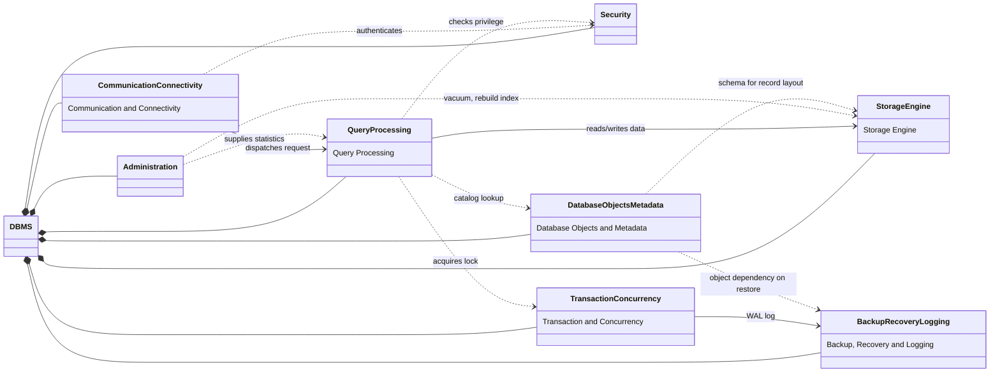

# Class Diagram Level 1 — DBMS High-Level Architecture

Sơ đồ thể hiện **8 module chính** và mối quan hệ giữa chúng ở mức tổng quan.

> **Relationship legend:**
> - `*--` Composition (DBMS sở hữu module)
> - `-->` Association (phụ thuộc thường xuyên)
> - `..>` Dependency (dùng tạm thời)

---

---

## Tổng hợp Relationships

| Từ | Đến | Loại | Ý nghĩa |
|---|---|---|---|
| `DBMS` | `Communication & Connectivity` | Composition | DBMS sở hữu |
| `DBMS` | `Security` | Composition | DBMS sở hữu |
| `DBMS` | `Administration` | Composition | DBMS sở hữu |
| `Communication & Connectivity` | `Query Processing` | Association | Entry point của mọi request |
| `Communication & Connectivity` | `Security` | Dependency | Xác thực khi connect |
| `Query Processing` | `Security` | Dependency | Kiểm tra quyền truy cập object |
| `Query Processing` | `Transaction & Concurrency` | Dependency | Xin lock, đọc MVCC snapshot |
| `Query Processing` | `Storage Engine` | Association | Đọc/ghi dữ liệu thực sự |
| `Query Processing` | `Database Objects & Metadata` | Dependency | Tra cứu catalog, statistics |
| `Transaction & Concurrency` | `Backup, Recovery & Logging` | Association | WAL trước mỗi thay đổi |
| `Administration` | `Query Processing` | Dependency | Cung cấp statistics cho optimizer |
| `Administration` | `Storage Engine` | Dependency | Vacuum, rebuild index, collect stats |
| `Database Objects & Metadata` | `Storage Engine` | Dependency | Schema để layout record |
| `Database Objects & Metadata` | `Backup, Recovery & Logging` | Dependency | Object dependency khi restore |
