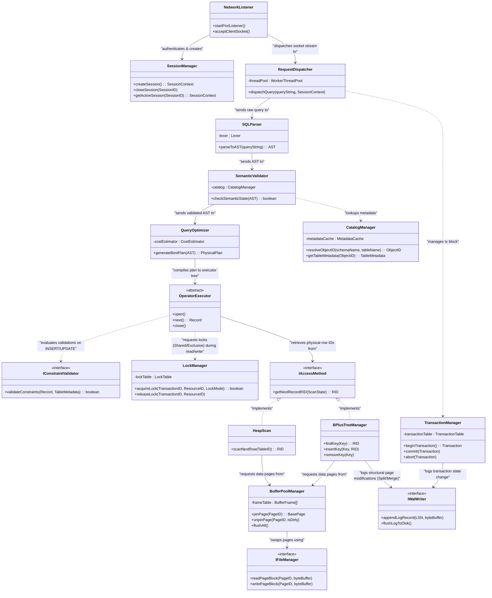

# Class Diagram Level 1: Hệ thống DBMS (High-Level Architecture)

Tài liệu này cung cấp sơ đồ Class Diagram Level 1, thể hiện sự tương tác, phụ thuộc và thừa kế giữa các Class/Interface lớn nhất đại diện cho 8 nhánh của hệ thống DBMS.

---

## 1. Bản vẽ Class Diagram Level 1 (Mermaid)

Sơ đồ này mô tả cách các thành phần trong các tầng kiến trúc (Connectivity -> Query Parser -> Execution Operators -> Access Methods -> Buffer Pool -> OS Files/Logs) giao tiếp với nhau bằng cách sử dụng các Interfaces cột trụ để giảm sự phụ thuộc trực tiếp (coupling).

---

## 2. Giải thích sự tương tác giữa các Class thông qua Interface

Sơ đồ Class Diagram Level 1 thể hiện rõ nét triết lý **Dependency Inversion** (các module cấp cao không phụ thuộc phụ thuộc trực tiếp vào module cấp thấp, cả hai đều phụ thuộc vào lớp trừu tượng - Interface):

1.  **Sự cô lập của Query Execution (`OperatorExecutor`):**
    *   `OperatorExecutor` là lớp trừu tượng đại diện cho các toán tử chạy lệnh (Volcano Iterator Model). Nó **không hề giao tiếp trực tiếp** với File cứng trên đĩa và cũng không biết cấu trúc cây B+Tree index chạy ra sao.
    *   Nó tương tác với bộ máy ổ cứng thông qua giao diện **`IAccessMethod`**.
2.  **Trừu tượng hóa cách lấy Row ID (`IAccessMethod`):**
    *   Tùy thuộc vào kế hoạch chạy (Physical Plan), `OperatorExecutor` sẽ gọi `IAccessMethod`. Nếu dùng index, hệ thống nạp engine **`BPlusTreeManager`**; nếu quét hết bảng, hệ thống nạp **`HeapScan`**. Cả hai đều implement `IAccessMethod` để trả về Số định danh bản ghi `RID` (Row ID).
3.  **Cách ly lưu trữ đĩa thông qua `IFileManager`:**
    *   Bộ điều phối RAM **`BufferPoolManager`** khi hết bộ đệm hoặc khi cần ghi tệp tin sẽ không gọi trực tiếp API của OS mà thông qua Interface **`IFileManager`** (Cửa ngõ quản lý file). Việc này cho phép chúng ta dễ dàng đổi cơ chế lưu trữ (lưu trên file NTFS cục bộ, lưu trên ổ SSD trực tiếp - Raw Device, hay lưu trên Cloud Storage) bằng cách viết các class triển khai mới kế thừa `IFileManager`.
4.  **Kiểm soát khóa bất đồng bộ qua `LockManager`:**
    *   Khi `OperatorExecutor` duyệt dữ liệu, nó sẽ liên lạc với `LockManager` để xin cấp khóa (ví dụ: xin khóa đọc Shared Lock cho Row ID tương ứng). Nếu thành công, nó mới tiếp tục gọi `IAccessMethod` nạp trang. Việc này tách biệt hoàn toàn logic kiểm soát đồng thời khỏi logic lưu trữ.
5.  **Bảo vệ toàn vẹn qua `IConstraintValidator`:**
    *   Khi Executor làm nhiệm vụ ghi (như INSERT), nó sẽ gọi giao diện `IConstraintValidator`. Tùy theo thiết lập bảng, `ForeignKeyValidator` hay `PrimaryKeyValidator` sẽ được nạp vào để kiểm duyệt điều kiện logic, bảm đảm tính Integrity.
