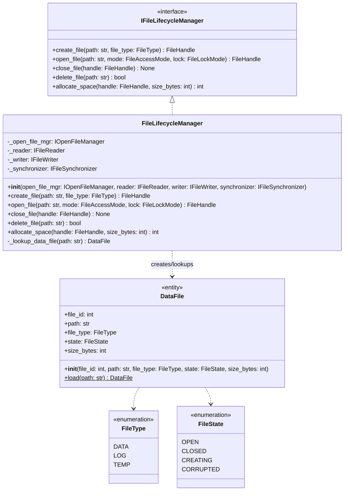
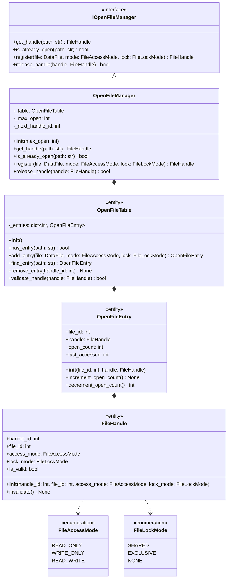
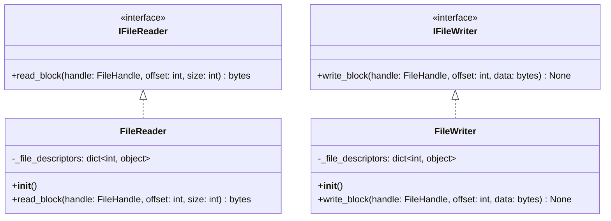
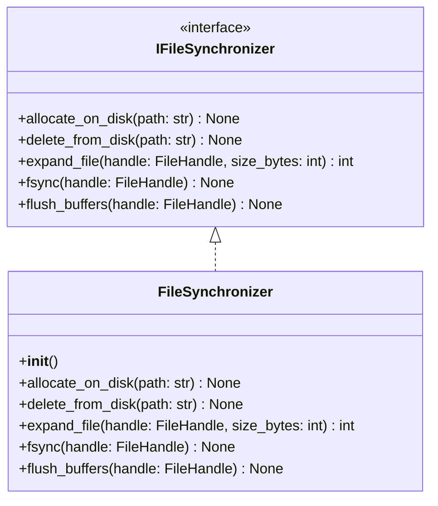
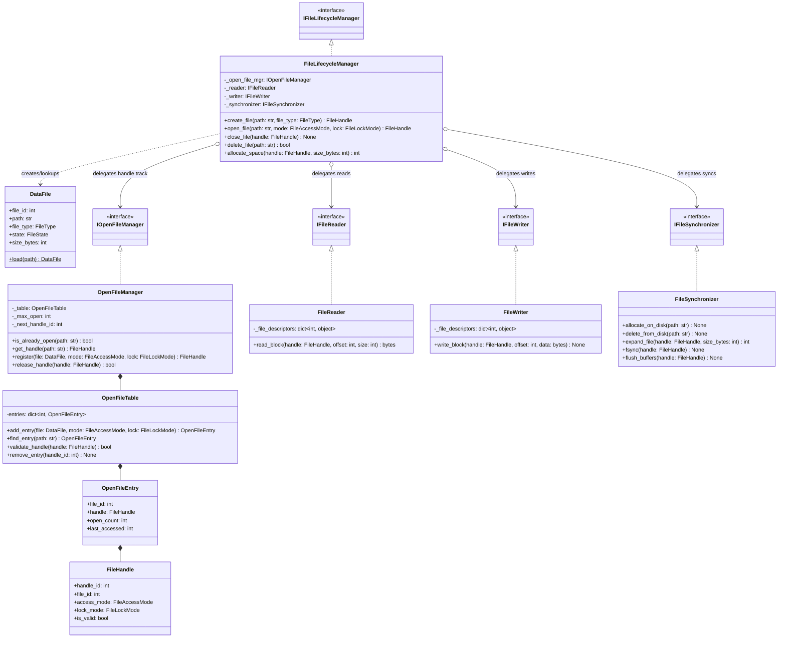

# Detailed Class Diagram — File Manager (Storage Engine)

Tài liệu này đặc tả chi tiết Layer 4 cho sub-module **File Manager**, bao gồm đầy đủ thuộc tính (properties), phương thức (methods), kiểu dữ liệu (Python type hint), và quan hệ giữa các lớp. (Cập nhật sau khi phân tích luồng Sequence D5/D6).

---

## 1. Chi Tiết Các Sub-Groups

### Sub-Group 1: File Lifecycle
Chịu trách nhiệm tạo mới, xóa bỏ, đổi tên và kiểm soát trạng thái vật lý của các file dữ liệu trên hệ thống.

### Sub-Group 2: File Open/Close Management
Quản lý việc ánh xạ các file đang mở (OpenFileTable), cơ chế đếm số lần sử dụng (reference counting), và cơ chế khóa file nhằm đảm bảo tính toàn vẹn đa luồng/tiến trình.

### Sub-Group 3: Data Read/Write
Xử lý các thao tác đọc và ghi dữ liệu mức tối thấp (block-level read/write) tại một offset cụ thể.

### Sub-Group 4: Disk Synchronization
Đảm bảo cơ chế đồng bộ hóa dữ liệu từ bộ nhớ đệm (OS cache) xuống thiết bị lưu trữ vật lý nhằm đáp ứng tiêu chí ACID (phần Durability). Cũng quản lý việc không gian tĩnh.

---

## 2. Toàn Bộ Detailed Class Diagram (Gộp & Quan Hệ Hoàn Chỉnh)

Sơ đồ quan hệ phụ thuộc giữa các lớp thực thi và interface trong cấu trúc File Manager (bao gồm các dependency injection):

---

## 3. Bản Đồ Properties & Methods Chi Tiết

Dưới đây là thống kê toàn bộ thuộc tính và phương thức với kiểu dữ liệu của File Manager chuẩn bị cho TDD:

| Class / Entity | Type | Properties | Methods & Signatures |
| :--- | :--- | :--- | :--- |
| **`DataFile`** | Entity | - `file_id: int` - `path: str` - `file_type: FileType` - `state: FileState` - `size_bytes: int` | - `__init__(file_id, path, file_type, state, size_bytes)` - `load(path: str) -> DataFile` (Static) |
| **`FileHandle`** | Entity | - `handle_id: int` - `file_id: int` - `access_mode: FileAccessMode` - `lock_mode: FileLockMode` - `is_valid: bool` | - `__init__(handle_id, file_id, access_mode, lock_mode)` - `invalidate() -> None` |
| **`OpenFileEntry`** | Entity | - `file_id: int` - `handle: FileHandle` - `open_count: int` - `last_accessed: int` | - `__init__(file_id, handle)` - `increment_open_count() -> None` - `decrement_open_count() -> int` |
| **`OpenFileTable`** | Entity | - `_entries: dict[int, OpenFileEntry]` | - `__init__()` - `has_entry(path: str) -> bool` - `add_entry(file, mode, lock) -> OpenFileEntry` - `find_entry(path: str) -> OpenFileEntry` - `remove_entry(handle_id)` - `validate_handle(handle) -> bool` |
| **`FileLifecycleManager`** | Facade | - `_open_file_mgr: IOpenFileManager` - `_reader: IFileReader` - `_writer: IFileWriter` - `_synchronizer: IFileSynchronizer` | - `__init__(open_file_mgr, reader, writer, synchronizer)` - `create_file(path, file_type) -> FileHandle` - `open_file(path, mode, lock) -> FileHandle` - `close_file(handle) -> None` - `delete_file(path) -> bool` - `allocate_space(handle, size_bytes) -> int` - `_lookup_data_file(path) -> DataFile` |
| **`OpenFileManager`** | Service | - `_table: OpenFileTable` - `_max_open: int` - `_next_handle_id: int` | - `__init__(max_open)` - `get_handle(path: str) -> FileHandle` - `is_already_open(path: str) -> bool` - `register(file, mode, lock) -> FileHandle` - `release_handle(handle) -> bool` |
| **`FileReader`** | Service | - `_file_descriptors: dict[int, object]` | - `__init__()` - `read_block(handle, offset, size) -> bytes` |
| **`FileWriter`** | Service | - `_file_descriptors: dict[int, object]` | - `__init__()` - `write_block(handle, offset, data) -> None` |
| **`FileSynchronizer`** | Service | None | - `allocate_on_disk(path: str) -> None` - `delete_from_disk(path: str) -> None` - `expand_file(handle, size_bytes) -> int` - `fsync(handle) -> None` - `flush_buffers(handle) -> None` |
