# Class Diagram Level 1 — DBMS High-Level Architecture

Sơ đồ thể hiện **8 module chính** và mối quan hệ giữa chúng.  
Mỗi class đại diện cho **façade/entry-point** của từng module — không đi vào chi tiết con.

> **Relationship legend:**
> - `<|--` Inheritance (kế thừa)
> - `<|..` Realization (implement interface)
> - `*--` Composition (sở hữu, vòng đời phụ thuộc)
> - `o--` Aggregation (tham chiếu, vòng đời độc lập)
> - `-->` Association / uses (phụ thuộc có hướng)
> - `..>` Dependency (dùng tạm thời / parameter)

---

## Mermaid Class Diagram

```mermaid
classDiagram

    %% ─────────────────────────────────────────
    %% MODULE 1: COMMUNICATION & CONNECTIVITY
    %% ─────────────────────────────────────────
    class ConnectionManager {
        +port: int
        +max_connections: int
        +accept_connection() Connection
        +close_connection(conn_id: int) None
    }

    class SessionManager {
        +create_session(conn: Connection) SessionId
        +destroy_session(session_id: SessionId) None
        +get_session(session_id: SessionId) Session
    }

    class ProtocolHandler {
        +parse_packet(stream: bytes) Request
        +serialize_response(result: ResultSet) bytes
    }

    class RequestDispatcher {
        +dispatch(request: Request, session: Session) None
        +route_command(command: Command) CommandHandler
    }

    ConnectionManager *-- SessionManager : "creates"
    ConnectionManager *-- ProtocolHandler : "owns"
    ProtocolHandler --> RequestDispatcher : "forwards parsed request"

    %% ─────────────────────────────────────────
    %% MODULE 2: QUERY PROCESSING
    %% ─────────────────────────────────────────
    class SQLParser {
        +parse(sql: str) AST
    }

    class QueryValidator {
        +validate(ast: AST) ValidationResult
    }

    class QueryOptimizer {
        +optimize(ast: AST) PhysicalPlan
    }

    class QueryExecutor {
        +execute(plan: PhysicalPlan) ResultSet
    }

    class ResultProcessor {
        +format(result: ResultSet) Response
    }

    RequestDispatcher --> SQLParser : "sends raw SQL"
    SQLParser --> QueryValidator : "passes AST"
    QueryValidator --> QueryOptimizer : "passes validated AST"
    QueryOptimizer --> QueryExecutor : "passes physical plan"
    QueryExecutor --> ResultProcessor : "passes raw result"

    %% ─────────────────────────────────────────
    %% MODULE 3: TRANSACTION & CONCURRENCY
    %% ─────────────────────────────────────────
    class TransactionManager {
        +begin() TransactionId
        +commit(tx_id: TransactionId) None
        +rollback(tx_id: TransactionId) None
    }

    class LockManager {
        +acquire(tx_id: TransactionId, resource_id: str, mode: LockMode) bool
        +release(tx_id: TransactionId, resource_id: str) None
    }

    class DeadlockHandler {
        +detect() list[TransactionId]
        +resolve(cycle: list) None
    }

    class MVCCEngine {
        +create_version(rid: RID, data: bytes, tx_id: TransactionId) None
        +get_visible_version(rid: RID, snapshot: Snapshot) bytes
    }

    RequestDispatcher --> TransactionManager : "begins/commits tx"
    QueryExecutor ..> LockManager : "requests locks"
    QueryExecutor ..> MVCCEngine : "reads versioned data"
    TransactionManager *-- LockManager : "coordinates"
    TransactionManager *-- DeadlockHandler : "owns"
    TransactionManager *-- MVCCEngine : "manages versions"

    %% ─────────────────────────────────────────
    %% MODULE 4: SECURITY
    %% ─────────────────────────────────────────
    class AuthenticationManager {
        +authenticate(credential: Credential) AuthResult
        +logout(session_id: SessionId) None
    }

    class AuthorizationManager {
        +check_privilege(user_id: UserId, action: Action, obj: DBObject) bool
    }

    class AccessControlManager {
        +apply_row_security(user_id: UserId, query: AST) AST
        +mask_columns(user_id: UserId, result: ResultSet) ResultSet
    }

    class AuditManager {
        +log(event: AuditEvent) None
        +query_log(filter: AuditFilter) list[AuditEvent]
    }

    ConnectionManager ..> AuthenticationManager : "verifies identity on connect"
    QueryValidator ..> AuthorizationManager : "checks object privileges"
    QueryExecutor ..> AccessControlManager : "applies RLS/column masking"
    RequestDispatcher ..> AuditManager : "logs every command"

    %% ─────────────────────────────────────────
    %% MODULE 5: DATABASE OBJECT & METADATA
    %% ─────────────────────────────────────────
    class CatalogManager {
        +get_table_meta(table_id: int) TableMetadata
        +get_column_meta(col_id: int) ColumnMetadata
        +resolve_object(name: str) ObjectId
        +invalidate_cache(obj_id: ObjectId) None
    }

    class ConstraintManager {
        +validate(record: Record, table_id: int) ValidationResult
    }

    class SchemaManager {
        +create_schema(name: str) SchemaId
        +drop_schema(schema_id: SchemaId, cascade: bool) None
    }

    QueryValidator ..> CatalogManager : "resolves names & types"
    QueryOptimizer ..> CatalogManager : "reads statistics & index info"
    QueryExecutor ..> ConstraintManager : "validates on INSERT/UPDATE"
    CatalogManager *-- SchemaManager : "manages schema objects"

    %% ─────────────────────────────────────────
    %% MODULE 6: STORAGE ENGINE
    %% ─────────────────────────────────────────
    class StorageEngine {
        <<facade>>
        +read_record(rid: RID) bytes
        +write_record(rid: RID, data: bytes) None
        +delete_record(rid: RID) None
    }

    class IAccessMethod {
        <<interface>>
        +search(key: object) RID
        +range_search(low: object, high: object) list[RID]
        +insert(key: object, rid: RID) None
        +delete(key: object) None
    }

    class BPlusTreeManager {
        +search(key: object) RID
        +range_search(low: object, high: object) list[RID]
        +insert(key: object, rid: RID) None
        +delete(key: object) None
    }

    class BufferManager {
        +pin_page(page_id: int) Page
        +unpin_page(page_id: int, is_dirty: bool) None
        +flush_all() None
    }

    class FileManager {
        +read_page(page_id: int) bytes
        +write_page(page_id: int, data: bytes) None
    }

    IAccessMethod <|.. BPlusTreeManager : "implements"
    QueryExecutor --> StorageEngine : "reads/writes records"
    StorageEngine --> IAccessMethod : "delegates to"
    StorageEngine *-- BufferManager : "owns"
    BufferManager --> FileManager : "swaps pages"

    %% ─────────────────────────────────────────
    %% MODULE 7: BACKUP, RECOVERY & LOGGING
    %% ─────────────────────────────────────────
    class WALManager {
        +log_begin(tx_id: TransactionId) LSN
        +log_update(tx_id: TransactionId, rid: RID, before: bytes, after: bytes) LSN
        +log_commit(tx_id: TransactionId) LSN
        +flush_to(lsn: LSN) None
    }

    class CheckpointManager {
        +trigger_checkpoint() None
        +get_latest_checkpoint() CheckpointRecord
    }

    class RecoveryManager {
        +recover(start_lsn: LSN) None
        +redo(record: LogRecord) None
        +undo(record: LogRecord) None
    }

    class BackupManager {
        +backup(db_id: int, destination: str) BackupId
        +restore(backup_id: BackupId) None
    }

    TransactionManager --> WALManager : "logs every state change"
    BufferManager --> WALManager : "WAL before dirty write"
    CheckpointManager o-- WALManager : "reads LSN from"
    RecoveryManager o-- WALManager : "replays log from"
    BackupManager o-- CheckpointManager : "uses checkpoint as base"

    %% ─────────────────────────────────────────
    %% MODULE 8: ADMINISTRATION
    %% ─────────────────────────────────────────
    class MonitoringManager {
        +collect_metrics() MetricsSnapshot
        +get_slow_queries() list[QueryProfile]
        +get_active_sessions() list[SessionInfo]
    }

    class ConfigManager {
        +get(key: str) str
        +set(key: str, value: str) None
        +reload(key: str) None
    }

    class MaintenanceManager {
        +collect_statistics(table_id: int) None
        +rebuild_index(index_id: int) None
        +vacuum(table_id: int) None
    }

    class ThreadPoolManager {
        +submit(task: Callable) Future
        +resize(new_size: int) None
        +get_stats() ThreadPoolStats
    }

    RequestDispatcher *-- ThreadPoolManager : "uses worker threads"
    StorageEngine ..> MaintenanceManager : "triggers vacuum/stats"
    QueryOptimizer ..> MaintenanceManager : "reads updated statistics"
```

---

## Tổng hợp Relationships

| Relationship | Từ | Đến | Ý nghĩa |
|---|---|---|---|
| Composition `*--` | `ConnectionManager` | `SessionManager`, `ProtocolHandler` | Connection sở hữu Session/Protocol |
| Composition `*--` | `TransactionManager` | `LockManager`, `DeadlockHandler`, `MVCCEngine` | TxManager điều phối toàn bộ concurrency |
| Composition `*--` | `StorageEngine` | `BufferManager` | StorageEngine sở hữu Buffer |
| Composition `*--` | `CatalogManager` | `SchemaManager` | Catalog quản lý Schema objects |
| Realization `<|..` | `BPlusTreeManager` | `IAccessMethod` | Strategy pattern — swap được engine |
| Association `-->` | `BufferManager` | `WALManager` | WAL before dirty page write (WAL rule) |
| Association `-->` | `QueryExecutor` | `StorageEngine` | Query layer dùng StorageEngine |
| Aggregation `o--` | `RecoveryManager` | `WALManager` | Recovery đọc log, không sở hữu |
| Dependency `..>` | `QueryValidator` | `CatalogManager` | Tra cứu tạm thời |
| Dependency `..>` | `QueryExecutor` | `LockManager` | Xin lock trong lúc chạy |
| Dependency `..>` | `QueryExecutor` | `ConstraintManager` | Validate trước khi ghi |
| Dependency `..>` | `ConnectionManager` | `AuthenticationManager` | Auth một lần khi connect |
| Dependency `..>` | `RequestDispatcher` | `AuditManager` | Log mọi command |
