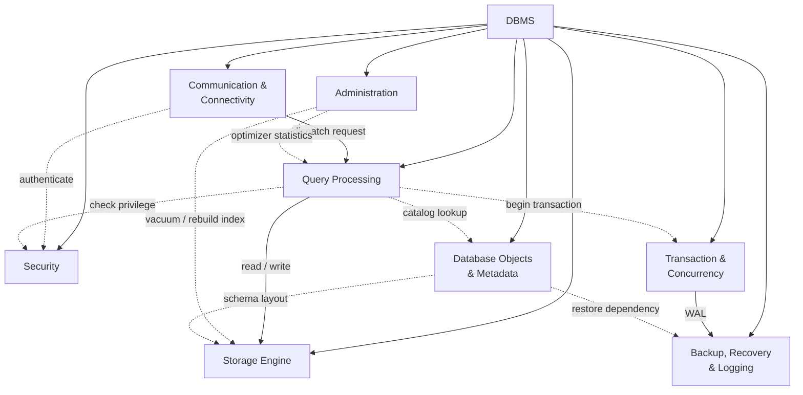

# DBMS High-Level Architecture (Flowchart)

> **Relationship legend**
>
> - **──▶** Main Association (gọi thường xuyên)
> - **-.-▶** Dependency (sử dụng tạm thời)
> - **DBMS → Module** : Ownership / Composition (ở mức kiến trúc)

@startuml
title DBMS High-Level Architecture

skinparam shadowing false
skinparam linetype ortho
skinparam packageStyle rectangle
skinparam defaultTextAlignment center
skinparam ArrowThickness 1.2

top to bottom direction

rectangle "DBMS" as DBMS

'==========================
' Layer 1
'==========================

together {
rectangle "Communication\n&\nConnectivity" as CC
rectangle "Security" as SEC
rectangle "Administration" as ADM
}

'==========================
' Layer 2
'==========================

rectangle "Query\nProcessing" as QP

'==========================
' Layer 3
'==========================

together {
rectangle "Transaction\n&\nConcurrency" as TX
rectangle "Backup,\nRecovery\n& Logging" as BR
}

'==========================
' Layer 4
'==========================

together {
rectangle "Storage\nEngine" as SE
rectangle "Database Objects\n& Metadata" as META
}

'------------------------------------
' Hidden links (force layout)
'------------------------------------

CC -[hidden]- SEC
SEC -[hidden]- ADM

TX -[hidden]- BR

SE -[hidden]- META

CC -[hidden]down- QP
QP -[hidden]down- TX
QP -[hidden]down- SE

'------------------------------------
' Composition
'------------------------------------

DBMS *-down- CC
DBMS *-down- SEC
DBMS *-down- ADM

DBMS *-down- QP

DBMS *-down- TX
DBMS *-down- BR

DBMS *-down- SE
DBMS *-down- META

'------------------------------------
' Main pipeline
'------------------------------------

CC --> QP : dispatch request

QP --> SE : read/write

TX --> BR : WAL

'------------------------------------
' Dependency
'------------------------------------

CC ..> SEC : authenticate

QP ..> SEC : check privilege

QP ..> TX : begin transaction

QP ..> META : catalog lookup

ADM ..> QP : optimizer statistics

ADM ..> SE : vacuum / rebuild index

META ..> SE : schema layout

META ..> BR : restore dependency

@enduml
