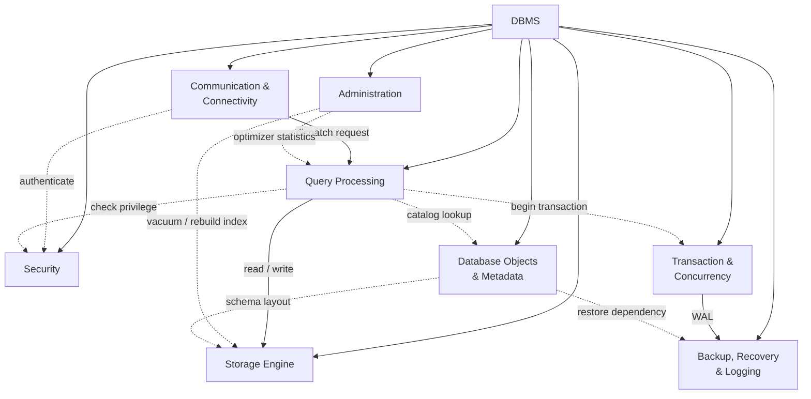
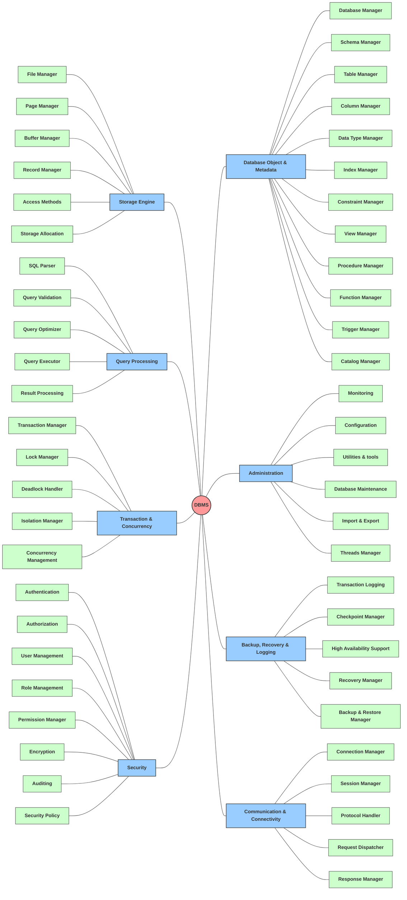

# DBMS High-Level Architecture (Flowchart)

> **Relationship legend**
>
> - **──▶** Main Association (gọi thường xuyên)
> - **-.-▶** Dependency (sử dụng tạm thời)
> - **DBMS → Module** : Ownership / Composition (ở mức kiến trúc)

