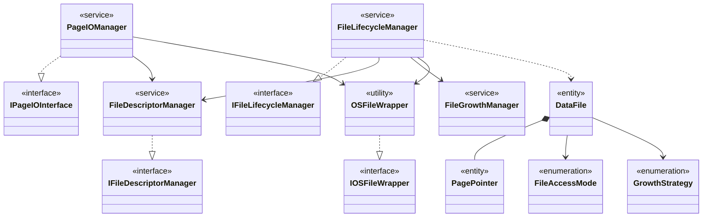

# High-Level Class Diagram: File Manager

This diagram illustrates the macro-architectural view specifically isolated for the **File Manager** subsystem.
*Note: Properties and Methods are intentionally hidden to explicitly feature dependencies, composition, and inheritance structures prior to establishing Sequence boundaries.*

---

## Component Roles & Relationships

### 1. Component Summary
| Component / Class | Type | Functionality / Role |
|---|---|---|
| `IFileLifecycleManager` | Interface | Contract defining lifecycle operations (create, open, delete) for database files. |
| `IPageIOInterface` | Interface | Contract for reading/writing raw blocks of bytes between RAM and disk. |
| `IFileDescriptorManager` | Interface | Contract managing operating system file handles securely. |
| `IOSFileWrapper` | Interface | Contract masking raw OS-level kernel system calls (e.g., POSIX `read`/`write`). |
| `FileAccessMode` | Enum | Defines file intent limits (Read-Only, Read-Write, Exclusive, Append). |
| `GrowthStrategy` | Enum | Defines expansion algorithms mathematically (e.g., Fixed Chunk, Exponential). |
| `DataFile` | Entity | Represents the logical state properties of an active relational storage file. |
| `PagePointer` | Entity | Maps logical limits mapping exact offset addresses within a specific `DataFile`. |
| `FileLifecycleManager` | Service | Main orchestrator managing the existence loop of files. Resolves boundaries avoiding conflicts. |
| `PageIOManager` | Service | Bypasses caching fetching block offsets mapping physical bytes safely to Memory blocks. |
| `FileDescriptorManager` | Service | Balances and tracks OS file pointer limits (saving File Descriptors dynamically). |
| `FileGrowthManager` | Service | Calculates required append sizes tracking metadata limits appending bytes logically. |
| `OSFileWrapper` | Utility | Translates generalized IO commands directly into hardware compatible kernel system calls. |

### 2. Relationship Mappings
| From | To | Relationship Type | Meaning / Purpose |
|---|---|---|---|
| `FileLifecycleManager` | `IFileLifecycleManager` | Realization (`..\|>`) | Fulfills the lifecycle interface logic. |
| `PageIOManager` | `IPageIOInterface` | Realization (`..\|>`) | Fulfills the page-block interface bounds. |
| `FileDescriptorManager` | `IFileDescriptorManager`| Realization (`..\|>`) | Implements the handle tracking pool bounds. |
| `OSFileWrapper` | `IOSFileWrapper` | Realization (`..\|>`) | Implements explicit low-level operational calls (Mockable). |
| `FileLifecycleManager` | `FileDescriptorManager` | Association (`-->`) | Registers or closes file pointers (`fd`) continuously during file operations. |
| `FileLifecycleManager` | `FileGrowthManager` | Association (`-->`) | Delegates physical expansion limit decisions to external rules engine. |
| `FileLifecycleManager` | `OSFileWrapper` | Association (`-->`) | Fires final physical kernel operations natively preventing locking. |
| `PageIOManager` | `FileDescriptorManager` | Association (`-->`) | Requires pulling active `fd` pointers before commencing block fetching. |
| `PageIOManager` | `OSFileWrapper` | Association (`-->`) | Triggers direct byte-array flushing operations bypassing unneeded logics. |
| `DataFile` | `PagePointer` | Composition (`*--`) | A data file structurally owns memory chunks represented via internal pointers. |
| `DataFile` | `FileAccessMode` | Association (`-->`) | Imposes restrictive reading rule bounds (Read/Write definitions). |
| `DataFile` | `GrowthStrategy` | Association (`-->`) | Utilizes static configuration strategies strictly bounding auto-growth logic. |
| `FileLifecycleManager` | `DataFile` | Dependency (`..>`) | Mutates object state initializing metadata inside logical entity instances. |
