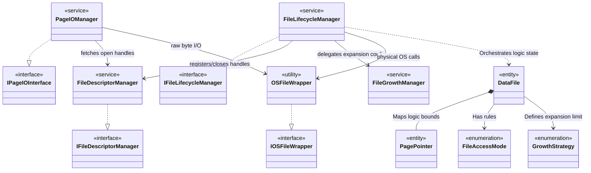

# High-Level Class Diagram: File Manager

This diagram illustrates the macro-architectural view specifically isolated for the **File Manager** subsystem.
*Note: Properties and Methods are intentionally hidden to explicitly feature dependencies, composition, and inheritance structures prior to establishing Sequence boundaries.*

