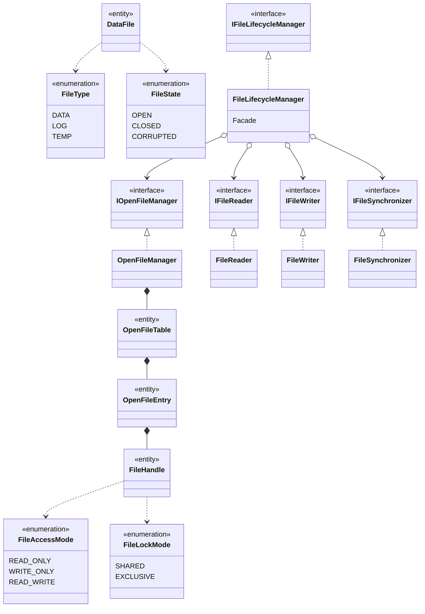

```mermaid

classDiagram
    direction TB

    %% ══════════════════════════════
    %% SUB-GROUP 1: FILE LIFECYCLE
    %% ══════════════════════════════
    class FileType {
        <<enumeration>>
        DATA
        LOG
        TEMP
    }
    class FileState {
        <<enumeration>>
        OPEN
        CLOSED
        CORRUPTED
    }
    class DataFile {
        <<entity>>
    }
    class IFileLifecycleManager {
        <<interface>>
    }
    class FileLifecycleManager {
        Facade
    }

    %% ══════════════════════════════
    %% SUB-GROUP 2: FILE OPEN/CLOSE
    %% ══════════════════════════════
    class FileAccessMode {
        <<enumeration>>
        READ_ONLY
        WRITE_ONLY
        READ_WRITE
    }
    class FileLockMode {
        <<enumeration>>
        SHARED
        EXCLUSIVE
    }
    class FileHandle {
        <<entity>>
    }
    class OpenFileEntry {
        <<entity>>
    }
    class OpenFileTable {
        <<entity>>
    }
    class IOpenFileManager {
        <<interface>>
    }
    class OpenFileManager

    %% ══════════════════════════════
    %% SUB-GROUP 3: DATA READ/WRITE
    %% ══════════════════════════════
    class IFileReader {
        <<interface>>
    }
    class IFileWriter {
        <<interface>>
    }
    class FileReader
    class FileWriter

    %% ══════════════════════════════
    %% SUB-GROUP 4: DISK SYNC
    %% ══════════════════════════════
    class IFileSynchronizer {
        <<interface>>
    }
    class FileSynchronizer

    %% ── REALIZATIONS ──
    IFileLifecycleManager <|.. FileLifecycleManager
    IOpenFileManager      <|.. OpenFileManager
    IFileReader           <|.. FileReader
    IFileWriter           <|.. FileWriter
    IFileSynchronizer     <|.. FileSynchronizer

    %% ── FACADE (cross-group dependencies) ──
    FileLifecycleManager o--> IOpenFileManager
    FileLifecycleManager o--> IFileReader
    FileLifecycleManager o--> IFileWriter
    FileLifecycleManager o--> IFileSynchronizer

    %% ── ENTITY COMPOSITION ──
    OpenFileManager *-- OpenFileTable
    OpenFileTable   *-- OpenFileEntry
    OpenFileEntry   *-- FileHandle

    %% ── ENUM USAGE ──
    DataFile   ..> FileType
    DataFile   ..> FileState
    FileHandle ..> FileAccessMode
    FileHandle ..> FileLockMode
```
