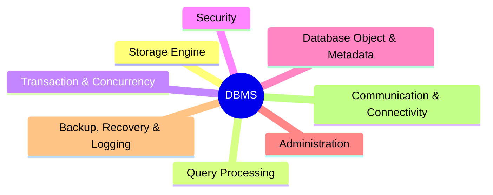
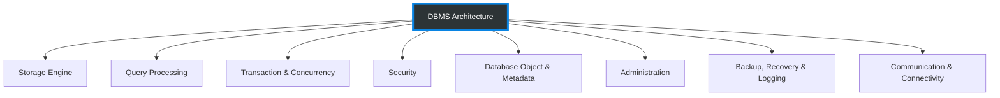

# DBMS Layer 1: Architecture Overview

This document provides a high-level overview of the DBMS architecture. The system is decomposed into 8 core global domains.

## Mindmap Representation

The quickest way to grasp the scale of the system.

## Flowchart Representation

A top-down structure representing dependency resolution.

