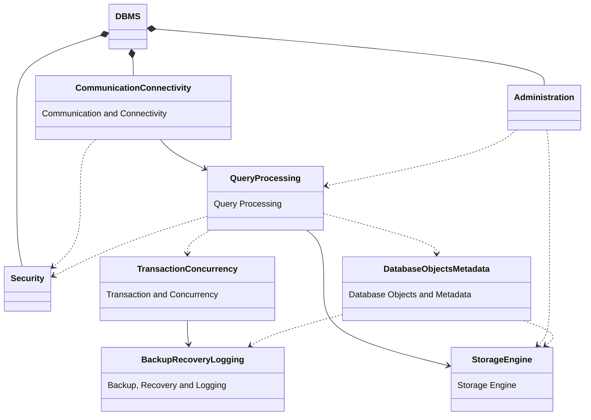

# Class Diagram Level 1 — DBMS High-Level Architecture

This diagram illustrates the **8 core modules** and their high-level architectural relationships.

> **Relationship legend:**
> - `*--` Composition (DBMS owns the module)
> - `-->` Association (regular interaction)
> - `..>` Dependency (temporary utilization)

---

---

## Relationship Summary

| From | To | Type | Meaning / Purpose |
|---|---|---|---|
| `DBMS` | `Communication & Connectivity` | Composition | The DBMS inherently owns the module. |
| `DBMS` | `Security` | Composition | The DBMS inherently owns the module. |
| `DBMS` | `Administration` | Composition | The DBMS inherently owns the module. |
| `Communication & Connectivity` | `Query Processing` | Association | Dispatches payload; acts as the entry point of all requests. |
| `Communication & Connectivity` | `Security` | Dependency | Requests authentication verification upon connection establishment. |
| `Query Processing` | `Security` | Dependency | Checks access privileges and resource permissions dynamically. |
| `Query Processing` | `Transaction & Concurrency` | Dependency | Acquires logical locks and requests MVCC snapshot reading limits. |
| `Query Processing` | `Storage Engine` | Association | Executes the physical read/write operations against storage units. |
| `Query Processing` | `Database Objects & Metadata` | Dependency | Looks up schema catalogs, configuration variables, and statistics. |
| `Transaction & Concurrency` | `Backup, Recovery & Logging` | Association | Synchronously flushes WAL logs prior to persistence mutations. |
| `Administration` | `Query Processing` | Dependency | Serves execution statistics and metrics profiling to the optimizer. |
| `Administration` | `Storage Engine` | Dependency | Issues hardware-level commands (vacuuming, index rebuilding). |
| `Database Objects & Metadata` | `Storage Engine` | Dependency | Translates semantic schema layouts defining record formatting limits. |
| `Database Objects & Metadata` | `Backup, Recovery & Logging` | Dependency | Preserves structural dependency mappings during point-in-time restores. |
