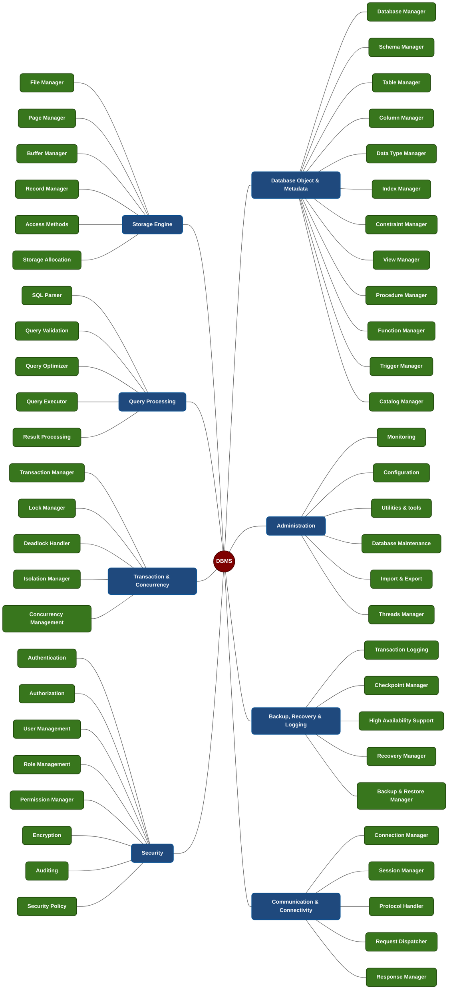

# DBMS Layer 2: Functional Breakdown

This document illustrates the Layer-2 subsystem breakdown for each of the core 8 systems in the DBMS, structured in a symmetrical topology.

## Layer 2 Modules Explanatory Table

Layer 2 represents the first functional decomposition level branching from the core domains (Layer 1). Each Layer 1 branch is split into smaller component modules (Layer 2) to strictly establish functional and domain boundaries:

| Category | Subsystem (Layer 1) | Functionality (Layer 2 Modules) |
|---|---|---|
| **Core Engine** | **Storage Engine** | Decomposed into 6 specialized modules responsible for: disk interaction, buffer pool management, physical file & page structure formatting, space optimization, and access path allocation (records, index modeling). |
| | **Query Processing** | Decomposed horizontally following the SQL Pipeline lifecycle: raw syntax parsing (Parser), semantics validation (Validation), physical disk-read planning (Optimizer), query physical execution (Executor), and response payload packaging (Result Processing). |
| | **Transaction & Concurrency** | Fully manages the ACID infrastructure: sustaining active transaction states (Transaction Manager), handling conflict-resolution locks (Lock Manager), monitoring cyclic deadlocks (Deadlock Handler), and managing concurrent multi-version histories (MVCC/Isolation). |
| | **Security** | Focuses entirely on security mechanisms: identity verification (Authentication), resource-level rules access (Authorization), permanent disk encryption (Encryption), and historical behavior tracking (Auditing). |
| **Management** | **Database Object & Metadata** | Manages the systemic lifecycle of all logical structures created by end-users (Schema, Table, Column, Index, View, etc.). Acts as the centralized Data Dictionary. |
| | **Administration** | Provides essential utilities for privileged operators (DBAs): monitoring system health and states, flexibly adjusting configuration parameters at runtime, and executing import/export operations. |
| | **Backup, Recovery & Logging** | Distributes and isolates recovery workflows: writing immediate execution data to log files (Transaction WAL) for software crash recovery, and creating storage snapshots (Backup Manager) to safeguard against hardware storage failures. |
| | **Communication & Connectivity** | Acts as the external interface adapter: routing inbound TCP ports (Connection), managing live connections (Session Manager), and decoding stream packets (Protocol Handler) before forwarding the structural payloads directly into the Core Engine. |
