# DBMS Layer 3: Component Deep-dive

This document presents a **fully unified Layer-3 operational breakdown** for all 8 core subsystems of the DBMS.

> **Visualization Note:** Integrating 150+ operational components into a standard flowchart (`graph LR` or `TD`) leads to severe line-crossing (spaghetti). To satisfy the requirement of achieving a **single overarching diagram**, we uniquely utilize the **Mermaid Mindmap** structure. The Mindmap algorithm radially balances 8 subsystems around the DBMS Root, offering a flawless, single-view diagram without any tangled overlapping lines.

```mermaid
mindmap
  root((DBMS Layer 3))
    Storage Engine
      File Manager
        OS File Wrapper
        Data File Registry
        File Descriptor Manager
        File Growth Manager
      Page Manager
        Page Formatter
        Page Header Manager
        Slot Directory Manager
        Free Space Manager
        Page IO Interface
      Buffer Manager
        Buffer Frame Manager
        Page Replacement Policy
        Dirty Page Writer
        Prefetch Manager
      Record Manager
        Record Layout Manager
        RID Generator
        Variable Length Data Manager
        Large Object Manager
      Access Methods
        B Tree Manager
        Hash Index Manager
        Index State Manager
        Index Maintenance
      Storage Allocation
        Extent Manager
        Segment Manager
        Tablespace Manager
        Space Reclamation
    Query Processing
      SQL Parser
        Lexical Analyzer
        Syntax Analyzer
        AST Builder
        Error Reporter
      Query Validation
        Semantic Validator
        Catalog Metadata Lookup
        Privilege Checker
        Constraint Validator
      Query Optimizer
        Logical Plan Generator
        Rule Based Optimizer
        Cost Based Optimizer
        Physical Plan Generator
        Plan Cache Manager
      Query Execution
        Operator Engine
        Pipeline Manager
        Expression Evaluator
        Resource Manager
      Result Processing
        Result Set Builder
        Data Converter
        Cursor Pagination Manager
        Output Buffer
    Transaction and Concurrency
      Transaction Manager
        Transaction Lifecycle
        Transaction ID Generator
        Savepoint Manager
        Transaction Table
      Lock Manager
        Lock Table
        Lock Compatibility Matrix
        Lock Escalation Manager
        Two Phase Locking
      Deadlock Handler
        Deadlock Detector
        Victim Selector
        Deadlock Prevention
      Isolation Manager
        Isolation Level Controller
        Snapshot Manager
        Phantom Protection
      Concurrency Management
        MVCC Engine
        Version Store
        Version Chain Manager
        Visibility Checker
        Garbage Collector
    Database Object and Metadata
      Database Manager
        Database Lifecycle
        Database State Manager
        Database Configuration
        Database Validator
      Schema Manager
        Schema Lifecycle
        Schema Ownership
        Object Namespace
      Table Manager
        Table Lifecycle
        Table Definition
        Partition Manager
      Column Manager
        Column Lifecycle
        Default Value Manager
        Identity Manager
        Computed Column Manager
        Nullability Manager
      Data Type Manager
        Built in Type Registry
        User defined Type Manager
        Type Conversion Manager
        Type Validator
        Collation Management
      Index Manager
        Index Lifecycle
        Index Definition
        Index Type Manager
        Index Dependency Tracker
      Constraint Manager
        Primary Key Manager
        Foreign Key Manager
        Unique Constraint Manager
        Check Constraint Manager
        Constraint Validator
      View Manager
        View Lifecycle
        View Definition Storage
        View Resolver
        Updatable View Manager
        Indexed View
      Programmable Objects
        Stored Procedure Manager
        Function Manager
        Trigger Manager
        Parameter Manager
        Routine Catalog
      Catalog Manager
        System Table Manager
        Metadata Reader
        Metadata Writer
        Dependency Tracker
        Metadata Cache
        Object Identifier
        Catalog Versioning
    Security
      Authentication
        Credential Validator
        Authentication Protocol
        Login Manager
        Password Policy Enforcer
      Authorization
        Permission Resolver
        Privilege Evaluator
        Grant Revoke Manager
        Policy Decision Engine
      Access Control
        RBAC Policy Evaluator
        Row level Security Filter
        Column level Security Masker
        Object Permission Checker
      User Management
        User Catalog
        Role Catalog
        Role Hierarchy Resolver
        Account Lifecycle Manager
      Encryption
        Transparent Data Encryption
        Transport Encryption
        Key Management
        Column Level Encryption
      Auditing
        Audit Log Writer
        Audit Rule Engine
        Audit Trail Manager
    Administration
      Monitoring
        Performance Metrics Collector
        Slow Query Profiler
        System Event Logger
        Active Session Monitor
      Configuration
        Config Parameters Registry
        Dynamic Parameter Reloader
        Engine Options Manager
      Utilities and tools
        DBCC Engine
        Resource Governor
        Database CLI Tool
      Database Maintenance
        Statistics Collector
        Database Page Verifier
        Index Maintenance Agent
        Auto Vacuum Agent
      Import Export
        Bulk COPY Loader
        CSV JSON Importer
        Binary Importer
        Logical Dump Utility
        Data Export Manager
      Threads Pool Manager
        Thread Pool Controller
        Task Scheduler
        Worker Thread Pool
    Backup Recovery and Logging
      Transaction Logging
        WAL Manager
        WAL Writer
        WAL Buffer
        LSN Generator
        Log Segment Manager
        Log Archive Manager
      Checkpoint Manager
        Checkpointer Daemon
        Fuzzy Checkpoint Controller
        Dirty Page Flush Coordinator
        Checkpoint Metadata Manager
      High Availability Support
        Replication Log Sender
        Replication Log Receiver
        Replication Log Applier
        Replication Coordinator
        Synchronization Manager
      Recovery Manager
        Crash Recovery Manager
        Point in Time Recovery Engine
        Recovery Coordinator
      Backup and Restore Manager
        Full Backup Manager
        Incremental Backup Engine
        Physical Hot Backup Manager
        Backup Metadata Catalog
        Restore Planner
        File Restorer
        Restore Validator
    Communication and Connectivity
      Connection Manager
        Connection Listener
        Connection Pooler
        Connection Limiter
      Session Manager
        Session Lifecycle Controller
        Session Context Store
        Session Timeout Manager
      Protocol Handler
        Stream Packet Parser
        Data Packet Serializer
        SSL TLS Handshake Handler
      Request Dispatcher
        Request Queue Manager
        Command Router
        Thread Assigner
      Response Manager
        Response Formatter
        Network Buffer Writer
        Response Stream Writer
```

