# DBMS Layer 3: Component Deep-dive

This flowchart focuses on Layer-3 breakdown for all core systems. It is visualized with a symmetrical topology mapping from root context out to specific granular components.

```mermaid
graph LR
    %% Styles & Colors
    classDef default fill:#f9f9f9,stroke:#333,stroke-width:1px;
    classDef root fill:#ff9999,stroke:#333,stroke-width:2px,font-weight:bold;
    classDef layer1 fill:#99ccff,stroke:#333,stroke-width:1.5px,font-weight:bold;
    classDef layer2 fill:#ccffcc,stroke:#333,stroke-width:1px;
    classDef layer3 fill:#fff3cd,stroke:#aaa,stroke-width:1px;

    %% Root
    db((DBMS)):::root

    %% ==========================================
    %% LEFT SIDE
    %% ==========================================
    se[Storage Engine]:::layer1
    qp[Query Processing]:::layer1
    tc[Transaction & Concurrency]:::layer1
    sc[Security]:::layer1

    se --- db
    qp --- db
    tc --- db
    sc --- db

    %% --------------------------------
    %% 1. STORAGE ENGINE
    %% --------------------------------
    se_fm[File Manager]:::layer2 --- se
    se_pm[Page Manager]:::layer2 --- se
    se_bm[Buffer Manager]:::layer2 --- se
    se_rm[Record Manager]:::layer2 --- se
    se_am[Access Methods]:::layer2 --- se
    se_sa[Storage Allocation]:::layer2 --- se

    %% File Manager → L3
    se_fm_1[OS File Wrapper]:::layer3 --- se_fm
    se_fm_2[Data File Registry]:::layer3 --- se_fm
    se_fm_3[File Descriptor Manager]:::layer3 --- se_fm
    se_fm_4[File Growth Manager]:::layer3 --- se_fm

    %% Page Manager → L3
    se_pm_1[Page Formatter]:::layer3 --- se_pm
    se_pm_2[Page Header Manager]:::layer3 --- se_pm
    se_pm_3[Slot Directory Manager]:::layer3 --- se_pm
    se_pm_4[Free Space Manager]:::layer3 --- se_pm
    se_pm_5[Page I/O Interface]:::layer3 --- se_pm

    %% Buffer Manager → L3
    se_bm_1[Buffer Frame Manager]:::layer3 --- se_bm
    se_bm_2[Page Replacement Policy]:::layer3 --- se_bm
    se_bm_3[Dirty Page Writer]:::layer3 --- se_bm
    se_bm_4[Prefetch Manager]:::layer3 --- se_bm

    %% Record Manager → L3
    se_rm_1[Record Layout Manager]:::layer3 --- se_rm
    se_rm_2[RID Generator]:::layer3 --- se_rm
    se_rm_3[Variable-Length Data Manager]:::layer3 --- se_rm
    se_rm_4[Large Object Manager]:::layer3 --- se_rm

    %% Access Methods → L3
    se_am_1[B+Tree Manager]:::layer3 --- se_am
    se_am_2[Hash Index Manager]:::layer3 --- se_am
    se_am_3[Index State Manager]:::layer3 --- se_am
    se_am_4[Index Maintenance]:::layer3 --- se_am

    %% Storage Allocation → L3
    se_sa_1[Extent Manager]:::layer3 --- se_sa
    se_sa_2[Segment Manager]:::layer3 --- se_sa
    se_sa_3[Tablespace Manager]:::layer3 --- se_sa
    se_sa_4[Space Reclamation]:::layer3 --- se_sa

    %% --------------------------------
    %% 2. QUERY PROCESSING
    %% --------------------------------
    qp_sp[SQL Parser]:::layer2 --- qp
    qp_qv[Query Validation]:::layer2 --- qp
    qp_qo[Query Optimizer]:::layer2 --- qp
    qp_qe[Query Executor]:::layer2 --- qp
    qp_rp[Result Processing]:::layer2 --- qp

    %% SQL Parser → L3
    qp_sp_1[Lexical Analyzer]:::layer3 --- qp_sp
    qp_sp_2[Syntax Analyzer]:::layer3 --- qp_sp
    qp_sp_3[AST Builder]:::layer3 --- qp_sp
    qp_sp_4[Error Reporter]:::layer3 --- qp_sp

    %% Query Validation → L3
    qp_qv_1[Semantic Validator]:::layer3 --- qp_qv
    qp_qv_2[Catalog & Metadata Lookup]:::layer3 --- qp_qv
    qp_qv_3[Privilege Checker]:::layer3 --- qp_qv
    qp_qv_4[Constraint Validator]:::layer3 --- qp_qv

    %% Query Optimizer → L3
    qp_qo_1[Logical Plan Generator]:::layer3 --- qp_qo
    qp_qo_2[Rule-Based Optimizer]:::layer3 --- qp_qo
    qp_qo_3[Cost-Based Optimizer]:::layer3 --- qp_qo
    qp_qo_4[Physical Plan Generator]:::layer3 --- qp_qo
    qp_qo_5[Plan Cache Manager]:::layer3 --- qp_qo

    %% Query Executor → L3
    qp_qe_1[Operator Engine]:::layer3 --- qp_qe
    qp_qe_2[Pipeline Manager]:::layer3 --- qp_qe
    qp_qe_3[Expression Evaluator]:::layer3 --- qp_qe
    qp_qe_4[Resource Manager]:::layer3 --- qp_qe

    %% Result Processing → L3
    qp_rp_1[Result Set Builder]:::layer3 --- qp_rp
    qp_rp_2[Data Converter]:::layer3 --- qp_rp
    qp_rp_3[Cursor Manager]:::layer3 --- qp_rp
    qp_rp_4[Pagination Manager]:::layer3 --- qp_rp
    qp_rp_5[Output Buffer]:::layer3 --- qp_rp

    %% --------------------------------
    %% 3. TRANSACTION & CONCURRENCY
    %% --------------------------------
    tc_tm[Transaction Manager]:::layer2 --- tc
    tc_lm[Lock Manager]:::layer2 --- tc
    tc_dh[Deadlock Handler]:::layer2 --- tc
    tc_im[Isolation Manager]:::layer2 --- tc
    tc_cm[Concurrency Management]:::layer2 --- tc

    %% Transaction Manager -> L3
    tc_tm_1[Transaction Lifecycle]:::layer3 --- tc_tm
    tc_tm_2[Transaction ID Generator]:::layer3 --- tc_tm
    tc_tm_3[Savepoint Manager]:::layer3 --- tc_tm
    tc_tm_4[Transaction Table]:::layer3 --- tc_tm

    %% Lock Manager -> L3
    tc_lm_1[Lock Table]:::layer3 --- tc_lm
    tc_lm_2[Lock Compatibility Matrix]:::layer3 --- tc_lm
    tc_lm_3[Lock Escalation Manager]:::layer3 --- tc_lm
    tc_lm_4[Two-Phase Locking]:::layer3 --- tc_lm

    %% Deadlock Handler -> L3
    tc_dh_1[Deadlock Detector]:::layer3 --- tc_dh
    tc_dh_2[Victim Selector]:::layer3 --- tc_dh
    tc_dh_3[Deadlock Prevention]:::layer3 --- tc_dh

    %% Isolation Manager -> L3
    tc_im_1[Isolation Level Controller]:::layer3 --- tc_im
    tc_im_2[Snapshot Manager]:::layer3 --- tc_im
    tc_im_3[Phantom Protection]:::layer3 --- tc_im

    %% Concurrency Management -> L3
    tc_cm_1[MVCC Engine]:::layer3 --- tc_cm
    tc_cm_2[Version Store]:::layer3 --- tc_cm
    tc_cm_3[Version Chain Manager]:::layer3 --- tc_cm
    tc_cm_4[Visibility Checker]:::layer3 --- tc_cm
    tc_cm_5[Garbage Collector]:::layer3 --- tc_cm

    %% --------------------------------
    %% 5. SECURITY
    %% --------------------------------
    sc_at[Authentication]:::layer2 --- sc
    sc_az[Authorization]:::layer2 --- sc
    sc_ac[Access Control]:::layer2 --- sc
    sc_um[User Management]:::layer2 --- sc
    sc_ec[Encryption]:::layer2 --- sc
    sc_ad[Auditing]:::layer2 --- sc

    %% Authentication -> L3
    sc_at_1[Credential Validator]:::layer3 --- sc_at
    sc_at_2[Authentication Protocol]:::layer3 --- sc_at
    sc_at_3[Login Manager]:::layer3 --- sc_at
    sc_at_4[Password Policy Enforcer]:::layer3 --- sc_at

    %% Authorization -> L3
    sc_az_1[Permission Resolver]:::layer3 --- sc_az
    sc_az_2[Privilege Evaluator]:::layer3 --- sc_az
    sc_az_3[Grant & Revoke Manager]:::layer3 --- sc_az
    sc_az_4[Policy Decision Engine]:::layer3 --- sc_az

    %% Access Control -> L3
    sc_ac_1[RBAC Policy Evaluator]:::layer3 --- sc_ac
    sc_ac_2[Row-level Security Filter]:::layer3 --- sc_ac
    sc_ac_3[Column-level Security Masker]:::layer3 --- sc_ac
    sc_ac_4[Object Permission Checker]:::layer3 --- sc_ac

    %% User Management -> L3
    sc_um_1[User Catalog]:::layer3 --- sc_um
    sc_um_2[Role Catalog]:::layer3 --- sc_um
    sc_um_3[Role Hierarchy Resolver]:::layer3 --- sc_um
    sc_um_4[Account Lifecycle Manager]:::layer3 --- sc_um

    %% Encryption -> L3
    sc_ec_1[Transparent Data Encryption]:::layer3 --- sc_ec
    sc_ec_2[Transport Encryption]:::layer3 --- sc_ec
    sc_ec_3[Key Management]:::layer3 --- sc_ec
    sc_ec_4[Column-Level Encryption]:::layer3 --- sc_ec

    %% Auditing -> L3
    sc_ad_1[Audit Log Writer]:::layer3 --- sc_ad
    sc_ad_2[Audit Rule Engine]:::layer3 --- sc_ad
    sc_ad_3[Audit Trail Manager]:::layer3 --- sc_ad

    %% ==========================================
    %% RIGHT SIDE
    %% ==========================================
    dom[Database Object & Metadata]:::layer1
    adm[Administration]:::layer1
    brl[Backup, Recovery & Logging]:::layer1
    cc[Communication & Connectivity]:::layer1

    db --- dom
    db --- adm
    db --- brl
    db --- cc

    %% --------------------------------
    %% 4. DATABASE OBJECT & METADATA
    %% --------------------------------
    dom --- dom_db[Database Manager]:::layer2
    dom --- dom_sc[Schema Manager]:::layer2
    dom --- dom_tb[Table Manager]:::layer2
    dom --- dom_cl[Column Manager]:::layer2
    dom --- dom_dt[Data Type Manager]:::layer2
    dom --- dom_id[Index Manager]:::layer2
    dom --- dom_cs[Constraint Manager]:::layer2
    dom --- dom_vw[View Manager]:::layer2
    dom --- dom_pr[Programmable Objects]:::layer2
    dom --- dom_ct[Catalog Manager]:::layer2

    %% Database Manager -> L3
    dom_db_1[Database Lifecycle]:::layer3 --- dom_db
    dom_db_2[Database State Manager]:::layer3 --- dom_db
    dom_db_3[Database Configuration]:::layer3 --- dom_db
    dom_db_4[Database Validator]:::layer3 --- dom_db

    %% Schema Manager -> L3
    dom_sc_1[Schema Lifecycle]:::layer3 --- dom_sc
    dom_sc_2[Schema Ownership]:::layer3 --- dom_sc
    dom_sc_3[Object Namespace]:::layer3 --- dom_sc

    %% Table Manager -> L3
    dom_tb_1[Table Lifecycle]:::layer3 --- dom_tb
    dom_tb_2[Table Definition]:::layer3 --- dom_tb
    dom_tb_3[Partition Manager]:::layer3 --- dom_tb

    %% Column Manager -> L3
    dom_cl_1[Column Lifecycle]:::layer3 --- dom_cl
    dom_cl_2[Default Value Manager]:::layer3 --- dom_cl
    dom_cl_3[Identity Manager]:::layer3 --- dom_cl
    dom_cl_4[Computed Column Manager]:::layer3 --- dom_cl
    dom_cl_5[Nullability Manager]:::layer3 --- dom_cl

    %% Data Type Manager -> L3
    dom_dt_1[Built-in Type Registry]:::layer3 --- dom_dt
    dom_dt_2[User-defined Type Manager]:::layer3 --- dom_dt
    dom_dt_3[Type Conversion Manager]:::layer3 --- dom_dt
    dom_dt_4[Type Validator]:::layer3 --- dom_dt
    dom_dt_5[Collation Management]:::layer3 --- dom_dt

    %% Index Manager -> L3
    dom_id_1[Index Lifecycle]:::layer3 --- dom_id
    dom_id_2[Index Definition]:::layer3 --- dom_id
    dom_id_3[Index Type Manager]:::layer3 --- dom_id
    dom_id_4[Index Dependency Tracker]:::layer3 --- dom_id

    %% Constraint Manager -> L3
    dom_cs_1[Primary Key Manager]:::layer3 --- dom_cs
    dom_cs_2[Foreign Key Manager]:::layer3 --- dom_cs
    dom_cs_3[Unique Constraint Manager]:::layer3 --- dom_cs
    dom_cs_4[Check Constraint Manager]:::layer3 --- dom_cs
    dom_cs_5[Constraint Validator]:::layer3 --- dom_cs

    %% View Manager -> L3
    dom_vw_1[View Lifecycle]:::layer3 --- dom_vw
    dom_vw_2[View Definition Storage]:::layer3 --- dom_vw
    dom_vw_3[View Resolver]:::layer3 --- dom_vw
    dom_vw_4[Updatable View Manager]:::layer3 --- dom_vw
    dom_vw_5[Indexed View]:::layer3 --- dom_vw

    %% Programmable Objects -> L3
    dom_pr_1[Stored Procedure Manager]:::layer3 --- dom_pr
    dom_pr_2[Function Manager]:::layer3 --- dom_pr
    dom_pr_3[Trigger Manager]:::layer3 --- dom_pr
    dom_pr_4[Parameter Manager]:::layer3 --- dom_pr
    dom_pr_5[Routine Catalog]:::layer3 --- dom_pr

    %% Catalog Manager -> L3
    dom_ct_1[System Table Manager]:::layer3 --- dom_ct
    dom_ct_2[Metadata Reader]:::layer3 --- dom_ct
    dom_ct_3[Metadata Writer]:::layer3 --- dom_ct
    dom_ct_4[Dependency Tracker]:::layer3 --- dom_ct
    dom_ct_5[Metadata Cache]:::layer3 --- dom_ct
    dom_ct_6[Object Identifier]:::layer3 --- dom_ct
    dom_ct_7[Catalog Versioning]:::layer3 --- dom_ct

    %% --------------------------------
    %% 6. ADMINISTRATION
    %% --------------------------------
    adm --- adm_mn[Monitoring]:::layer2
    adm --- adm_cf[Configuration]:::layer2
    adm --- adm_ut[Utilities & tools]:::layer2
    adm --- adm_dm[Database Maintenance]:::layer2
    adm --- adm_ie[Import & Export]:::layer2
    adm --- adm_tm[Threads Pool Manager]:::layer2

    %% Monitoring -> L3
    adm_mn_1[Performance Metrics Collector]:::layer3 --- adm_mn
    adm_mn_2[Slow Query Profiler]:::layer3 --- adm_mn
    adm_mn_3[System Event Logger]:::layer3 --- adm_mn
    adm_mn_4[Active Session Monitor]:::layer3 --- adm_mn

    %% Configuration -> L3
    adm_cf_1[Config Parameters Registry]:::layer3 --- adm_cf
    adm_cf_2[Dynamic Parameter Reloader]:::layer3 --- adm_cf
    adm_cf_3[Engine Options Manager]:::layer3 --- adm_cf

    %% Utilities & tools -> L3
    adm_ut_1[DBCC Engine]:::layer3 --- adm_ut
    adm_ut_2[Resource Governor]:::layer3 --- adm_ut
    adm_ut_3[Database CLI Tool]:::layer3 --- adm_ut

    %% Database Maintenance -> L3
    adm_dm_1[Statistics Collector]:::layer3 --- adm_dm
    adm_dm_2[Database Page Verifier]:::layer3 --- adm_dm
    adm_dm_3[Index Maintenance Agent]:::layer3 --- adm_dm
    adm_dm_4[Auto Vacuum Agent]:::layer3 --- adm_dm

    %% Import & Export -> L3
    adm_ie_1[Bulk COPY Loader]:::layer3 --- adm_ie
    adm_ie_2[CSV/JSON Importer]:::layer3 --- adm_ie
    adm_ie_3[Binary Importer]:::layer3 --- adm_ie
    adm_ie_4[Logical Dump Utility]:::layer3 --- adm_ie
    adm_ie_5[Data Export Manager]:::layer3 --- adm_ie

    %% Threads Pool Manager -> L3
    adm_tm_1[Thread Pool Controller]:::layer3 --- adm_tm
    adm_tm_2[Task Scheduler]:::layer3 --- adm_tm
    adm_tm_3[Worker Thread Pool]:::layer3 --- adm_tm

    %% --------------------------------
    %% 7. BACKUP, RECOVERY & LOGGING
    %% --------------------------------
    brl --- brl_tl[Transaction Logging]:::layer2
    brl --- brl_cm[Checkpoint Manager]:::layer2
    brl --- brl_ha[High Availability Support]:::layer2
    brl --- brl_rm[Recovery Manager]:::layer2
    brl --- brl_br[Backup & Restore Manager]:::layer2

    %% Transaction Logging -> L3
    brl_tl_1[WAL Manager]:::layer3 --- brl_tl
    brl_tl_2[WAL Writer]:::layer3 --- brl_tl
    brl_tl_3[WAL Buffer]:::layer3 --- brl_tl
    brl_tl_4[LSN Generator]:::layer3 --- brl_tl
    brl_tl_5[Log Segment Manager]:::layer3 --- brl_tl
    brl_tl_6[Log Archive Manager]:::layer3 --- brl_tl

    %% Checkpoint Manager -> L3
    brl_cm_1[Checkpointer Daemon]:::layer3 --- brl_cm
    brl_cm_2[Fuzzy Checkpoint Controller]:::layer3 --- brl_cm
    brl_cm_3[Dirty Page Flush Coordinator]:::layer3 --- brl_cm
    brl_cm_4[Checkpoint Metadata Manager]:::layer3 --- brl_cm

    %% High Availability Support -> L3
    brl_ha_1[Replication Log Sender]:::layer3 --- brl_ha
    brl_ha_2[Replication Log Receiver]:::layer3 --- brl_ha
    brl_ha_3[Replication Log Applier]:::layer3 --- brl_ha
    brl_ha_4[Replication Coordinator]:::layer3 --- brl_ha
    brl_ha_5[Synchronization Manager]:::layer3 --- brl_ha

    %% Recovery Manager -> L3
    brl_rm_1[Crash Recovery Manager]:::layer3 --- brl_rm
    brl_rm_2[Point-in-Time Recovery Engine]:::layer3 --- brl_rm
    brl_rm_3[Recovery Coordinator]:::layer3 --- brl_rm

    %% Backup & Restore Manager -> L3
    brl_br_1[Full Backup Manager]:::layer3 --- brl_br
    brl_br_2[Incremental Backup Engine]:::layer3 --- brl_br
    brl_br_3[Physical Hot Backup Manager]:::layer3 --- brl_br
    brl_br_4[Backup Metadata Catalog]:::layer3 --- brl_br
    brl_br_5[Restore Planner]:::layer3 --- brl_br
    brl_br_6[File Restorer]:::layer3 --- brl_br
    brl_br_7[Restore Validator]:::layer3 --- brl_br

    %% --------------------------------
    %% 8. COMMUNICATION & CONNECTIVITY
    %% --------------------------------
    cc --- cc_cm[Connection Manager]:::layer2
    cc --- cc_sm[Session Manager]:::layer2
    cc --- cc_ph[Protocol Handler]:::layer2
    cc --- cc_rd[Request Dispatcher]:::layer2
    cc --- cc_rm[Response Manager]:::layer2

    %% Connection Manager -> L3
    cc_cm_1[Connection Listener]:::layer3 --- cc_cm
    cc_cm_2[Connection Pooler]:::layer3 --- cc_cm
    cc_cm_3[Connection Limiter]:::layer3 --- cc_cm

    %% Session Manager -> L3
    cc_sm_1[Session Lifecycle Controller]:::layer3 --- cc_sm
    cc_sm_2[Session Context Store]:::layer3 --- cc_sm
    cc_sm_3[Session Timeout Manager]:::layer3 --- cc_sm

    %% Protocol Handler -> L3
    cc_ph_1[Stream Packet Parser]:::layer3 --- cc_ph
    cc_ph_2[Data Packet Serializer]:::layer3 --- cc_ph
    cc_ph_3[SSL/TLS Handshake Handler]:::layer3 --- cc_ph

    %% Request Dispatcher -> L3
    cc_rd_1[Request Queue Manager]:::layer3 --- cc_rd
    cc_rd_2[Command Router]:::layer3 --- cc_rd
    cc_rd_3[Thread Assigner]:::layer3 --- cc_rd

    %% Response Manager -> L3
    cc_rm_1[Response Formatter]:::layer3 --- cc_rm
    cc_rm_2[Network Buffer Writer]:::layer3 --- cc_rm
    cc_rm_3[Response Stream Writer]:::layer3 --- cc_rm
```

