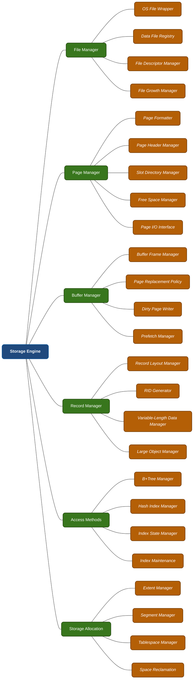
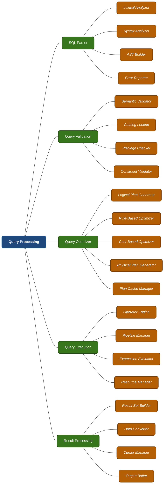
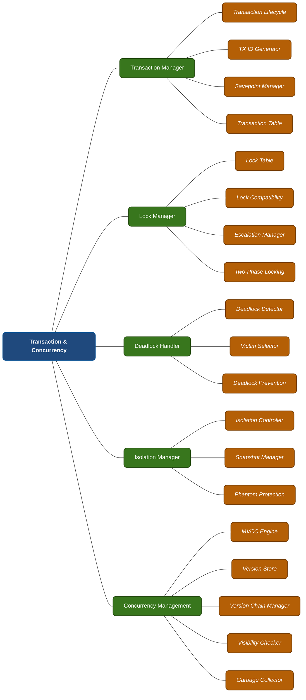
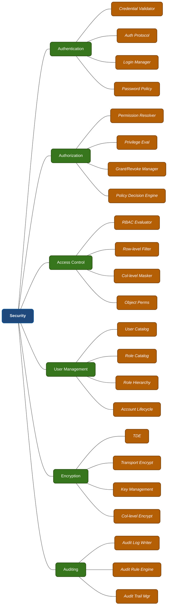
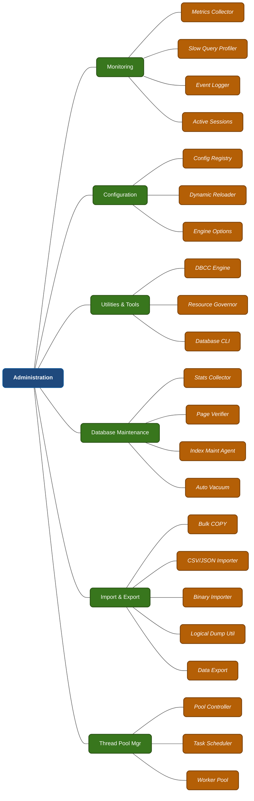
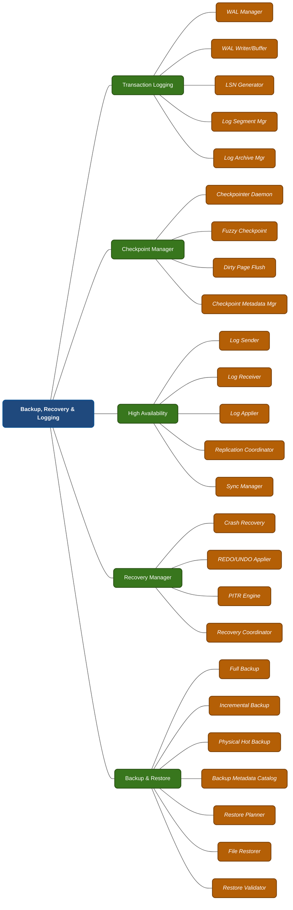
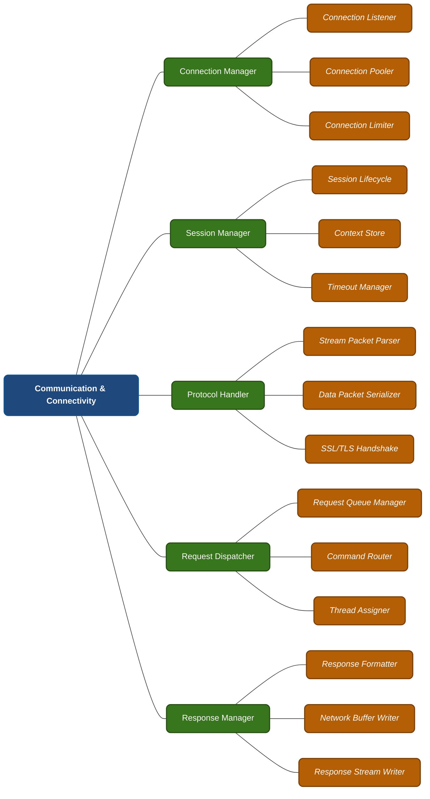

# DBMS Layer 3: Component Deep-dive

This document breaks the detailed Layer-3 operational architecture down for all 8 core subsystems of the DBMS into individual branch flowcharts.

> **Note on Visualization:** Each of the 8 core systems is rendered as a standalone flow chart using a Left-to-Right (`graph LR`) layout. This orientation forces leaf nodes to stack **vertically**, forming a clean list-like cascade that perfectly solves horizontal overstretching and guarantees crisp readability on any screen size.

## 1. Storage Engine

## 2. Query Processing

## 3. Transaction & Concurrency

## 4. Database Object & Metadata

```mermaid
graph LR
    classDef layer1 fill:#1f497d,color:#ffffff,stroke:#0b5394,stroke-width:2px,font-weight:bold,rx:8,ry:8;
    classDef layer2 fill:#38761d,color:#ffffff,stroke:#274e13,stroke-width:2px,rx:8,ry:8;
    classDef layer3 fill:#b45f06,color:#ffffff,stroke:#783f04,stroke-width:2px,font-style:italic,rx:8,ry:8;

    ROOT[Database Object & Metadata]:::layer1

    DB[Database Mgr]:::layer2
    SC[Schema Mgr]:::layer2
    TB[Table Mgr]:::layer2
    CL[Column Mgr]:::layer2
    DT[Data Type Mgr]:::layer2
    ID[Index Mgr]:::layer2
    CS[Constraint Mgr]:::layer2
    VW[View Mgr]:::layer2
    PR[Programmable Objects]:::layer2
    CT[Catalog Mgr]:::layer2

    ROOT --- DB
    ROOT --- SC
    ROOT --- TB
    ROOT --- CL
    ROOT --- DT
    ROOT --- ID
    ROOT --- CS
    ROOT --- VW
    ROOT --- PR
    ROOT --- CT

    DB --- DB1[DB Lifecycle]:::layer3
    DB --- DB2[DB State]:::layer3
    DB --- DB3[DB Config]:::layer3
    DB --- DB4[DB Validator]:::layer3

    SC --- SC1[Schema Lifecycle]:::layer3
    SC --- SC2[Ownership]:::layer3
    SC --- SC3[Namespace]:::layer3

    TB --- TB1[Table Lifecycle]:::layer3
    TB --- TB2[Definition]:::layer3
    TB --- TB3[Partition Mgr]:::layer3

    CL --- CL1[Column Lifecycle]:::layer3
    CL --- CL2[Default Value]:::layer3
    CL --- CL3[Identity]:::layer3
    CL --- CL4[Computed Col]:::layer3
    CL --- CL5[Nullability]:::layer3

    DT --- DT1[Built-in Types]:::layer3
    DT --- DT2[UDT Manager]:::layer3
    DT --- DT3[Type Conversion]:::layer3
    DT --- DT4[Type Validator]:::layer3
    DT --- DT5[Collation Management]:::layer3

    ID --- ID1[Index Lifecycle]:::layer3
    ID --- ID2[Index Def]:::layer3
    ID --- ID3[Index Type Manager]:::layer3
    ID --- ID4[Dependency Tracker]:::layer3

    CS --- CS1[PK Manager]:::layer3
    CS --- CS2[FK Manager]:::layer3
    CS --- CS3[Unique Const]:::layer3
    CS --- CS4[Check Const]:::layer3
    CS --- CS5[Constraint Validator]:::layer3

    VW --- VW1[View Lifecycle]:::layer3
    VW --- VW2[View Def Storage]:::layer3
    VW --- VW3[View Resolver]:::layer3
    VW --- VW4[Updatable View Manager]:::layer3
    VW --- VW5[Indexed View]:::layer3

    PR --- PR1[Stored Procs]:::layer3
    PR --- PR2[Functions]:::layer3
    PR --- PR3[Triggers]:::layer3
    PR --- PR4[Parameters]:::layer3
    PR --- PR5[Routine Catalog]:::layer3

    CT --- CT1[System Tables]:::layer3
    CT --- CT2[Meta Reader]:::layer3
    CT --- CT3[Meta Writer]:::layer3
    CT --- CT4[Dependency Tracker]:::layer3
    CT --- CT5[Metadata Cache]:::layer3
    CT --- CT6[Object Identifier]:::layer3
    CT --- CT7[Catalog Versioning]:::layer3
```

## 5. Security

## 6. Administration

## 7. Backup, Recovery & Logging

## 8. Communication & Connectivity

