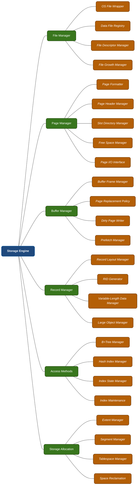
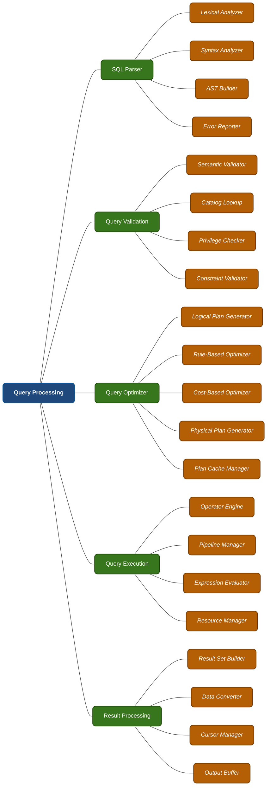
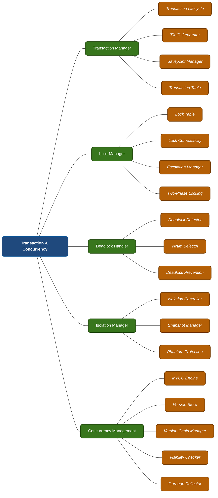
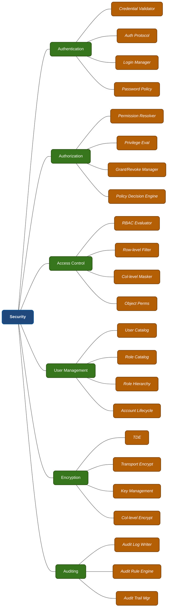
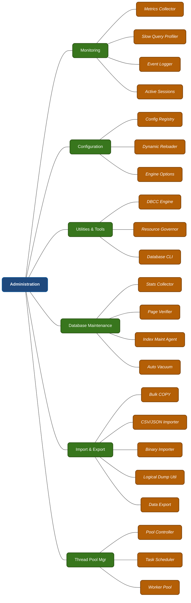
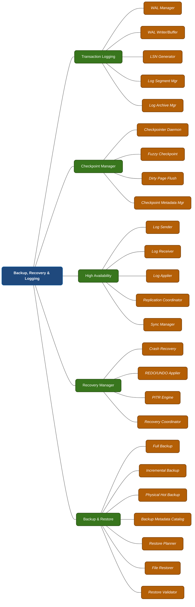
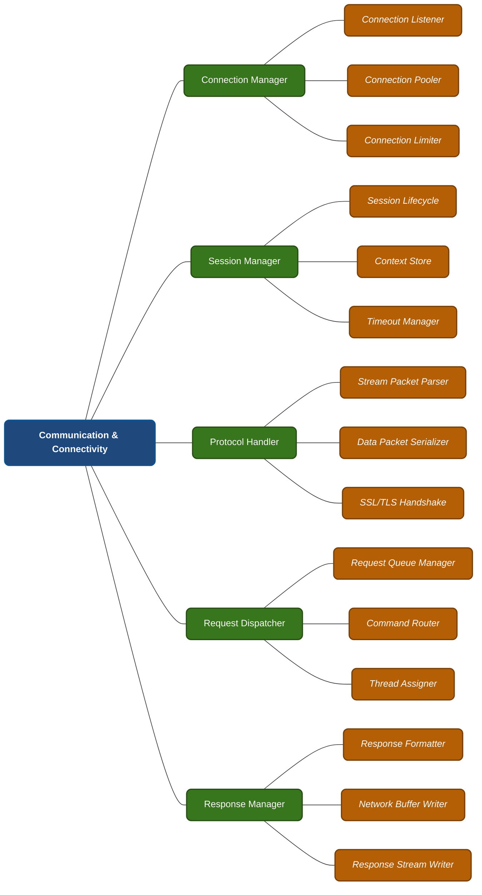

# DBMS Layer 3: Component Deep-dive

This document breaks the detailed Layer-3 operational architecture down for all 8 core subsystems of the DBMS into individual branch flowcharts, supplemented with **explanatory tables** defining the strict architectural responsibilities of each sub-component.

> **Note on Visualization:** Each of the 8 core systems is rendered as a standalone flow chart using a Left-to-Right (`graph LR`) layout. This orientation forces leaf nodes to stack **vertically**, forming a clean list-like cascade that perfectly solves horizontal overstretching and guarantees crisp readability on any screen size.

---

## 1. Storage Engine

### Storage Engine Component Roles
| Layer 2 Subsystem | Layer 3 Component | Functionality / Role |
|---|---|---|
| **File Manager** | OS File Wrapper | Abstracts underlying OS file operations (open, read, write, close) providing cross-platform unity. |
| | Data File Registry | Tracks all active database files and their physical mapping directory strings. |
| | File Descriptor Manager | Manages open file handles and caches tracking to bypass OS limits. |
| | File Growth Manager | Handles automatic physical disk file expansion when capacity limits are hit. |
| **Page Manager** | Page Formatter | Initializes the physical layout mapping for empty unassigned RAM pages. |
| | Page Header Manager | Interacts with metadata embedded within a page's header (e.g., LSN, Page ID). |
| | Slot Directory Manager | Tracks memory offsets referencing records stored on a page (allowing dynamic sizing). |
| | Free Space Manager | Calculates and manages operational free bytes available within a single Page. |
| | Page I/O Interface | Connects Pages structures functionally against the raw physical bytes on Disk via File Manager. |
| **Buffer Manager** | Buffer Frame Manager | Maps dynamically translating physical memory pages onto logical cache buffer slots. |
| | Page Replacement Policy | Elects "victim" pages to evict (e.g. LRU, 2Q, Clock) when the cache pool is exhausted. |
| | Dirty Page Writer | Periodically flushes heavily modified non-persistent RAM pages securely down to the storage disk. |
| | Prefetch Manager | Proactively anticipates sequential disk read needs and caches pages before the executor asks. |
| **Record Manager** | Record Layout Manager | Handles semantic serializing (flattening tuples) into byte arrays and vice-versa. |
| | RID Generator | Generates globally unique Record Identifiers composed of Page ID and Slot ID. |
| | Variable-Length Data Manager | Stores strings (VARCHAR) structurally without wasting byte padding limits. |
| | Large Object Manager | Slices and manages storing enormous objects (LOBs) spanning across multiple pages sequentially. |
| **Access Methods** | B+Tree Manager | Orchestrates heavily balanced hierarchical tree lookups optimizing read/write access. |
| | Hash Index Manager | Manages linear hashing buckets for high-velocity O(1) equality predicate resolutions. |
| | Index State Manager | Monitors indexing structural integrity and validates rebuilding necessity (Fragmentation checks). |
| | Index Maintenance | Repairs tree node balance, executing complex splitting or node merging during heavily loaded DMLs. |
| **Storage Allocation** | Extent Manager | Allocates operational logic spaces in chunks of 8 to 64 consecutive pages (Extents) for locality. |
| | Segment Manager | Organizes allocated extents linking them logically to tables or indexes structures natively. |
| | Tablespace Manager | Binds schemas/Databases logic mapping to physically mounted hardware storage containers. |
| | Space Reclamation | Compacts and reclaims abandoned orphan disk locations previously soft-deleted natively. |

---

## 2. Query Processing

### Query Processing Component Roles
| Layer 2 Subsystem | Layer 3 Component | Functionality / Role |
|---|---|---|
| **SQL Parser** | Lexical Analyzer | Tokenizes text-based SQL queries slicing them down into known dictionary literals and types. |
| | Syntax Analyzer | Enforces grammatical token structural matching against configured dialect guidelines. |
| | AST Builder | Represents the abstract syntax sequence strictly graphically using logic tree patterns. |
| | Error Reporter | Reconstructs semantic failure bounds indicating which string character caused the compilation failure. |
| **Query Validation** | Semantic Validator | Authenticates whether requested attributes and structures actively exist dynamically. |
| | Catalog Lookup | Leverages Metadata caches inspecting schema bounds defining tables boundaries dynamically. |
| | Privilege Checker | Determines whether the session explicitly executing has read/write RBAC clearance per column. |
| | Constraint Validator | Inspects potential query payloads guaranteeing referential bounds (e.g. FK matching). |
| **Query Optimizer** | Logical Plan Generator | Interprets the confirmed AST and translates components into Relational Algebra expressions. |
| | Rule-Based Optimizer | Executes predefined algorithm modifications structurally (e.g., Predicate filtering pushdowns). |
| | Cost-Based Optimizer | Selects the cheapest path iterating statistics mapping CPU vectors and I/O loading limits. |
| | Physical Plan Generator | Formats the theoretical logic into specific actionable engine commands mapping exact Storage rules. |
| | Plan Cache Manager | Caches heavily executed queries into memory intercepting identical text bypassing Parsing completely. |
| **Query Execution** | Operator Engine | Enacts physical core relational operations dynamically (Table Scans, Hash Joins, Loop Joins). |
| | Pipeline Manager | Steers continuous streamed tuples executing continuously without stalling memory footprints. |
| | Expression Evaluator | Calculates active mathematical evaluations embedded as logic predicates recursively mapping tuples. |
| | Resource Manager | Controls CPU threshold scheduling blocking individual heavy queries throttling out all threads heavily. |
| **Result Processing** | Result Set Builder | Rearranges internal bytes into structured tabular logic formatted exactly for the client mapping. |
| | Data Converter | Reconstructs native internal raw Byte arrays translating dynamically into readable text format output. |
| | Cursor Manager | Maintains logical fetch states preserving sequence iteration logic bypassing RAM limits structurally. |
| | Output Buffer | Holds outgoing parsed response payload staging strictly for network propagation cleanly offloading. |

---

## 3. Transaction & Concurrency

### Transaction & Concurrency Component Roles
| Layer 2 Subsystem | Layer 3 Component | Functionality / Role |
|---|---|---|
| **Transaction Manager**| Transaction Lifecycle | Orchestrates transactional states (Active, Partially Committed, Failed, Aborted, or Committed). |
| | TX ID Generator | Mints monotonically increasing transaction integers dynamically binding sequence boundaries. |
| | Savepoint Manager | Implements logical rollback sub-checkpoints preventing entire transaction failures linearly. |
| | Transaction Table | Hosts in-memory hash mappings tracking all active sessions scaling dynamically. |
| **Lock Manager** | Lock Table | Tracks specific resources heavily bound globally dictating active locking states memory boundaries. |
| | Lock Compatibility | Decides matrices conflict boundaries mapping Shared vs Exclusive scaling dynamically preventing data racing. |
| | Escalation Manager | Mutates massive granular Row locks collapsing explicitly into Table bounds bypassing memory threshold limits. |
| | Two-Phase Locking | Forces strict serializable limits preventing releasing locks early until phase shrinking commences explicitly. |
| **Deadlock Handler** | Deadlock Detector | Iterates cyclical wait-for graphs natively mapping transactions mutually preventing infinite hanging. |
| | Victim Selector | Targets specifically executing processes terminating linearly based crucially on lowest-cost boundaries logically. |
| | Deadlock Prevention | Proactively manages limits aggressively failing transactions preventing cycles entirely using heuristic timeout algorithms. |
| **Isolation Manager** | Isolation Controller | Polices explicit ANSI anomalies managing boundaries strictly matching RC, RR, configuring consistency mapping. |
| | Snapshot Manager | Locks read-bounds freezing state dynamically ensuring read-write collisions resolve mapping historically natively. |
| | Phantom Protection | Deploys Gap locking boundaries isolating insertions blocking phantom row emergence predictably natively. |
| **Concurrency (MVCC)**| MVCC Engine | Modulates reading limits mapping reads independently without blocking modifying writes globally. |
| | Version Store | Maintains exact historic clones mapped logically resolving modifications safely preserving snapshot limits. |
| | Version Chain Manager | Configures backwards-linked maps iterating previous record states natively spanning globally safely. |
| | Visibility Checker | Correlates whether specific historical versions validate viewing permissions dynamically per executing Transaction IDs. |
| | Garbage Collector | Executes purging bounds physically cleaning version chains terminating expired ghost tuples aggressively natively. |

---

## 4. Database Object & Metadata

```mermaid
graph LR
    classDef layer1 fill:#1f497d,color:#ffffff,stroke:#0b5394,stroke-width:2px,font-weight:bold,rx:8,ry:8;
    classDef layer2 fill:#38761d,color:#ffffff,stroke:#274e13,stroke-width:2px,rx:8,ry:8;
    classDef layer3 fill:#b45f06,color:#ffffff,stroke:#783f04,stroke-width:2px,font-style:italic,rx:8,ry:8;

    ROOT[Database Object & Metadata]:::layer1

    DB[Database Mgr]:::layer2
    SC[Schema Mgr]:::layer2
    TB[Table Mgr]:::layer2
    CL[Column Mgr]:::layer2
    DT[Data Type Mgr]:::layer2
    ID[Index Mgr]:::layer2
    CS[Constraint Mgr]:::layer2
    VW[View Mgr]:::layer2
    PR[Programmable Objects]:::layer2
    CT[Catalog Mgr]:::layer2

    ROOT --- DB
    ROOT --- SC
    ROOT --- TB
    ROOT --- CL
    ROOT --- DT
    ROOT --- ID
    ROOT --- CS
    ROOT --- VW
    ROOT --- PR
    ROOT --- CT

    DB --- DB1[DB Lifecycle]:::layer3
    DB --- DB2[DB State]:::layer3
    DB --- DB3[DB Config]:::layer3
    DB --- DB4[DB Validator]:::layer3

    SC --- SC1[Schema Lifecycle]:::layer3
    SC --- SC2[Ownership]:::layer3
    SC --- SC3[Namespace]:::layer3

    TB --- TB1[Table Lifecycle]:::layer3
    TB --- TB2[Definition]:::layer3
    TB --- TB3[Partition Mgr]:::layer3

    CL --- CL1[Column Lifecycle]:::layer3
    CL --- CL2[Default Value]:::layer3
    CL --- CL3[Identity]:::layer3
    CL --- CL4[Computed Col]:::layer3
    CL --- CL5[Nullability]:::layer3

    DT --- DT1[Built-in Types]:::layer3
    DT --- DT2[UDT Manager]:::layer3
    DT --- DT3[Type Conversion]:::layer3
    DT --- DT4[Type Validator]:::layer3
    DT --- DT5[Collation Management]:::layer3

    ID --- ID1[Index Lifecycle]:::layer3
    ID --- ID2[Index Def]:::layer3
    ID --- ID3[Index Type Manager]:::layer3
    ID --- ID4[Dependency Tracker]:::layer3

    CS --- CS1[PK Manager]:::layer3
    CS --- CS2[FK Manager]:::layer3
    CS --- CS3[Unique Const]:::layer3
    CS --- CS4[Check Const]:::layer3
    CS --- CS5[Constraint Validator]:::layer3

    VW --- VW1[View Lifecycle]:::layer3
    VW --- VW2[View Def Storage]:::layer3
    VW --- VW3[View Resolver]:::layer3
    VW --- VW4[Updatable View Manager]:::layer3
    VW --- VW5[Indexed View]:::layer3

    PR --- PR1[Stored Procs]:::layer3
    PR --- PR2[Functions]:::layer3
    PR --- PR3[Triggers]:::layer3
    PR --- PR4[Parameters]:::layer3
    PR --- PR5[Routine Catalog]:::layer3

    CT --- CT1[System Tables]:::layer3
    CT --- CT2[Meta Reader]:::layer3
    CT --- CT3[Meta Writer]:::layer3
    CT --- CT4[Dependency Tracker]:::layer3
    CT --- CT5[Metadata Cache]:::layer3
    CT --- CT6[Object Identifier]:::layer3
    CT --- CT7[Catalog Versioning]:::layer3
```

### DB Object & Metadata Component Roles
*(Because Metadata contains 40+ objects, key definitions are grouped generally for documentation compactness)*
| Layer 2 Subsystem | Functionality / Role of Inner Components |
|---|---|
| **Database & Schema Mgr** | Resolves creation logically encapsulating table bindings. Sets operational states configuring read-only scaling and ownership boundaries structurally bypassing collision natively. |
| **Table & Column Mgr** | Architecturally maps definitions strictly bounding variables logic configuring defaults, primary incremental vectors, nullability, partitioning mappings natively. |
| **Data Type Mgr** | Controls native memory mappings assigning semantic structures globally resolving implicit Casting matrices seamlessly tracking strings character limits predictably. |
| **Index & Constraint Mgr** | Dictates structural enforcement binding keys verifying domains dynamically handling relationships universally preventing corrupt relationships organically. |
| **View & Programmable Mgr**| Materializes logic sequences converting stored queries into transparently fetched dynamic subsets heavily executing grouped behavioral batches cleanly. |
| **Catalog Mgr** | Hosts the Universal Truth tables configuring caching logic managing identifiers globally ensuring referencing dependencies dynamically resolving correctly. |

---

## 5. Security

### Security Component Roles
| Layer 2 Subsystem | Layer 3 Component | Functionality / Role |
|---|---|---|
| **Authentication** | Credential Validator | Checks explicitly hashed incoming tokens verifying encrypted user credentials securely predictably. |
| | Auth Protocol | Orchestrates standardized handshake logic resolving token structures reliably. |
| | Login Manager | Sets contextual properties logging access bounds isolating sessions globally reliably. |
| | Password Policy | Polices formatting bounds restricting weakly structured strings configuring cycling timers securely. |
| **Authorization/RBAC** | Permission Eval/Resolver | Matches mapping trees linking users towards granular granted vectors aggressively. |
| | Access Filters (Row/Col) | Dynamically edits logical queries blocking restricted tuple subsets masking unprivileged column data completely natively. |
| **Encryption & Audit** | TDE / Key Management | Transparently encrypts storage files dynamically rendering drives unreadable bypassing valid key boundaries tracking logging actions structurally. |

---

## 6. Administration

### Administration Component Roles
| Layer 2 Subsystem | Functionality / Role of Inner Components |
|---|---|
| **Monitoring & Config** | Exposes metrics capturing CPU/I/O limits analyzing heavily executing delays tracking runtime tuning reloading parameters globally safely. |
| **Maintenance & Utils** | Fixes orphaned clusters reorganizing structures checking logical consistencies managing scheduled pruning (Vacuuming). |
| **Import/Export & Threads**| Multiplexes structural vectors processing massive payloads assigning multi-threaded logic explicitly resolving workloads concurrently effortlessly. |

---

## 7. Backup, Recovery & Logging

### Backup, Recovery Component Roles
| Layer 2 Subsystem | Functionality / Role of Inner Components |
|---|---|
| **Logging (WAL)** | Queues active delta changes mapping linear sequences appending explicitly ensuring persistency before actual commits. |
| **Checkpoint & HA** | Pauses logical flushing limits establishing recovery lines. Replicates logs streaming logic maintaining secondary cluster synchronization gracefully. |
| **Recovery & Backup** | Traverses boundaries backwards/forwards orchestrating complete rebuilds resolving crash scenarios creating persistent disk snapshots explicitly securely. |

---

## 8. Communication & Connectivity

### Communication Component Roles
| Layer 2 Subsystem | Functionality / Role of Inner Components |
|---|---|
| **Connection & Session** | Listens tracking active TCP sockets multiplexing heavily routing tracking session contexts globally bypassing disconnection limits cleanly. |
| **Protocol & Request** | Deserializes wire payloads explicitly routing logical boundaries allocating executing thread parameters explicitly isolating execution dynamically. |
| **Response** | Rearranges output streams chunking buffering boundaries efficiently terminating payload transfers across network limits smoothly. |
