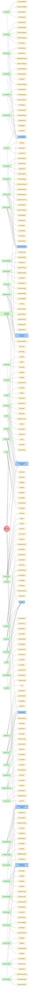

# DBMS Layer 3: Component Deep-dive

This flowchart visually maps out the comprehensive Layer-3 breakdown for all 8 core subsystems of the DBMS into a single unified diagram. 

```mermaid
graph LR
    %% Styles & Colors
    classDef default fill:#f9f9f9,stroke:#333,stroke-width:1px;
    classDef root fill:#ff9999,stroke:#333,stroke-width:2px,font-weight:bold;
    classDef layer1 fill:#99ccff,stroke:#333,stroke-width:1.5px,font-weight:bold;
    classDef layer2 fill:#ccffcc,stroke:#333,stroke-width:1px;
    classDef layer3 fill:#fff3cd,stroke:#aaa,stroke-width:1px;

    %% Root
    db((DBMS Layer 3)):::root

    %% --------------------------------
    %% LAYER 1: Core Subsystems
    %% --------------------------------
    se[Storage Engine]:::layer1
    qp[Query Processing]:::layer1
    tc[Transaction & Concurrency]:::layer1
    dom[Database Object & Metadata]:::layer1
    sc[Security]:::layer1
    adm[Administration]:::layer1
    brl[Backup, Recovery & Logging]:::layer1
    cc[Communication & Connectivity]:::layer1

    db --- se & qp & tc & dom & sc & adm & brl & cc

    %% --------------------------------
    %% 1. STORAGE ENGINE
    %% --------------------------------
    se_fm[File Manager]:::layer2 --- se
    se_pm[Page Manager]:::layer2 --- se
    se_bm[Buffer Manager]:::layer2 --- se
    se_rm[Record Manager]:::layer2 --- se
    se_am[Access Methods]:::layer2 --- se
    se_sa[Storage Allocation]:::layer2 --- se

    se_fm --- se_fm_1[OS File Wrapper]:::layer3 & se_fm_2[Data File Registry]:::layer3 & se_fm_3[File Descriptor Manager]:::layer3 & se_fm_4[File Growth Manager]:::layer3
    se_pm --- se_pm_1[Page Formatter]:::layer3 & se_pm_2[Page Header Manager]:::layer3 & se_pm_3[Slot Directory Manager]:::layer3 & se_pm_4[Free Space Manager]:::layer3 & se_pm_5[Page I/O Interface]:::layer3
    se_bm --- se_bm_1[Buffer Frame Manager]:::layer3 & se_bm_2[Page Replacement Policy]:::layer3 & se_bm_3[Dirty Page Writer]:::layer3 & se_bm_4[Prefetch Manager]:::layer3
    se_rm --- se_rm_1[Record Layout Manager]:::layer3 & se_rm_2[RID Generator]:::layer3 & se_rm_3[Variable-Length Data]:::layer3 & se_rm_4[Large Object Manager]:::layer3
    se_am --- se_am_1[B+Tree Manager]:::layer3 & se_am_2[Hash Index Manager]:::layer3 & se_am_3[Index State Manager]:::layer3 & se_am_4[Index Maintenance]:::layer3
    se_sa --- se_sa_1[Extent Manager]:::layer3 & se_sa_2[Segment Manager]:::layer3 & se_sa_3[Tablespace Manager]:::layer3 & se_sa_4[Space Reclamation]:::layer3

    %% --------------------------------
    %% 2. QUERY PROCESSING
    %% --------------------------------
    qp_sp[SQL Parser]:::layer2 --- qp
    qp_qv[Query Validation]:::layer2 --- qp
    qp_qo[Query Optimizer]:::layer2 --- qp
    qp_qe[Query Execution]:::layer2 --- qp
    qp_rp[Result Processing]:::layer2 --- qp

    qp_sp --- qp_sp_1[Lexical Analyzer]:::layer3 & qp_sp_2[Syntax Analyzer]:::layer3 & qp_sp_3[AST Builder]:::layer3 & qp_sp_4[Error Reporter]:::layer3
    qp_qv --- qp_qv_1[Semantic Validator]:::layer3 & qp_qv_2[Catalog Lookup]:::layer3 & qp_qv_3[Privilege Checker]:::layer3 & qp_qv_4[Constraint Validator]:::layer3
    qp_qo --- qp_qo_1[Logical Plan Generator]:::layer3 & qp_qo_2[Rule-Based Optimizer]:::layer3 & qp_qo_3[Cost-Based Optimizer]:::layer3 & qp_qo_4[Physical Plan Generator]:::layer3 & qp_qo_5[Plan Cache Manager]:::layer3
    qp_qe --- qp_qe_1[Operator Engine]:::layer3 & qp_qe_2[Pipeline Manager]:::layer3 & qp_qe_3[Expression Evaluator]:::layer3 & qp_qe_4[Resource Manager]:::layer3
    qp_rp --- qp_rp_1[Result Set Builder]:::layer3 & qp_rp_2[Data Converter]:::layer3 & qp_rp_3[Cursor Manager]:::layer3 & qp_rp_4[Output Buffer]:::layer3

    %% --------------------------------
    %% 3. TRANSACTION & CONCURRENCY
    %% --------------------------------
    tc_tm[Transaction Manager]:::layer2 --- tc
    tc_lm[Lock Manager]:::layer2 --- tc
    tc_dh[Deadlock Handler]:::layer2 --- tc
    tc_im[Isolation Manager]:::layer2 --- tc
    tc_cm[Concurrency Management]:::layer2 --- tc

    tc_tm --- tc_tm_1[Transaction Lifecycle]:::layer3 & tc_tm_2[TX ID Generator]:::layer3 & tc_tm_3[Savepoint Manager]:::layer3 & tc_tm_4[Transaction Table]:::layer3
    tc_lm --- tc_lm_1[Lock Table]:::layer3 & tc_lm_2[Lock Compatibility]:::layer3 & tc_lm_3[Escalation Manager]:::layer3 & tc_lm_4[Two-Phase Locking]:::layer3
    tc_dh --- tc_dh_1[Deadlock Detector]:::layer3 & tc_dh_2[Victim Selector]:::layer3 & tc_dh_3[Deadlock Prevention]:::layer3
    tc_im --- tc_im_1[Isolation Controller]:::layer3 & tc_im_2[Snapshot Manager]:::layer3 & tc_im_3[Phantom Protection]:::layer3
    tc_cm --- tc_cm_1[MVCC Engine]:::layer3 & tc_cm_2[Version Store]:::layer3 & tc_cm_3[Version Chain Manager]:::layer3 & tc_cm_4[Visibility Checker]:::layer3 & tc_cm_5[Garbage Collector]:::layer3

    %% --------------------------------
    %% 4. DATABASE OBJECT & METADATA
    %% --------------------------------
    dom_db[Database Mgr]:::layer2 --- dom
    dom_sc[Schema Mgr]:::layer2 --- dom
    dom_tb[Table Mgr]:::layer2 --- dom
    dom_cl[Column Mgr]:::layer2 --- dom
    dom_dt[Data Type Mgr]:::layer2 --- dom
    dom_id[Index Mgr]:::layer2 --- dom
    dom_cs[Constraint Mgr]:::layer2 --- dom
    dom_vw[View Mgr]:::layer2 --- dom
    dom_pr[Programmable]:::layer2 --- dom
    dom_ct[Catalog Mgr]:::layer2 --- dom

    dom_db --- dom_db_1[DB Lifecycle]:::layer3 & dom_db_2[DB State]:::layer3 & dom_db_3[DB Config]:::layer3
    dom_sc --- dom_sc_1[Schema Lifecycle]:::layer3 & dom_sc_2[Ownership]:::layer3 & dom_sc_3[Namespace]:::layer3
    dom_tb --- dom_tb_1[Table Lifecycle]:::layer3 & dom_tb_2[Definition]:::layer3 & dom_tb_3[Partition Mgr]:::layer3
    dom_cl --- dom_cl_1[Column Lifecycle]:::layer3 & dom_cl_2[Default Value]:::layer3 & dom_cl_3[Identity]:::layer3 & dom_cl_4[Computed Col]:::layer3
    dom_dt --- dom_dt_1[Built-in Types]:::layer3 & dom_dt_2[UDT Manager]:::layer3 & dom_dt_3[Type Conversion]:::layer3
    dom_id --- dom_id_1[Index Lifecycle]:::layer3 & dom_id_2[Index Def]:::layer3 & dom_id_3[Dependency Tracker]:::layer3
    dom_cs --- dom_cs_1[PK Manager]:::layer3 & dom_cs_2[FK Manager]:::layer3 & dom_cs_3[Unique Const]:::layer3 & dom_cs_4[Check Const]:::layer3
    dom_vw --- dom_vw_1[View Lifecycle]:::layer3 & dom_vw_2[View Def Storage]:::layer3 & dom_vw_3[View Resolver]:::layer3 & dom_vw_4[Indexed View]:::layer3
    dom_pr --- dom_pr_1[Stored Procs]:::layer3 & dom_pr_2[Functions]:::layer3 & dom_pr_3[Triggers]:::layer3 & dom_pr_4[Parameters]:::layer3
    dom_ct --- dom_ct_1[System Tables]:::layer3 & dom_ct_2[Meta Reader/Writer]:::layer3 & dom_ct_3[Meta Cache]:::layer3 & dom_ct_4[Cat Versioning]:::layer3

    %% --------------------------------
    %% 5. SECURITY
    %% --------------------------------
    sc_at[Authentication]:::layer2 --- sc
    sc_az[Authorization]:::layer2 --- sc
    sc_ac[Access Control]:::layer2 --- sc
    sc_um[User Management]:::layer2 --- sc
    sc_ec[Encryption]:::layer2 --- sc
    sc_ad[Auditing]:::layer2 --- sc

    sc_at --- sc_at_1[Credential Validator]:::layer3 & sc_at_2[Auth Protocol]:::layer3 & sc_at_3[Login Manager]:::layer3 & sc_at_4[Password Policy]:::layer3
    sc_az --- sc_az_1[Permission Resolver]:::layer3 & sc_az_2[Privilege Eval]:::layer3 & sc_az_3[Grant/Revoke]:::layer3 & sc_az_4[Decision Engine]:::layer3
    sc_ac --- sc_ac_1[RBAC Evaluator]:::layer3 & sc_ac_2[Row-level Filter]:::layer3 & sc_ac_3[Col-level Masker]:::layer3 & sc_ac_4[Object Perms]:::layer3
    sc_um --- sc_um_1[User Catalog]:::layer3 & sc_um_2[Role Catalog]:::layer3 & sc_um_3[Role Hierarchy]:::layer3 & sc_um_4[Account Lifecycle]:::layer3
    sc_ec --- sc_ec_1[TDE]:::layer3 & sc_ec_2[Transport Encrypt]:::layer3 & sc_ec_3[Key Management]:::layer3 & sc_ec_4[Col-level Encrypt]:::layer3
    sc_ad --- sc_ad_1[Audit Log Writer]:::layer3 & sc_ad_2[Audit Rule Engine]:::layer3 & sc_ad_3[Audit Trail Mgr]:::layer3

    %% --------------------------------
    %% 6. ADMINISTRATION
    %% --------------------------------
    adm_mn[Monitoring]:::layer2 --- adm
    adm_cf[Configuration]:::layer2 --- adm
    adm_ut[Utilities & Tools]:::layer2 --- adm
    adm_dm[Database Maintenance]:::layer2 --- adm
    adm_ie[Import & Export]:::layer2 --- adm
    adm_tm[Thread Pool Mgr]:::layer2 --- adm

    adm_mn --- adm_mn_1[Metrics Collector]:::layer3 & adm_mn_2[Slow Query Profiler]:::layer3 & adm_mn_3[Event Logger]:::layer3 & adm_mn_4[Active Sessions]:::layer3
    adm_cf --- adm_cf_1[Config Registry]:::layer3 & adm_cf_2[Dynamic Reloader]:::layer3 & adm_cf_3[Engine Options]:::layer3
    adm_ut --- adm_ut_1[DBCC Engine]:::layer3 & adm_ut_2[Resource Governor]:::layer3 & adm_ut_3[Database CLI]:::layer3
    adm_dm --- adm_dm_1[Stats Collector]:::layer3 & adm_dm_2[Page Verifier]:::layer3 & adm_dm_3[Index Maint Agent]:::layer3 & adm_dm_4[Auto Vacuum]:::layer3
    adm_ie --- adm_ie_1[Bulk COPY]:::layer3 & adm_ie_2[CSV/JSON Importer]:::layer3 & adm_ie_3[Binary Importer]:::layer3 & adm_ie_4[Data Export]:::layer3
    adm_tm --- adm_tm_1[Pool Controller]:::layer3 & adm_tm_2[Task Scheduler]:::layer3 & adm_tm_3[Worker Pool]:::layer3

    %% --------------------------------
    %% 7. BACKUP, RECOVERY & LOGGING
    %% --------------------------------
    brl_tl[Transaction Logging]:::layer2 --- brl
    brl_cm[Checkpoint Manager]:::layer2 --- brl
    brl_ha[High Availability]:::layer2 --- brl
    brl_rm[Recovery Manager]:::layer2 --- brl
    brl_br[Backup & Restore]:::layer2 --- brl

    brl_tl --- brl_tl_1[WAL Manager]:::layer3 & brl_tl_2[WAL Writer/Buffer]:::layer3 & brl_tl_3[LSN Generator]:::layer3 & brl_tl_4[Log Archive]:::layer3
    brl_cm --- brl_cm_1[Checkpointer Daemon]:::layer3 & brl_cm_2[Fuzzy Checkpoint]:::layer3 & brl_cm_3[Dirty Page Flush]:::layer3
    brl_ha --- brl_ha_1[Log Sender]:::layer3 & brl_ha_2[Log Receiver]:::layer3 & brl_ha_3[Log Applier]:::layer3 & brl_ha_4[Sync Manager]:::layer3
    brl_rm --- brl_rm_1[Crash Recovery]:::layer3 & brl_rm_2[REDO/UNDO Applier]:::layer3 & brl_rm_3[PITR Engine]:::layer3
    brl_br --- brl_br_1[Full Backup]:::layer3 & brl_br_2[Incremental Backup]:::layer3 & brl_br_3[Hot Backup]:::layer3 & brl_br_4[File Restorer]:::layer3

    %% --------------------------------
    %% 8. COMMUNICATION & CONNECTIVITY
    %% --------------------------------
    cc_cn[Connection Manager]:::layer2 --- cc
    cc_sm[Session Manager]:::layer2 --- cc
    cc_ph[Protocol Handler]:::layer2 --- cc
    cc_rd[Request Dispatcher]:::layer2 --- cc
    cc_rs[Response Manager]:::layer2 --- cc

    cc_cn --- cc_cn_1[Connection Listener]:::layer3 & cc_cn_2[Connection Pooler]:::layer3 & cc_cn_3[Connection Limiter]:::layer3
    cc_sm --- cc_sm_1[Session Lifecycle]:::layer3 & cc_sm_2[Context Store]:::layer3 & cc_sm_3[Timeout Manager]:::layer3
    cc_ph --- cc_ph_1[Stream Packet Parser]:::layer3 & cc_ph_2[Data Serializer]:::layer3 & cc_ph_3[SSL/TLS Handshake]:::layer3
    cc_rd --- cc_rd_1[Request Queue]:::layer3 & cc_rd_2[Command Router]:::layer3 & cc_rd_3[Thread Assigner]:::layer3
    cc_rs --- cc_rs_1[Response Formatter]:::layer3 & cc_rs_2[Network Buffer Writer]:::layer3 & cc_rs_3[Response Stream Writer]:::layer3
```
