# DBMS Layer 3: Component Deep-dive

This document breaks the detailed Layer-3 operational architecture down for all 8 core subsystems of the DBMS.

> **Note on Visualization:** To prevent visual clutter and spaghetti crossing lines (which happens when 150+ nodes are merged into a single flowchart), the Layer-3 architecture is elegantly separated into 8 independent Tree structures mapping exactly to the concepts drafted in `DBMS_layer3.txt`. This ensures the design remains physically readable and professionally scalable for documentation purposes.

## 1. Storage Engine

```mermaid
graph TD
    classDef layer1 fill:#99ccff,stroke:#333,stroke-width:1.5px,font-weight:bold;
    classDef layer2 fill:#ccffcc,stroke:#333,stroke-width:1px;
    classDef layer3 fill:#fff3cd,stroke:#333,stroke-width:1px;

    ROOT[Storage Engine]:::layer1

    FM[File Manager]:::layer2
    PM[Page Manager]:::layer2
    BM[Buffer Manager]:::layer2
    RM[Record Manager]:::layer2
    AM[Access Methods]:::layer2
    SA[Storage Allocation]:::layer2

    ROOT --- FM & PM & BM & RM & AM & SA

    FM --- FM1[OS File Wrapper]:::layer3 & FM2[Data File Registry]:::layer3 & FM3[File Descriptor Manager]:::layer3 & FM4[File Growth Manager]:::layer3
    PM --- PM1[Page Formatter]:::layer3 & PM2[Page Header Manager]:::layer3 & PM3[Slot Directory Manager]:::layer3 & PM4[Free Space Manager]:::layer3 & PM5[Page I/O Interface]:::layer3
    BM --- BM1[Buffer Frame Manager]:::layer3 & BM2[Page Replacement Policy]:::layer3 & BM3[Dirty Page Writer]:::layer3 & BM4[Prefetch Manager]:::layer3
    RM --- RM1[Record Layout Manager]:::layer3 & RM2[RID Generator]:::layer3 & RM3[Variable-Length Data]:::layer3 & RM4[Large Object Manager]:::layer3
    AM --- AM1[B+Tree Manager]:::layer3 & AM2[Hash Index Manager]:::layer3 & AM3[Index State Manager]:::layer3 & AM4[Index Maintenance]:::layer3
    SA --- SA1[Extent Manager]:::layer3 & SA2[Segment Manager]:::layer3 & SA3[Tablespace Manager]:::layer3 & SA4[Space Reclamation]:::layer3
```

## 2. Query Processing

```mermaid
graph TD
    classDef layer1 fill:#99ccff,stroke:#333,stroke-width:1.5px,font-weight:bold;
    classDef layer2 fill:#ccffcc,stroke:#333,stroke-width:1px;
    classDef layer3 fill:#fff3cd,stroke:#333,stroke-width:1px;

    ROOT[Query Processing]:::layer1

    SP[SQL Parser]:::layer2
    QV[Query Validation]:::layer2
    QO[Query Optimizer]:::layer2
    QE[Query Execution]:::layer2
    RP[Result Processing]:::layer2

    ROOT --- SP & QV & QO & QE & RP

    SP --- SP1[Lexical Analyzer]:::layer3 & SP2[Syntax Analyzer]:::layer3 & SP3[AST Builder]:::layer3 & SP4[Error Reporter]:::layer3
    QV --- QV1[Semantic Validator]:::layer3 & QV2[Catalog Lookup]:::layer3 & QV3[Privilege Checker]:::layer3 & QV4[Constraint Validator]:::layer3
    QO --- QO1[Logical Plan Generator]:::layer3 & QO2[Rule-Based Optimizer]:::layer3 & QO3[Cost-Based Optimizer]:::layer3 & QO4[Physical Plan Generator]:::layer3 & QO5[Plan Cache Manager]:::layer3
    QE --- QE1[Operator Engine]:::layer3 & QE2[Pipeline Manager]:::layer3 & QE3[Expression Evaluator]:::layer3 & QE4[Resource Manager]:::layer3
    RP --- RP1[Result Set Builder]:::layer3 & RP2[Data Converter]:::layer3 & RP3[Cursor Manager]:::layer3 & RP4[Output Buffer]:::layer3
```

## 3. Transaction & Concurrency

```mermaid
graph TD
    classDef layer1 fill:#99ccff,stroke:#333,stroke-width:1.5px,font-weight:bold;
    classDef layer2 fill:#ccffcc,stroke:#333,stroke-width:1px;
    classDef layer3 fill:#fff3cd,stroke:#333,stroke-width:1px;

    ROOT[Transaction & Concurrency]:::layer1

    TM[Transaction Manager]:::layer2
    LM[Lock Manager]:::layer2
    DH[Deadlock Handler]:::layer2
    IM[Isolation Manager]:::layer2
    CM[Concurrency Management]:::layer2

    ROOT --- TM & LM & DH & IM & CM

    TM --- TM1[Transaction Lifecycle]:::layer3 & TM2[TX ID Generator]:::layer3 & TM3[Savepoint Manager]:::layer3 & TM4[Transaction Table]:::layer3
    LM --- LM1[Lock Table]:::layer3 & LM2[Lock Compatibility]:::layer3 & LM3[Escalation Manager]:::layer3 & LM4[Two-Phase Locking]:::layer3
    DH --- DH1[Deadlock Detector]:::layer3 & DH2[Victim Selector]:::layer3 & DH3[Deadlock Prevention]:::layer3
    IM --- IM1[Isolation Controller]:::layer3 & IM2[Snapshot Manager]:::layer3 & IM3[Phantom Protection]:::layer3
    CM --- CM1[MVCC Engine]:::layer3 & CM2[Version Store]:::layer3 & CM3[Version Chain Manager]:::layer3 & CM4[Visibility Checker]:::layer3 & CM5[Garbage Collector]:::layer3
```

## 4. Database Object & Metadata

```mermaid
graph TD
    classDef layer1 fill:#99ccff,stroke:#333,stroke-width:1.5px,font-weight:bold;
    classDef layer2 fill:#ccffcc,stroke:#333,stroke-width:1px;
    classDef layer3 fill:#fff3cd,stroke:#333,stroke-width:1px;

    ROOT[Database Object & Metadata]:::layer1

    DB[Database Mgr]:::layer2
    SC[Schema Mgr]:::layer2
    TB[Table Mgr]:::layer2
    CL[Column Mgr]:::layer2
    DT[Data Type Mgr]:::layer2
    ID[Index Mgr]:::layer2
    CS[Constraint Mgr]:::layer2
    VW[View Mgr]:::layer2
    PR[Programmable]:::layer2
    CT[Catalog Mgr]:::layer2

    ROOT --- DB & SC & TB & CL & DT & ID & CS & VW & PR & CT

    DB --- DB1[DB Lifecycle]:::layer3 & DB2[DB State]:::layer3 & DB3[DB Config]:::layer3
    SC --- SC1[Schema Lifecycle]:::layer3 & SC2[Ownership]:::layer3 & SC3[Namespace]:::layer3
    TB --- TB1[Table Lifecycle]:::layer3 & TB2[Definition]:::layer3 & TB3[Partition Mgr]:::layer3
    CL --- CL1[Column Lifecycle]:::layer3 & CL2[Default Value]:::layer3 & CL3[Identity]:::layer3 & CL4[Computed Col]:::layer3
    DT --- DT1[Built-in Types]:::layer3 & DT2[UDT Manager]:::layer3 & DT3[Type Conversion]:::layer3
    ID --- ID1[Index Lifecycle]:::layer3 & ID2[Index Def]:::layer3 & ID3[Dependency Tracker]:::layer3
    CS --- CS1[PK Manager]:::layer3 & CS2[FK Manager]:::layer3 & CS3[Unique Const]:::layer3 & CS4[Check Const]:::layer3
    VW --- VW1[View Lifecycle]:::layer3 & VW2[View Def Storage]:::layer3 & VW3[View Resolver]:::layer3 & VW4[Indexed View]:::layer3
    PR --- PR1[Stored Procs]:::layer3 & PR2[Functions]:::layer3 & PR3[Triggers]:::layer3 & PR4[Parameters]:::layer3
    CT --- CT1[System Tables]:::layer3 & CT2[Meta Reader/Writer]:::layer3 & CT3[Meta Cache]:::layer3 & CT4[Cat Versioning]:::layer3
```

## 5. Security

```mermaid
graph TD
    classDef layer1 fill:#99ccff,stroke:#333,stroke-width:1.5px,font-weight:bold;
    classDef layer2 fill:#ccffcc,stroke:#333,stroke-width:1px;
    classDef layer3 fill:#fff3cd,stroke:#333,stroke-width:1px;

    ROOT[Security]:::layer1

    AT[Authentication]:::layer2
    AZ[Authorization]:::layer2
    AC[Access Control]:::layer2
    UM[User Management]:::layer2
    EC[Encryption]:::layer2
    AD[Auditing]:::layer2

    ROOT --- AT & AZ & AC & UM & EC & AD

    AT --- AT1[Credential Validator]:::layer3 & AT2[Auth Protocol]:::layer3 & AT3[Login Manager]:::layer3 & AT4[Password Policy]:::layer3
    AZ --- AZ1[Permission Resolver]:::layer3 & AZ2[Privilege Eval]:::layer3 & AZ3[Grant/Revoke]:::layer3 & AZ4[Decision Engine]:::layer3
    AC --- AC1[RBAC Evaluator]:::layer3 & AC2[Row-level Filter]:::layer3 & AC3[Col-level Masker]:::layer3 & AC4[Object Perms]:::layer3
    UM --- UM1[User Catalog]:::layer3 & UM2[Role Catalog]:::layer3 & UM3[Role Hierarchy]:::layer3 & UM4[Account Lifecycle]:::layer3
    EC --- EC1[TDE]:::layer3 & EC2[Transport Encrypt]:::layer3 & EC3[Key Management]:::layer3 & EC4[Col-level Encrypt]:::layer3
    AD --- AD1[Audit Log Writer]:::layer3 & AD2[Audit Rule Engine]:::layer3 & AD3[Audit Trail Mgr]:::layer3
```

## 6. Administration

```mermaid
graph TD
    classDef layer1 fill:#99ccff,stroke:#333,stroke-width:1.5px,font-weight:bold;
    classDef layer2 fill:#ccffcc,stroke:#333,stroke-width:1px;
    classDef layer3 fill:#fff3cd,stroke:#333,stroke-width:1px;

    ROOT[Administration]:::layer1

    MN[Monitoring]:::layer2
    CF[Configuration]:::layer2
    UT[Utilities & Tools]:::layer2
    DM[Database Maintenance]:::layer2
    IE[Import & Export]:::layer2
    TM[Thread Pool Mgr]:::layer2

    ROOT --- MN & CF & UT & DM & IE & TM

    MN --- MN1[Metrics Collector]:::layer3 & MN2[Slow Query Profiler]:::layer3 & MN3[Event Logger]:::layer3 & MN4[Active Sessions]:::layer3
    CF --- CF1[Config Registry]:::layer3 & CF2[Dynamic Reloader]:::layer3 & CF3[Engine Options]:::layer3
    UT --- UT1[DBCC Engine]:::layer3 & UT2[Resource Governor]:::layer3 & UT3[Database CLI]:::layer3
    DM --- DM1[Stats Collector]:::layer3 & DM2[Page Verifier]:::layer3 & DM3[Index Maint Agent]:::layer3 & DM4[Auto Vacuum]:::layer3
    IE --- IE1[Bulk COPY]:::layer3 & IE2[CSV/JSON Importer]:::layer3 & IE3[Binary Importer]:::layer3 & IE4[Data Export]:::layer3
    TM --- TM1[Pool Controller]:::layer3 & TM2[Task Scheduler]:::layer3 & TM3[Worker Pool]:::layer3
```

## 7. Backup, Recovery & Logging

```mermaid
graph TD
    classDef layer1 fill:#99ccff,stroke:#333,stroke-width:1.5px,font-weight:bold;
    classDef layer2 fill:#ccffcc,stroke:#333,stroke-width:1px;
    classDef layer3 fill:#fff3cd,stroke:#333,stroke-width:1px;

    ROOT[Backup, Recovery & Logging]:::layer1

    TL[Transaction Logging]:::layer2
    CM[Checkpoint Manager]:::layer2
    HA[High Availability]:::layer2
    RM[Recovery Manager]:::layer2
    BR[Backup & Restore]:::layer2

    ROOT --- TL & CM & HA & RM & BR

    TL --- TL1[WAL Manager]:::layer3 & TL2[WAL Writer/Buffer]:::layer3 & TL3[LSN Generator]:::layer3 & TL4[Log Archive]:::layer3
    CM --- CM1[Checkpointer Daemon]:::layer3 & CM2[Fuzzy Checkpoint]:::layer3 & CM3[Dirty Page Flush]:::layer3
    HA --- HA1[Log Sender]:::layer3 & HA2[Log Receiver]:::layer3 & HA3[Log Applier]:::layer3 & HA4[Sync Manager]:::layer3
    RM --- RM1[Crash Recovery]:::layer3 & RM2[REDO/UNDO Applier]:::layer3 & RM3[PITR Engine]:::layer3
    BR --- BR1[Full Backup]:::layer3 & BR2[Incremental Backup]:::layer3 & BR3[Hot Backup]:::layer3 & BR4[File Restorer]:::layer3
```

## 8. Communication & Connectivity

```mermaid
graph TD
    classDef layer1 fill:#99ccff,stroke:#333,stroke-width:1.5px,font-weight:bold;
    classDef layer2 fill:#ccffcc,stroke:#333,stroke-width:1px;
    classDef layer3 fill:#fff3cd,stroke:#333,stroke-width:1px;

    ROOT[Communication & Connectivity]:::layer1

    CN[Connection Manager]:::layer2
    SM[Session Manager]:::layer2
    PH[Protocol Handler]:::layer2
    RD[Request Dispatcher]:::layer2
    RS[Response Manager]:::layer2

    ROOT --- CN & SM & PH & RD & RS

    CN --- CN1[Connection Listener]:::layer3 & CN2[Connection Pooler]:::layer3 & CN3[Connection Limiter]:::layer3
    SM --- SM1[Session Lifecycle]:::layer3 & SM2[Context Store]:::layer3 & SM3[Timeout Manager]:::layer3
    PH --- PH1[Stream Packet Parser]:::layer3 & PH2[Data Serializer]:::layer3 & PH3[SSL/TLS Handshake]:::layer3
    RD --- RD1[Request Queue]:::layer3 & RD2[Command Router]:::layer3 & RD3[Thread Assigner]:::layer3
    RS --- RS1[Response Formatter]:::layer3 & RS2[Network Buffer Writer]:::layer3 & RS3[Response Stream Writer]:::layer3
```

