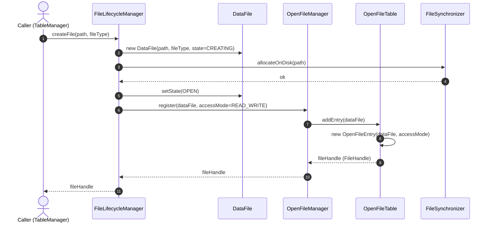
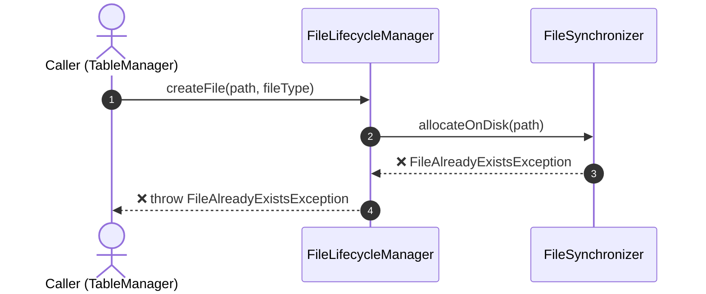
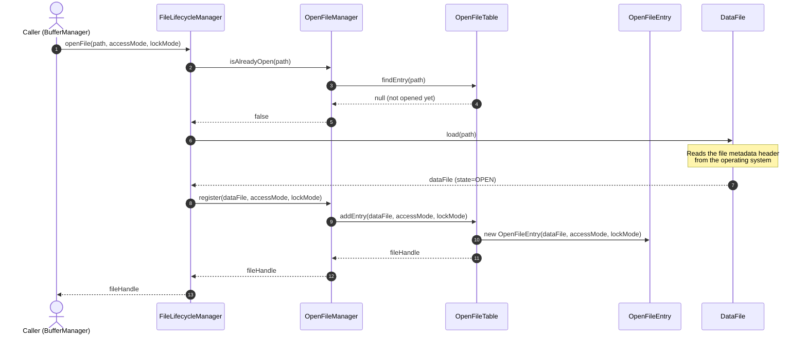
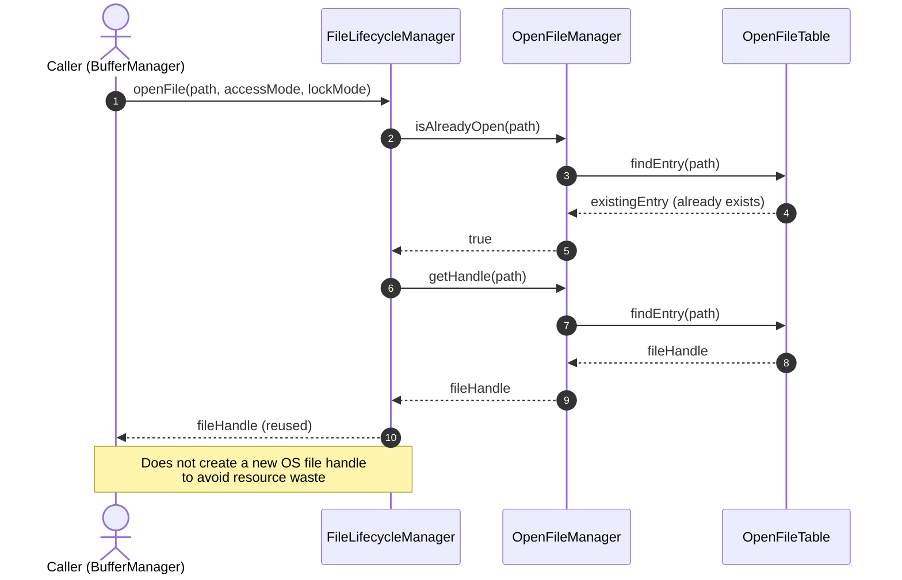
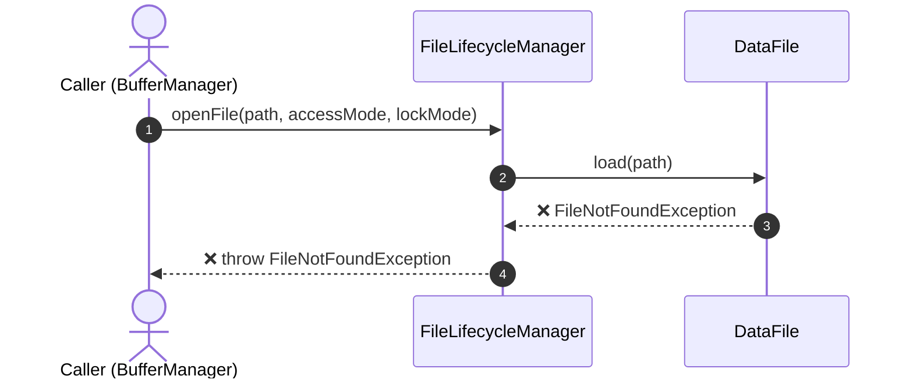
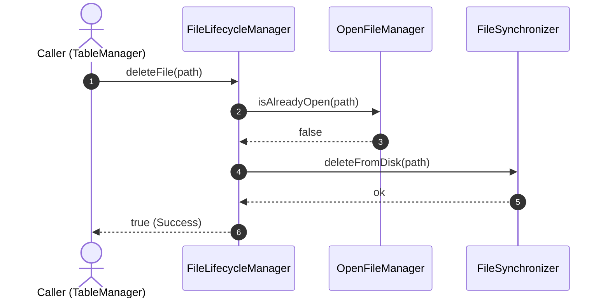
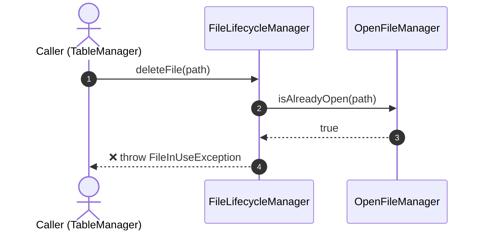
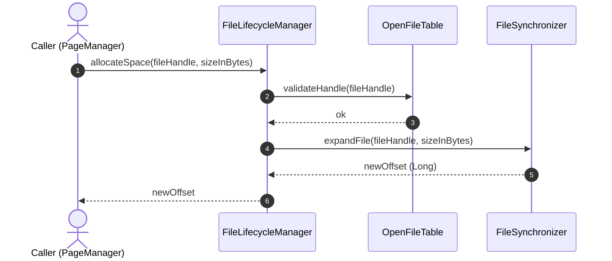
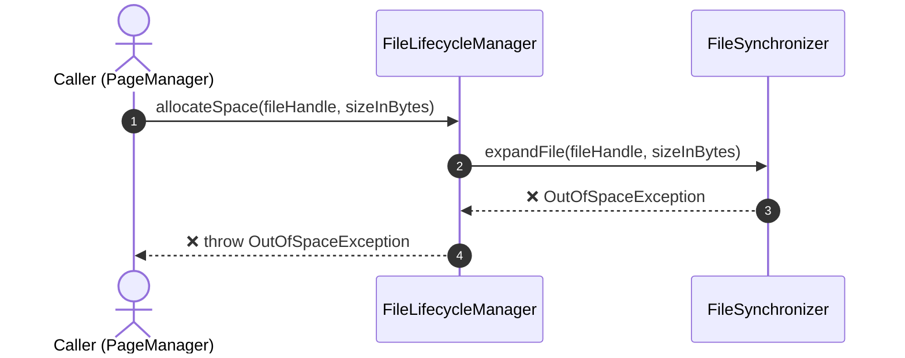

# File Management — Sequence Diagrams

> **Methodology:** Bottom-up approach — handle small operations first, then aggregate them up to the Feature-level.
>
> **Participants extracted from Layer 4 File Manager:**
> - `FileLifecycleManager` (Facade — F1)
> - `OpenFileManager` (F2)
> - `OpenFileTable` / `OpenFileEntry` / `FileHandle` (F2 Entities)
> - `DataFile` (F1 Entity)
> - `FileSynchronizer` (F4)
> - `FileReader` / `FileWriter` (F3)

---

## Operation 1: createFile()

**Scenario:** The DBMS needs to create a new physical data file (e.g., when creating a new Table).

**Happy Path:**

**Sad Path — File already exists:**

**Inferred Method Signatures:**
| Class | Method |
|---|---|
| `FileLifecycleManager` | `createFile(path: String, type: FileType): FileHandle` |
| `FileSynchronizer` | `allocateOnDisk(path: String): void` |
| `OpenFileManager` | `register(file: DataFile, mode: FileAccessMode): FileHandle` |
| `OpenFileTable` | `addEntry(file: DataFile): OpenFileEntry` |

---

## Operation 2: openFile()

**Scenario:** The DBMS reopens an existing physical file to prepare for read/write operations.

**Happy Path:**

**Happy Path — File was already opened (Reuse Handle):**

**Sad Path — File does not exist:**

**Inferred Method Signatures:**
| Class | Method |
|---|---|
| `FileLifecycleManager` | `openFile(path: String, mode: FileAccessMode, lock: FileLockMode): FileHandle` |
| `OpenFileManager` | `isAlreadyOpen(path: String): boolean` |
| `OpenFileManager` | `getHandle(path: String): FileHandle` |
| `OpenFileTable` | `findEntry(path: String): OpenFileEntry?` |
| `DataFile` | `load(path: String): DataFile` |

---

## Operation 3: deleteFile()

**Scenario:** The DBMS deletes a data file (e.g., DROP TABLE). It must ensure no one is currently opening the file before physical disk deletion.

**Happy Path:**

**Sad Path — File is currently in use:**

**Inferred Method Signatures:**
| Class | Method |
|---|---|
| `FileLifecycleManager` | `deleteFile(path: String): boolean` |
| `FileSynchronizer` | `deleteFromDisk(path: String): void` |

---

## Operation 4: allocateSpace()

**Scenario:** A data page is full, the Page Manager calls down to request additional capacity (allocating a new byte array) at the end of the physical file.

**Happy Path:**

**Sad Path — Out of Disk Space:**

**Inferred Method Signatures:**
| Class | Method |
|---|---|
| `FileLifecycleManager` | `allocateSpace(handle: FileHandle, size: Long): Long` |
| `OpenFileTable` | `validateHandle(handle: FileHandle): boolean` |
| `FileSynchronizer` | `expandFile(handle: FileHandle, size: Long): Long` |
