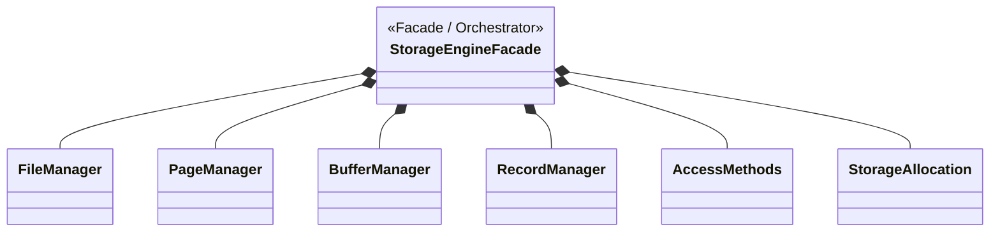

# Storage Engine — Layer 1 Class Diagram

Sơ đồ này thể hiện cấu trúc Layer 1 của riêng khối Storage Engine, nơi mà `StorageEngineFacade` đóng vai trò là container chứa (Composition) 6 thành phần con, hoàn toàn khớp với file source code `storage_core.py` mà bạn đang mở.

