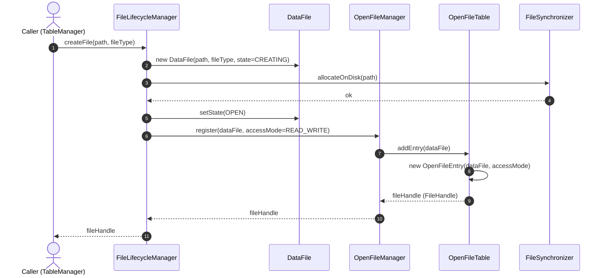
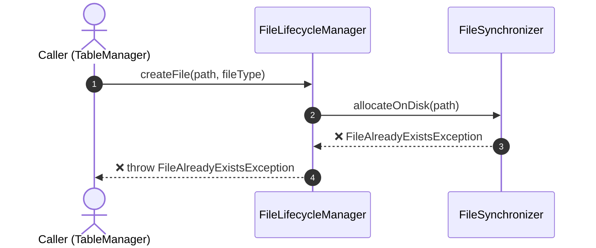
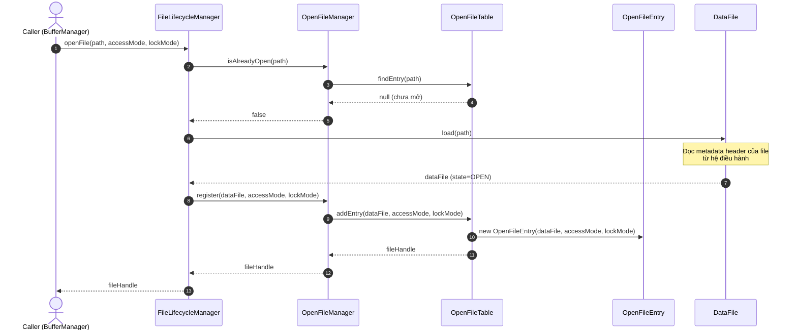
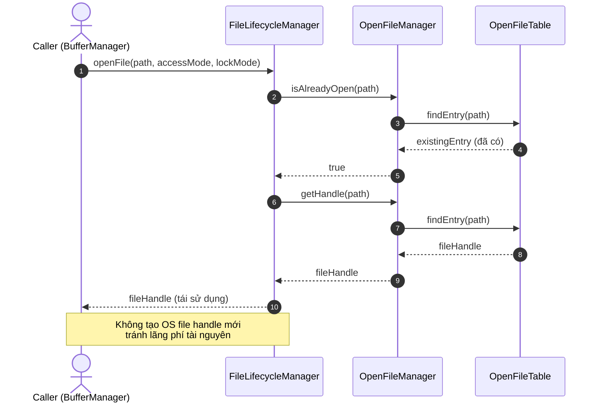
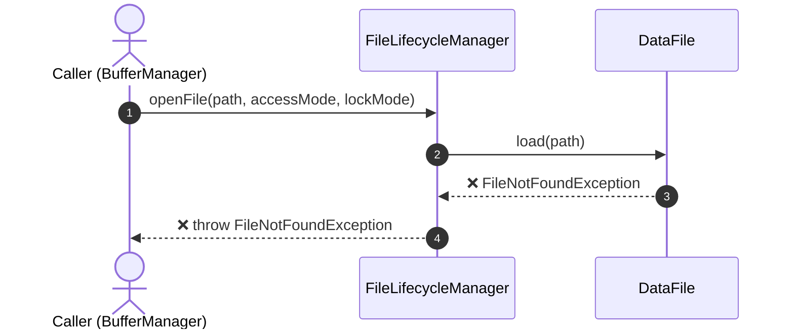
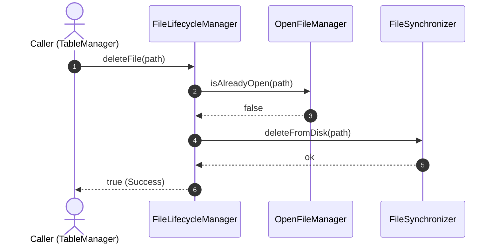
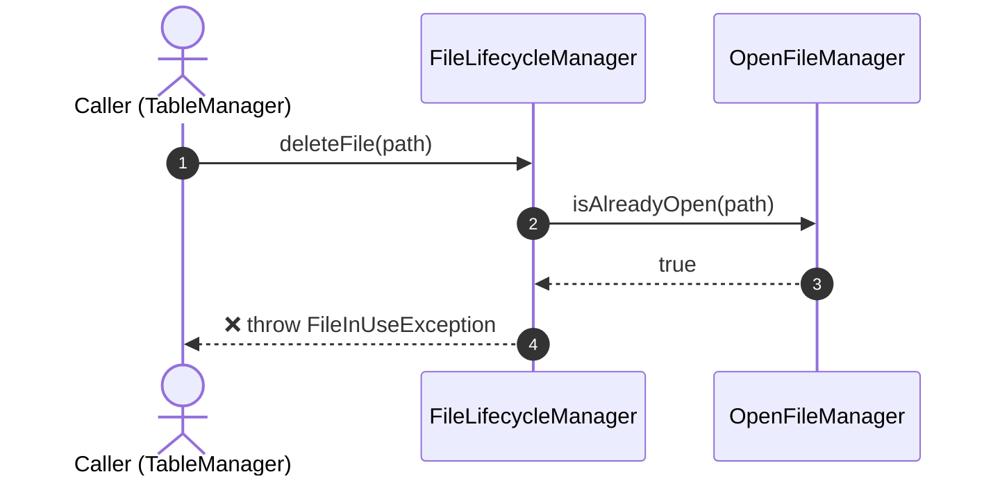
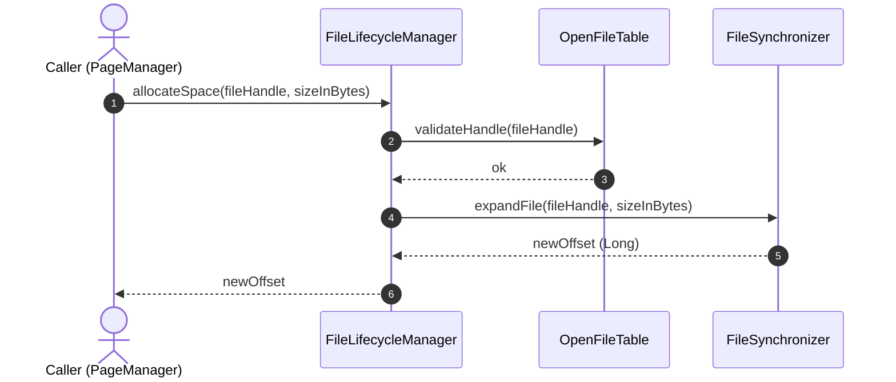
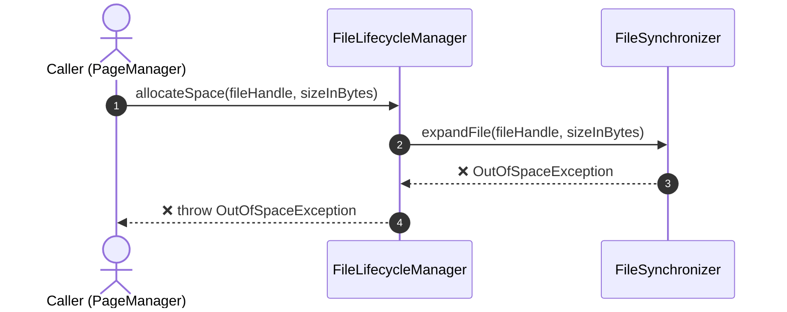

# File Management — Sequence Diagrams

> **Phương pháp:** Bottom-up — từng operation nhỏ trước, gộp dần lên Feature-level.
>
> **Participants lấy từ Layer 4 File Manager:**
> - `FileLifecycleManager` (Facade — F1)
> - `OpenFileManager` (F2)
> - `OpenFileTable` / `OpenFileEntry` / `FileHandle` (F2 Entities)
> - `DataFile` (F1 Entity)
> - `FileSynchronizer` (F4)
> - `FileReader` / `FileWriter` (F3)

---

## Operation 1: createFile()

**Kịch bản:** DBMS cần tạo một file dữ liệu vật lý mới (ví dụ khi tạo Table mới).

**Happy Path:**

**Sad Path — File đã tồn tại:**

**Method signatures suy ra từ sequence:**
| Class | Method |
|---|---|
| `FileLifecycleManager` | `createFile(path: String, type: FileType): FileHandle` |
| `FileSynchronizer` | `allocateOnDisk(path: String): void` |
| `OpenFileManager` | `register(file: DataFile, mode: FileAccessMode): FileHandle` |
| `OpenFileTable` | `addEntry(file: DataFile): OpenFileEntry` |

---

## Operation 2: openFile()

**Kịch bản:** DBMS mở lại một file vật lý đã tồn tại để chuẩn bị đọc/ghi dữ liệu.

**Happy Path:**

**Happy Path — File đã được mở trước đó (Reuse Handle):**

**Sad Path — File không tồn tại:**

**Method signatures suy ra từ sequence:**
| Class | Method |
|---|---|
| `FileLifecycleManager` | `openFile(path: String, mode: FileAccessMode, lock: FileLockMode): FileHandle` |
| `OpenFileManager` | `isAlreadyOpen(path: String): boolean` |
| `OpenFileManager` | `getHandle(path: String): FileHandle` |
| `OpenFileTable` | `findEntry(path: String): OpenFileEntry?` |
| `DataFile` | `load(path: String): DataFile` |

---

## Operation 3: deleteFile()

**Kịch bản:** DBMS xóa một file dữ liệu (ví dụ DROP TABLE). Cần đảm bảo file không còn ai đang mở trước khi xóa khỏi đĩa.

**Happy Path:**

**Sad Path — Đang có người dùng:**

**Method signatures suy ra từ sequence:**
| Class | Method |
|---|---|
| `FileLifecycleManager` | `deleteFile(path: String): boolean` |
| `FileSynchronizer` | `deleteFromDisk(path: String): void` |

---

## Operation 4: allocateSpace()

**Kịch bản:** Trang dữ liệu đã đầy, Page Manager gọi xuống xin thêm dung lượng (cấp phát mảng bytes mới) vào cuối file vật lý.

**Happy Path:**

**Sad Path — Hết dung lượng đĩa:**

**Method signatures suy ra từ sequence:**
| Class | Method |
|---|---|
| `FileLifecycleManager` | `allocateSpace(handle: FileHandle, size: Long): Long` |
| `OpenFileTable` | `validateHandle(handle: FileHandle): boolean` |
| `FileSynchronizer` | `expandFile(handle: FileHandle, size: Long): Long` |
