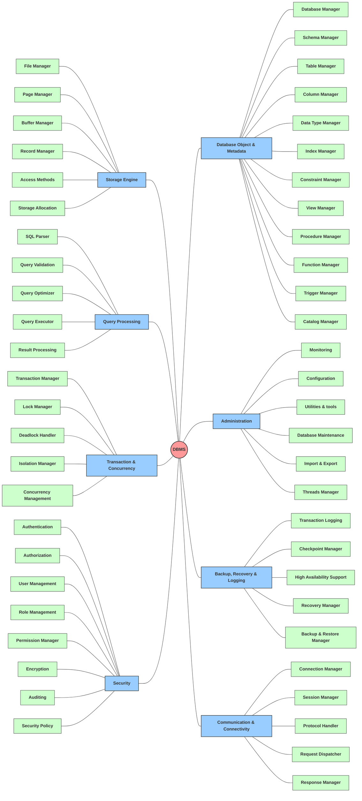

# DBMS Layer 2: Functional Breakdown

This document illustrates the Layer-2 subsystem breakdown for each of the core 8 systems in the DBMS, structured in a symmetrical topology.

## Bảng Giải Nghĩa Các Phân Hệ Layer 2

Layer 2 là bước phân rã thứ nhất từ các Domain cốt lõi (Layer 1). Mỗi nhánh của Layer 1 được tách ra thành các Module (phân hệ) con (Layer 2) nhằm định hình ranh giới nghiệp vụ:

| Nhóm | Phân Hệ (Layer 1) | Chức năng (Các Module Layer 2) |
|---|---|---|
| **Core Engine** | **Storage Engine** | Phân rã thành 6 Module trị trách nhiệm chuyên biệt: tương tác đĩa, quản lý bộ đệm, định dạng cấu trúc file & trang vật lý, tối ưu không gian và tạo phương thức truy xuất (bản ghi, mô hình chỉ mục). |
| | **Query Processing** | Phân rã dọc theo vòng đời của SQL Pipeline: phân tích cú pháp thô (Parser), tra cứu xác thực (Validation), lên kế hoạch đọc đĩa (Optimizer), thực thi vật lý (Executor) và đóng gói gửi phản hồi (Result Processing). |
| | **Transaction & Concurrency** | Đảm nhiệm trọn gói hệ thống ACID: lưu giữ trạng thái giao dịch (Transaction Manager), quản lý khóa chống xung đột (Lock Manager), theo dõi chu trình bế tắc (Deadlock Handler) và quản lý phiên bản dữ liệu song song (MVCC/Isolation). |
| | **Security** | Tập trung kiểm soát bảo mật: định danh (Authentication), ủy quyền cấp độ tài nguyên (Authorization), mã hóa ổ đĩa (Encryption) và lưu vết hành vi (Auditing). |
| **Management** | **Database Object & Metadata** | Quản lý vòng đời cấu trúc logic do end-user tạo ra (Schema, Table, Column, Index, View...). Đóng vai trò là từ điển Data Dictionary trung tâm. |
| | **Administration** | Cung cấp các công cụ trợ lý đặc quyền (DBA): giám sát trạng thái hệ thống, tinh chỉnh linh hoạt cấu hình tham số lúc runtime và cơ chế import/export dữ liệu. |
| | **Backup, Recovery & Logging** | Phân tách phân luồng phục hồi: Ghi dữ liệu tức thời qua nhật ký (Transaction WAL) để cứu vãn lỗi phần mềm, và tạo bản snapshot lưu trữ (Backup Manager) phòng ngừa hỏng hóc thiết bị lưu trữ. |
| | **Communication & Connectivity** | Đóng vai trò Adapter kết nối từ bên ngoài: Điều hướng cổng kết nối TCP (Connection), quản lý phiên (Session) và phân tích giao thức (Protocol Handler) trước khi payload đưa thẳng vào Core Engine. |
