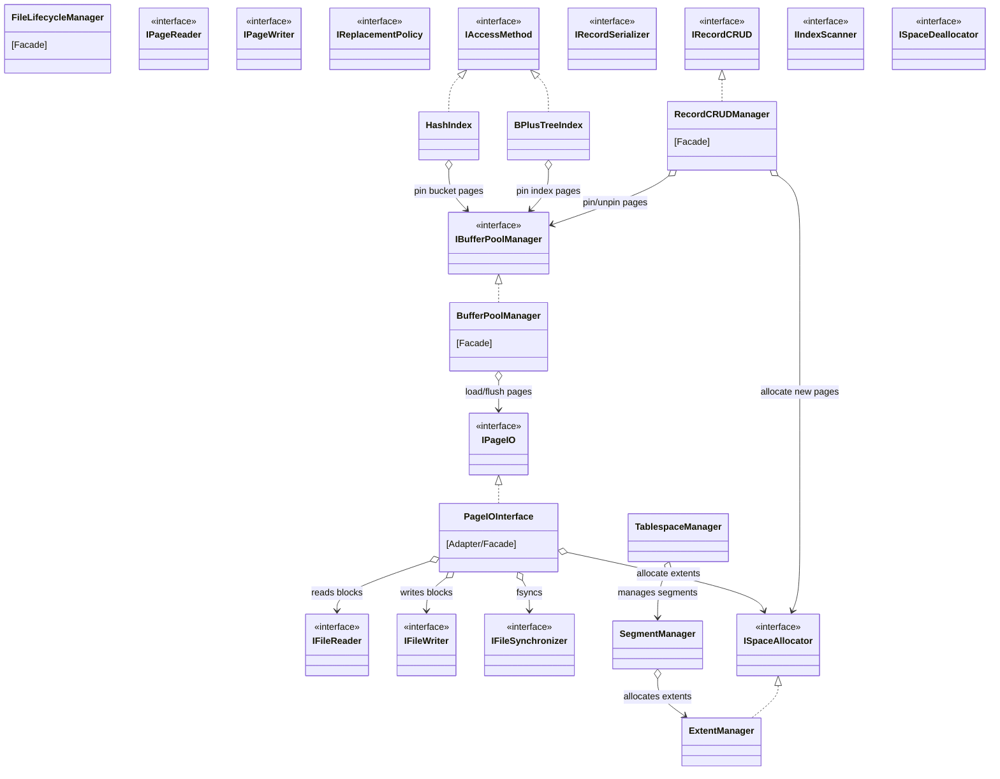

```mermaid

classDiagram
    direction TB

    %% ═══════════════════════════════
    %% FILE MANAGER
    %% ═══════════════════════════════
    class IFileReader { <<interface>> }
    class IFileWriter { <<interface>> }
    class IFileSynchronizer { <<interface>> }
    class FileLifecycleManager { [Facade] }

    %% ═══════════════════════════════
    %% PAGE MANAGER
    %% ═══════════════════════════════
    class IPageIO { <<interface>> }
    class IPageReader { <<interface>> }
    class IPageWriter { <<interface>> }
    class PageIOInterface { [Adapter/Facade] }

    %% ═══════════════════════════════
    %% BUFFER MANAGER
    %% ═══════════════════════════════
    class IBufferPoolManager { <<interface>> }
    class BufferPoolManager { [Facade] }
    class IReplacementPolicy { <<interface>> }

    %% ═══════════════════════════════
    %% RECORD MANAGER
    %% ═══════════════════════════════
    class IRecordCRUD { <<interface>> }
    class IRecordSerializer { <<interface>> }
    class RecordCRUDManager { [Facade] }

    %% ═══════════════════════════════
    %% ACCESS METHODS
    %% ═══════════════════════════════
    class IAccessMethod { <<interface>> }
    class IIndexScanner { <<interface>> }
    class BPlusTreeIndex
    class HashIndex

    %% ═══════════════════════════════
    %% STORAGE ALLOCATION
    %% ═══════════════════════════════
    class ISpaceAllocator { <<interface>> }
    class ISpaceDeallocator { <<interface>> }
    class TablespaceManager
    class SegmentManager
    class ExtentManager

    %% ── REALIZATIONS (Internal) ──
    IPageIO <|.. PageIOInterface
    IBufferPoolManager <|.. BufferPoolManager
    IRecordCRUD <|.. RecordCRUDManager
    IAccessMethod <|.. BPlusTreeIndex
    IAccessMethod <|.. HashIndex
    ISpaceAllocator <|.. ExtentManager

    %% ══ CROSS-MODULE DEPENDENCIES ══

    %% Page Manager dùng File Manager
    PageIOInterface o--> IFileReader      : reads blocks
    PageIOInterface o--> IFileWriter      : writes blocks
    PageIOInterface o--> IFileSynchronizer: fsyncs

    %% Buffer Manager dùng Page Manager
    BufferPoolManager o--> IPageIO        : load/flush pages

    %% Record Manager dùng Buffer Manager
    RecordCRUDManager o--> IBufferPoolManager : pin/unpin pages

    %% Access Methods dùng Buffer Manager
    BPlusTreeIndex o--> IBufferPoolManager : pin index pages
    HashIndex      o--> IBufferPoolManager : pin bucket pages

    %% Record + Page dùng Storage Allocation
    RecordCRUDManager o--> ISpaceAllocator : allocate new pages
    PageIOInterface   o--> ISpaceAllocator : allocate extents

    %% Storage Allocation hierarchy
    TablespaceManager o--> SegmentManager  : manages segments
    SegmentManager    o--> ExtentManager   : allocates extents
```
