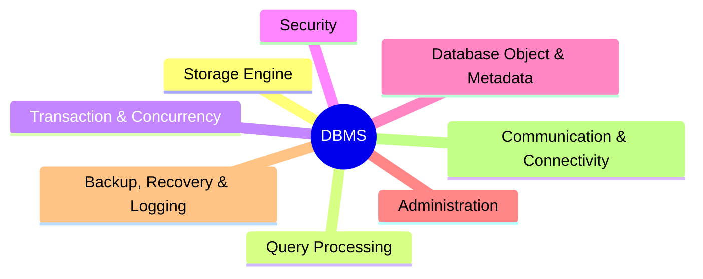
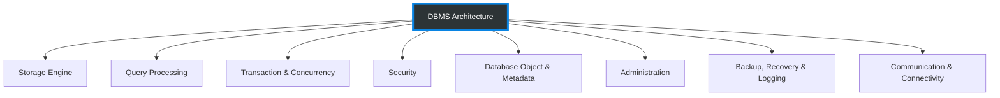
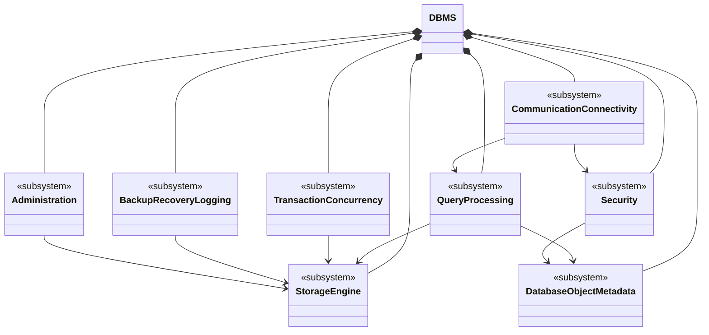

# DBMS Layer 1: Architecture Overview

This document provides a high-level overview of the DBMS architecture. The system is decomposed into 8 core global domains.

## Mindmap Representation

The quickest way to grasp the scale of the system.

## Flowchart Representation

A top-down structure representing dependency resolution.

---

## High-level Class Diagram (Layer 1)

Thể hiện 8 hệ thống con như các class (chưa có methods) và các mối quan hệ phụ thuộc giữa chúng ở cấp độ Layer 1.

